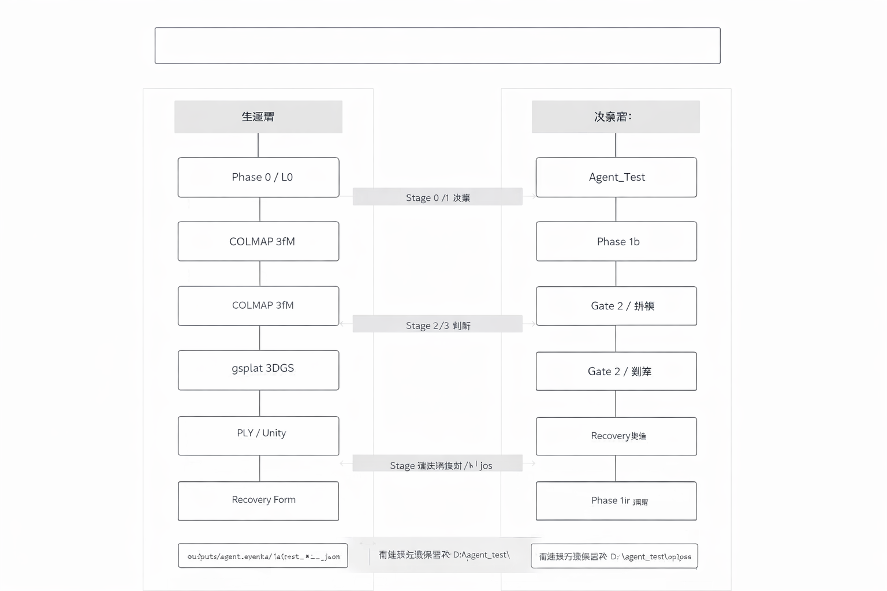
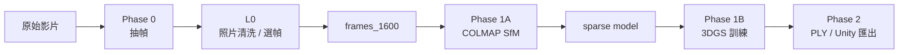

# 工業 3D 重建管線

**狀態**: current
**正式輸出根目錄**: `outputs/`

> **共同治理**：請見 [docs/_governance.md](docs/_governance.md)（治理戒律 + 正式說明書清單 + 跨層接口）。

Windows 上的工業場景 3D 重建管線：影片抽幀 → L0 照片清洗/選幀 → COLMAP SfM → gsplat 3DGS 訓練 → 匯出 / Unity。正式系統同時包含**生產層**與**決策層**的 Gate 回圈通信。



## 30 秒進入

| 你是 | 從這裡開始 |
|---|---|
| **第一次來** | [文件導航.md](文件導航.md)（3 條閱讀路線：人類 / AI / 操作員） |
| **想看當前狀態 + 正式最佳** | [專案願景與當前狀態.md](專案願景與當前狀態.md) |
| **要安裝 / 跑流水線** | [docs/安裝與環境建置.md](docs/安裝與環境建置.md) |
| **看 L0 / Gate 0~3 設計** | [docs/L0洗幀管線設計.md](docs/L0洗幀管線設計.md) |
| **看實驗歷史 + LPIPS 數據** | [docs/實驗歷史與決策日誌.md](docs/實驗歷史與決策日誌.md) |
| **想貢獻 PR** | [CONTRIBUTING.md](CONTRIBUTING.md) |
| **AI 代理執行任務** | [AI代理作業守則.md](AI代理作業守則.md) |
| **碰到 5070Ti / Unity / 其他故障** | [docs/故障排查與急診室.md](docs/故障排查與急診室.md) |
| **想評估新框架 / 備用路線** | [docs/未來路線圖與備用方案.md](docs/未來路線圖與備用方案.md) |

## 一眼看懂主線



各 Phase 詳細 I/O 與腳本對應見 [docs/L0洗幀管線設計.md](docs/L0洗幀管線設計.md)。

## 目前正式最佳結果

`U_base 853 張` + `官方 gsplat MCMC preset / 1M GS` →
**`PSNR 26.1572 / SSIM 0.8826 / LPIPS 0.19187`**

完整實驗紀錄、各路線（`U_base default` / `ffmpeg full-chain` / `GLOMAP` / `hloc+SuperPoint` / `Mask Route A` / `L0-S1` 等）的數據與失敗原因見 [docs/實驗歷史與決策日誌.md](docs/實驗歷史與決策日誌.md)。

## 生產層 / 決策層分工

正式 runtime 介面只透過 6 個 JSON 檔案契約：

```
outputs/agent_events/latest_{sfm,train,export}_complete.json     ← 生產 → 決策
outputs/agent_decisions/latest_{sfm,train,export}_decision.json  ← 決策 → 生產
```

完整跨層接口規則見 [docs/_governance.md § 3 跨層接口](docs/_governance.md)。決策層程式在 [`agent_3D` repo](https://github.com/e1134171019/agent_3D)。

## 目錄結構

```text
C:\3d-recon-pipeline
├─ src/                 正式生產層入口（preprocess / sfm / train / export）
├─ tests/               正式主線 smoke / unit tests
├─ scripts/             本機 watcher / 圖表工具（不計 coverage）
├─ data/                原始與工作影像集
├─ outputs/             所有生成物、實驗結果、報告
├─ weights/             本機模型權重
├─ gsplat_runner/       本地 bundled runner
├─ unity_setup/         Unity 匯入與 runtime 輔助
├─ colmap/              本機 COLMAP binary
└─ installers/          外部安裝包
```

目錄責任、Coverage 口徑、agent inbox/outbox 保留規則見 [AI代理作業守則.md § 4B Coverage 口徑](AI代理作業守則.md) 與 [docs/_governance.md](docs/_governance.md)。

## 最短使用路徑

完整安裝步驟（含 5070Ti 補丁）見 [docs/安裝與環境建置.md](docs/安裝與環境建置.md)。基本流程：

```powershell
cd C:\3d-recon-pipeline
python -m src.preprocess_phase0                                          # Phase 0
python -m src.downscale_frames --src data/frames_cleaned --dst data/frames_1600 --max-side 1600  # Phase 0.5
python -m src.sfm_colmap --imgdir data/frames_1600                       # Phase 1A
python -m src.train_3dgs --imgdir data/frames_1600                       # Phase 1B
python -m src.export_ply --ckpt outputs/3DGS_models/ckpts/ckpt_29999_rank0.pt \
  --out outputs/3DGS_models/ply/point_cloud_final.ply                    # Phase 2
```

正式 smoke test：`python scripts/test_cuda.py`。

## 主要腳本

| 腳本 | 階段 | 正式輸出 |
|------|------|------|
| `src/preprocess_phase0.py` | Phase 0 | `data/frames_cleaned/` |
| `src/downscale_frames.py` | Phase 0.5 | 由 `--dst` 指定 |
| `src/sfm_colmap.py` | Phase 1A | `outputs/SfM_models/sift/` |
| `src/train_3dgs.py` | Phase 1B | `outputs/3DGS_models/` |
| `src/export_ply.py` | Phase 2 | 由參數指定 |
| `src/export_ply_unity.py` | Phase 2 | Unity 端產物 |

## 編輯來源

- Canva 編輯版：https://www.canva.com/d/UKQGJvJ5CnX9Fve
- Canva 檢視版：https://www.canva.com/d/6rx53j8hTQGsHUu
