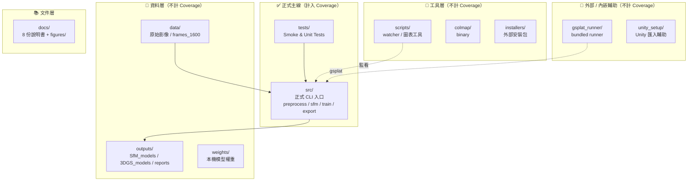
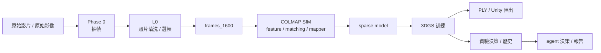
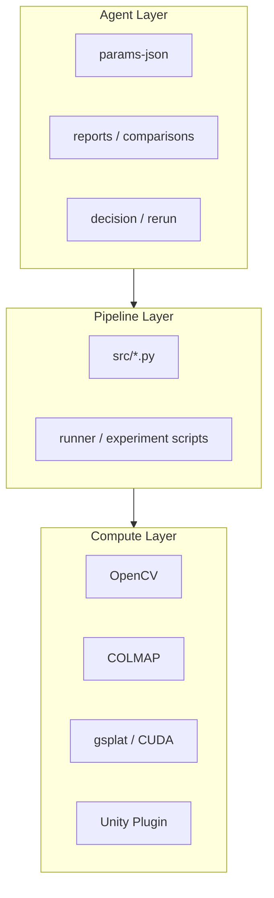
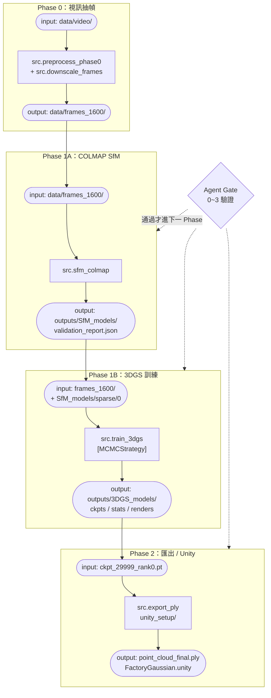

# 工業 3D 重建管線

**狀態**: current  
**最後整理**: 2026-04-18  
**正式輸出根目錄**: `outputs/`

> **共同治理摘要**
> - 以目前專案結構與正式主線為準，不依單張圖片、單次對話、舊封存文件或舊路徑推斷架構。
> - 任務開始前先依 [文件導航.md](/C:/3d-recon-pipeline/文件導航.md) 路由，再讀 [專案願景與當前狀態.md](/C:/3d-recon-pipeline/專案願景與當前狀態.md) 的「當前狀態」與任務對應正式文件；需要主線總覽時再讀本文件。
> - 正式來源只有 9 份文件（8+1）；舊中文文件與 `docs/experiments/` 不再作為正式決策依據。
> - 生產層：`C:\3d-recon-pipeline`；決策層：`D:\agent_test`；正式接口只看 `outputs/agent_events/latest_*_complete.json` 與 `outputs/agent_decisions/latest_*_decision.json`。
> - 長任務必須開可見終端；PowerShell 空格路徑只用 `Start-Process -FilePath` 或 `& '完整路徑'`；coverage 只看正式主線六模組；修改前先列保留 / 刪除 / 歸檔建議。

Windows 上的工業場景 3D 重建管線：影片抽幀 → L0 照片清洗/選幀 → COLMAP SfM → gsplat 3DGS 訓練 → 匯出 / Unity。正式系統同時包含生產層與決策層的 Gate 回圈通信。


圖說：

- 生產層在 stage 完成後寫出 `outputs/agent_events/latest_*.json`
- 決策層只讀正式 contract，完成 Gate 判斷後回寫 `outputs/agent_decisions/latest_*_decision.json`
- `D:\agent_test\outputs\phase0\...` 只保留完整審計與報告，不作為生產層正式 API

---

## 文件角色（9 份 = 8+1）

這個專案目前採用 **8+1** 文件結構：

- [文件導航.md](/C:/3d-recon-pipeline/文件導航.md)
  - 真正的導航頁，只負責告訴你去哪裡找答案
- [README.md](/C:/3d-recon-pipeline/README.md)
  - 主要說明頁，給人類快速理解主線、正式路徑、目錄責任與目前採用方案
- [專案願景與當前狀態.md](/C:/3d-recon-pipeline/專案願景與當前狀態.md)
  - 全域狀態唯一來源
- 其餘 6 份位於 `docs/` 與 [AI代理作業守則.md](/C:/3d-recon-pipeline/AI代理作業守則.md)
  - 依 Diátaxis 分層承擔 setup / troubleshooting / history / reference / roadmap

這代表：

- `文件導航.md` 不再承擔主說明
- `README.md` 不再承擔完整歷史知識庫
- 舊中文文件只作為遷移來源與封存知識庫，不再視為正式來源

編輯來源：
- Canva 編輯版：https://www.canva.com/d/UKQGJvJ5CnX9Fve
- Canva 檢視版：https://www.canva.com/d/6rx53j8hTQGsHUu

---

## 目前結論

截至 `2026-04-18`，這個 repo 已完成：

- 上游 `2x2`（`Phase 0 x SfM`）矩陣
- `L0` 選幀 / semantic ROI / loss-mask / train-only probe
- `U_base` 主線上的官方 `MCMC` 策略驗證

目前要分兩層看：

1. **`DefaultStrategy` 主線歷史結論**
- 現有 `data/frames_1600`
- baseline `SIFT + sequential matcher + incremental mapper`
- frozen train baseline：`grow_grad2d = 0.0008`
- 在這條 `default` 主線裡，多數 end-to-end 路線都收斂在 `LPIPS 0.205x`

2. **目前正式最佳結果**
- `853` 張 `U_base`
- 官方 `gsplat mcmc preset`
- `PSNR 26.1572 / SSIM 0.8826 / LPIPS 0.19187 / num_GS 1,000,000`

也就是說，現在的正式最佳已不再是 `U_base default`，而是：

- **`U_base + official MCMC preset`**

歷史上已完整驗證、但未升成正式主線的路線包括：

- `ffmpeg full-chain`
- `GLOMAP`
- `hloc + SuperPoint + LightGlue`
- `hloc + ALIKED + LightGlue`
- `Mask Route A`
- `L0-S1 / semantic ROI / loss-mask / train-only probes`

這些路線在 `DefaultStrategy` 下大多收斂於 `LPIPS 0.205x`，屬於正式歷史結論，不再在主說明頁重覆展開。完整數字、路線表與失敗原因請看：

- [docs/實驗歷史與決策日誌.md](/C:/3d-recon-pipeline/docs/實驗歷史與決策日誌.md)

目前正式主線已更新為：

- `853` 張 `U_base`
- 官方 `MCMC` preset

## 生產層 / 決策層分工

目前專案已明確切成兩層：

- **生產層**：`C:\3d-recon-pipeline`
  - 負責 Phase 0 / SfM / 3DGS / export / Unity 的實際執行
  - 負責產生正式 artifacts、reports、metrics
- **決策層**：`D:\agent_test`
  - 負責讀取正式 contract / metrics
  - 執行 Gate 判斷、Recovery 建議、Phase 報告彙整

正式 runtime 介面已收斂為：

- `outputs/agent_events/latest_sfm_complete.json`
- `outputs/agent_events/latest_train_complete.json`
- `outputs/agent_events/latest_export_complete.json`
- `outputs/agent_decisions/latest_sfm_decision.json`
- `outputs/agent_decisions/latest_train_decision.json`
- `outputs/agent_decisions/latest_export_decision.json`

決策層不再直接掃描舊式 `outputs/3DGS_models/...` 當作主入口，而是以生產層寫出的 stage contract 為準。
目前生產層在 `train_complete` / `export_complete` 寫出 `latest_*` event 後，會立即同步呼叫 `D:\agent_test\run_phase0.py --contract ...` 嘗試刷新對應的 `latest_*_decision.json`。若 decision hook 失敗，主流程仍保留 event 與本地 contract，不會因決策層異常反向中止生產流程。

### Agent 通信保留規則

- `outputs/agent_events/latest_*.json`
  - 保留
  - 這是生產層對決策層的正式共享狀態
- `outputs/agent_decisions/latest_*_decision.json`
  - 保留
  - 這是決策層回寫給生產層的正式共享判斷
- `run_root/reports/agent_<stage>.json`
  - 保留
  - 這是該次 run 的正式本地 contract
- `D:\\agent_test\\outputs\\phase0\\<run_id>\\<stage>\\*`
  - 保留
  - 這是決策層完整審計與報告
- `outputs/agent_events/<timestamp>_*.json`
  - 不作長期保存
  - 它是共享 inbox 的歷史快照，可在消費完成後清理
- `outputs/agent_decisions/<timestamp>_*.json`
  - 不作長期保存
  - 它是共享 outbox 的歷史快照，可在對應 run 已落地後清理

mailbox 清理腳本：

```powershell
python scripts/cleanup_agent_mailboxes.py
python scripts/cleanup_agent_mailboxes.py --apply
```

目前最合理的下一步不是再重開舊的 `L0`、`143 張` 或 train-only 小旋鈕，而是：

- 保留 `1M MCMC` 作離線品質 benchmark
- 以 `750k + antialiased` 作最新 Unity 候選部署版
- 繼續完成 Unity 端的 FPS / VRAM / 視覺驗證
- 若畫質仍卡在白霧 / halo / 拖影，優先改走 `export_ply_unity.py` 的 export-side probe：
  - `min_opacity`
  - `max_scale`
  - `max_scale_percentile`

正式設計見：

- [docs/L0洗幀管線設計.md](/C:/3d-recon-pipeline/docs/L0洗幀管線設計.md)

備用資料層方案保留於：

- [docs/未來路線圖與備用方案.md](/C:/3d-recon-pipeline/docs/未來路線圖與備用方案.md)

---

## 目前目錄結構

```text
C:\3d-recon-pipeline
├─ src/                 正式生產層入口
├─ tests/               正式主線 smoke / unit tests
├─ scripts/             本機 watcher / 圖表工具
├─ data/                原始與工作影像集
├─ outputs/             所有生成物、實驗結果、報告
├─ weights/             本機模型權重（不屬於正式主線程式）
├─ gsplat_runner/       本地 bundled runner（第三方/內嵌依賴性質）
├─ unity_setup/         Unity 匯入與 runtime 輔助
├─ colmap/              本機 COLMAP binary
└─ installers/          外部安裝包暫存
```

目錄責任邊界：

- `src/`：正式主線與正式 CLI 入口
- `tests/`：正式主線 smoke / unit tests，用來拉升產品 coverage
- `scripts/`：本機操作與監看工具，不計入產品主線 coverage
- `outputs/`：產物與紀錄，不視為原始碼
- `gsplat_runner/`：目前視為 bundled runner，與 `src/` 分開評估

其中 `outputs/agent_events/` 是生產層提供給決策層的正式 event inbox；`outputs/agent_decisions/` 是決策層回寫給生產層的共享 decision outbox。`agent_test` 只讀 contract / latest event，並把 Gate 結果寫回共享 decision，不再依賴舊時代的固定路徑猜測。

### C4 Level 2：目錄責任邊界圖




## 一眼看懂





---

## 專案目前在做什麼

這個 repo 的正式主線不是單一演算法庫，而是一條可分階段執行的流程：

1. 從影片抽幀
2. 對抽幀照片做 `L0` 清洗與選幀
3. 用 COLMAP 重建稀疏點雲與相機位姿
4. 用 gsplat 進行 3D Gaussian Splatting 訓練
5. 匯出 PLY 或往 Unity 流程銜接

目前首頁只描述 repo 內已存在且可對上的主線腳本。舊版路徑、研究規劃、外部協作流程不再作為主線說明。

---

## 正式主線流程

### C4 Level 3：各 Phase 組件與 I/O



> **鐵則**：每個 Phase 的輸出目錄必須乾淨獨立。\n> 尤其 `Phase 1B` 的 `_colmap_scene` 必須建立在自己的 `run` 目錄下，禁止重用全域 `data/colmap_scene`。

---

### Phase 0: 視訊抽幀

- 腳本: `python -m src.preprocess_phase0`
- 主要輸入: `data/viode/`
- 主要輸出: `data/frames_cleaned/`

用途：

- 從原始影片抽出影格
- 生成後續 `L0` 清洗與選幀的候選影格集

補充：

- 目前這批工業資料直接用 `data/frames_cleaned/` 跑 SfM 會偏慢
- 正式主線建議在 Phase 0 後先執行 `src.downscale_frames.py`，生成 `data/frames_1600/`
- 後續 Phase 1A 與 Phase 1B 目前都以 `data/frames_1600/` 作為優先主線，避免前後影像集不一致

### L0: 照片清洗 / 選幀

- 正式定位：影片主線中的照片清洗層
- 目前方向：`OpenCV + NumPy` 為 baseline，搭配 Gate 0 ~ Gate 3 快速驗證
- 設計稿：
  - [docs/L0洗幀管線設計.md](/C:/3d-recon-pipeline/docs/L0洗幀管線設計.md)

用途：

- 去除低價值影格
- 限制背景與前景雜物對主體重建的干擾
- 在不重寫後段主線的前提下，提升輸入有效性

### Phase 1A: SfM / COLMAP

- 腳本: `python -m src.sfm_colmap`
- 目前預設輸入: `data/frames_1600/`
- 正式輸出: `outputs/SfM_models/sift/`
- 驗證報告: `outputs/reports/pointcloud_validation_report.json`

用途：

- 特徵提取
- 影像匹配
- 稀疏重建
- 產生供 3DGS 訓練使用的 sparse model

### Phase 1B: 3DGS 訓練

- 腳本: `python -m src.train_3dgs`
- 目前預設影像: `data/frames_1600/`
- 預設 COLMAP 輸入: `outputs/SfM_models/sift/sparse/0`
- 正式輸出: `outputs/3DGS_models/`

用途：

- 讀取 COLMAP sparse model
- 建立 gsplat 訓練場景
- 產生 checkpoints、stats、renders、tensorboard 輸出

註：

- `imgdir` 建議與 Phase 1A 使用的影像集保持一致
- 若 `data/frames_1600/` 暫時不存在，`src.train_3dgs.py` 會回退到 `data/frames_cleaned/`
- 目前正式建議仍是先補齊 `data/frames_1600/`，讓 SfM 和 3DGS 使用同一批影像

### Phase 2: 匯出 / Unity

- PLY 匯出: `python -m src.export_ply`
- Unity 相關工具: `unity_setup/`、`src/export_ply_unity.py`

---

## 最短使用路徑

以下命令假設你的 Windows / Python / CUDA / COLMAP 環境已經準備好。

```powershell
cd C:\3d-recon-pipeline

# Phase 0
python -m src.preprocess_phase0

# Phase 0.5（目前推薦主線）
python -m src.downscale_frames --src data/frames_cleaned --dst data/frames_1600 --max-side 1600

# Phase 1A
python -m src.sfm_colmap --imgdir data/frames_1600

# Phase 1B
python -m src.train_3dgs --imgdir data/frames_1600

# Phase 2
python -m src.export_ply --ckpt outputs/3DGS_models/ckpts/ckpt_29999_rank0.pt --out outputs/3DGS_models/ply/point_cloud_final.ply
```

## 正式 Smoke Test

目前只保留一支正式 smoke test：

```powershell
python scripts/test_cuda.py
```

其餘歷史排障工具已移除或封存，不再視為主線入口。

## 已完成歷史路線摘要

以下路線已正式驗證，但都沒有超過目前的正式最佳：

- `上游 2x2`（`Phase 0 x SfM`）
- `ffmpeg full-chain`
- `GLOMAP`
- `hloc + SuperPoint + LightGlue`
- `hloc + ALIKED + LightGlue`
- `Mask Route A`
- `L0-S1 / semantic ROI / loss-mask / train-only probes`

如果你要看：

- 各路線完整數字、LPIPS 長表、污染 run 更正、`MCMC` 打破 `0.205x` 的完整過程  
  -> [docs/實驗歷史與決策日誌.md](/C:/3d-recon-pipeline/docs/實驗歷史與決策日誌.md)

- L0 的 Gate 0~3、Phase 0 v2 歷史設計契約、ROI-aware selection 設計  
  -> [docs/L0洗幀管線設計.md](/C:/3d-recon-pipeline/docs/L0洗幀管線設計.md)

- Agent 怎麼做 A/B 比較、哪些欄位必比、什麼叫公平對照  
  -> [AI代理作業守則.md](/C:/3d-recon-pipeline/AI代理作業守則.md)

---

## 主要腳本

| 腳本 | 階段 | 用途 | 目前正式輸出 |
|------|------|------|-------------|
| `src/preprocess_phase0.py` | Phase 0 | 影片抽幀與品質篩選 | `data/frames_cleaned/` |
| `src/downscale_frames.py` | Phase 0.5 | 影像縮圖 | 目標目錄由 `--dst` 指定 |
| `src/sfm_colmap.py` | Phase 1A | COLMAP SfM 主線 | `outputs/SfM_models/sift/` |
| `src/train_3dgs.py` | Phase 1B | gsplat 訓練入口 | `outputs/3DGS_models/` |
| `src/export_ply.py` | Phase 2 | 匯出 PLY | 匯出路徑由參數指定 |
| `src/export_ply_unity.py` | Phase 2 | Unity 相關匯出 | 依參數指定 |

---

## 正式目錄與舊路徑

### 正式路徑

- SfM: `outputs/SfM_models/`
- 報告: `outputs/reports/`
- 3DGS: `outputs/3DGS_models/`

### 舊路徑

- `exports/` 目前視為 `legacy`

如果你看到文件或腳本提到 `exports/3dgs_auto`、`exports/3dgs_output`、`exports/3dgs`，那是舊流程或過渡產物，不是現在首頁主線。

---

## 延伸閱讀

- 狀態唯一來源： [專案願景與當前狀態.md](/C:/3d-recon-pipeline/專案願景與當前狀態.md)
- 實驗歷史與正式數據： [docs/實驗歷史與決策日誌.md](/C:/3d-recon-pipeline/docs/實驗歷史與決策日誌.md)
- L0 / Gate 0~3 / Phase 0 v2 歷史設計： [docs/L0洗幀管線設計.md](/C:/3d-recon-pipeline/docs/L0洗幀管線設計.md)
- 安裝： [docs/安裝與環境建置.md](/C:/3d-recon-pipeline/docs/安裝與環境建置.md)
- 排障 / Unity / scale calibration： [docs/故障排查與急診室.md](/C:/3d-recon-pipeline/docs/故障排查與急診室.md)
- 備用路線與表示層升級： [docs/未來路線圖與備用方案.md](/C:/3d-recon-pipeline/docs/未來路線圖與備用方案.md)
- Agent 規則與 A/B 比較戒律： [AI代理作業守則.md](/C:/3d-recon-pipeline/AI代理作業守則.md)
