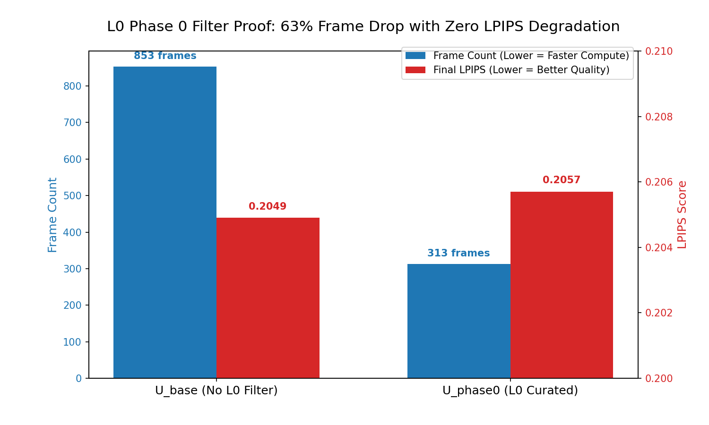
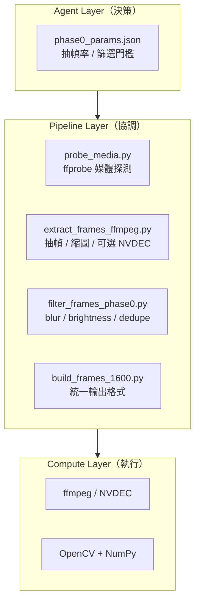
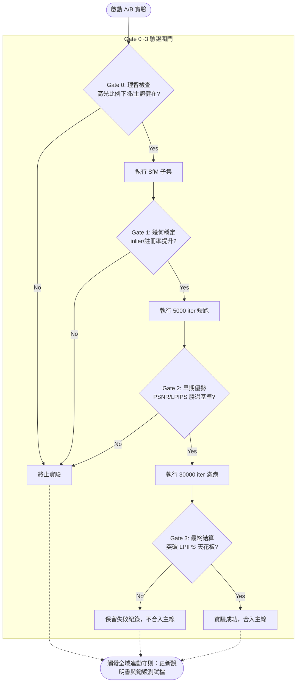

# L0 資料洗幀與管線驗證白皮書 (L0 & Pipeline Design Doc)

> 狀態：Current / Reference
> 用途：詳述「為什麼要介入影片抽幀」以及 Agent 在進行自動化 A/B 實驗時，**必須死守的 4 道驗證閥門 (Gate Protocol)**。

## 1. 源頭的焦慮：為何要做 L0 洗幀？
在 3DGS 訓練參數 (Phase 1B) 遇到天花板後，我們意識到「Trash In, Trash Out」。盲目使用 `ffmpeg` 的規律幀數盲抽，會把含有大量高光爆點、動態模糊、焦段錯亂的廢照片餵給 COLMAP。
因此我們設計了 L0 洗幀資料層探勘：目標是**「在不破壞相機原圖特徵像素的前提下，從源頭剔除毒藥」**。

## 2. 演進路線：從 OpenCV 走向 AI
### 階段 A：L0-S1 (Windowed Selection + Heuristic ROI) [已驗證]

- **作法**：使用 OpenCV 偵測顏色、邊緣與連通區，算出一塊「猜測的主體 ROI」。再利用滑動視窗 (Window=6, Keep=1) 去評估 `glare_ratio` 與 `blur_score`，決定要保留窗口內的哪一張。
- **結論**：成功證明了過濾高光能提升 SfM 幾何穩定性，但 OpenCV 推測的 ROI 對於複雜的工業機台與背景干擾依然過於脆弱。

### 階段 B：L0-S2 (Semantic ROI) [未來演進路徑]
- **升級作法**：捨棄瞎猜的邊緣偵測，引入 AI 模型 (如 YOLO 或 Grounded-SAM-2) 去精準框出 `punch_holders` 等機台關鍵部位。
- **粗標策略原則**：若推進至 YOLO 微調，嚴禁動輒發送全量 853 張的標註指令！請遵守 Bootstrap 原則：**第一輪只挑 20~50 張代表圖，只需標記可見的 `punch_holders` 單一類別**，做粗略多邊形即可，切勿追求 Pixel-perfect。
- **不變的鐵則**：這個 AI 框**只做 L0 洗幀計分區域的權重參考**，絕不對原圖像素做 Hard Mask 塗黑，以此保證 SfM 對全域幾何的完整拾取能力。

### L0-S1 vs L0-S2 策略對比

| 比較項目 | L0-S1（已驗證）| L0-S2（未來路徑）|
|---------|:---:|:---:|
| ROI 取得方式 | OpenCV 邊緣+顏色 heuristic | YOLO / SAM2 語義偵測 |
| 成本 | 低（純 CV） | 高（需標注+訓練）|
| Gate 1 幾何改善 | ✅ points3D +11%，inlier 0.868→0.883 | 未驗證 |
| Gate 2 畫質改善 | ❌ 未超越 baseline | 未驗證 |
| 主體誤砍風險 | 高（heuristic 不穩定）| 低（語義感知）|
| 現行狀態 | 幾何有訊號，暫停推進 | Bootstrap 36 張 mAP50=0.746 |

### Phase 0 v2 三層架構



### Phase 0 v2 保留模組契約

> 下列內容是從舊版 `Phase0_v2_ffmpeg_agent_設計草案.md` 整併進來的**正式保留契約**。  
> 目的是保留主線真正需要的責任切分，而不是把整份舊草案逐字搬進新文件。

| 模組 | 正式責任 | 典型輸出 |
|------|----------|----------|
| `probe_media.py` | 用 `ffprobe` 讀影片/影像來源的 metadata，提供 Agent 決策上下文，不直接做重建判斷 | `outputs/reports/phase0_media_probe.json` |
| `extract_frames_ffmpeg.py` | 以 `ffmpeg` 抽候選影格、必要時縮圖，解決解碼與抽幀穩定性 | `data/phase0_candidates/` |
| `filter_frames_phase0.py` | 以工程指標做第一層品質篩選：`blur / brightness / dedupe` | `data/frames_cleaned/` |
| `build_frames_1600.py` | 將清洗後影格轉為正式工作集，統一命名與尺寸 | `data/frames_1600/` |
| `phase0_runner_v2.py` | 協調 probe、抽幀、篩選與輸出，是 Phase 0 v2 的 orchestration 入口 | 單次 run 目錄與 reports |

### `ffprobe` / `ffmpeg` / `NVDEC` / `NIMA` 的正式角色

- `ffprobe`
  - 只負責探測來源檔資訊：`duration / fps / frame_count / width / height / codec`
  - 不直接決定哪條重建路線會贏
- `ffmpeg`
  - 只負責解碼、抽幀、基礎縮圖與必要濾鏡
  - 不是自由拼命令的視覺增強器
- `NVDEC`
  - 只是一種可選解碼加速後端
  - 開或不開，不應改變 L0 的評估邏輯
- `NIMA`
  - 不是第一層主篩選器
  - 只應作為第二層可選感知品質評估器
  - 預設關閉，只有在工程指標（`blur / brightness / dedupe`）通過後才考慮介入

### `phase0_params.json` 的正式最小契約

> Agent 在 Phase 0 只能**選參數**，不能任意拼接 `ffmpeg` 命令字串。

建議保留的最小欄位：

```json
{
  "phase0_params": {
    "profile_name": "video_default_gpu_decode",
    "recommended_params": {
      "source_type": "video",
      "fps_extract": 6,
      "max_side": 1600,
      "use_hwaccel": true,
      "hwaccel_backend": "cuda",
      "blur_threshold": 40,
      "brightness_low": 30,
      "brightness_high": 220,
      "dedupe_similarity_threshold": 0.97,
      "use_nima": false,
      "crop": "",
      "start_time": "",
      "end_time": ""
    }
  }
}
```

這個契約的作用只有兩個：
- 讓 Agent 的責任維持在「選 profile / 選參數」
- 避免 Phase 0 退化成不可追蹤的 ad-hoc shell command

---

## 3. Agent 介入的最高鐵則：Gate 0~3 快速驗證協定
這套專案被設計成一個自動化煉丹爐。未來 Agent (即 AI 管家) 在自動提出新的 L0 洗幀策略或給予新的 `sfm_params.json` 並要求試跑時，**為了防止浪費動輒數小時的訓練算力**，必須嚴格由低至高踩過以下 4 個閥門。沒過該關，就立即停止實驗並產出失敗報告。



### 🚪 Gate 0: 影像理智檢查 (Sanity ROI)
- **觀測點**：不跑 SfM。直接人工或透過演算法抽查 L0 產出的圖片。
- **過關條件**：高光比例 (`glare_ratio`) 是否真的下降？主體特徵是否遭到誤砍？如果畫面上連機台都不見了，直接宣告失敗。

### 🚪 Gate 1: 幾何穩定性驗證 (Geometry)
- **觀測點**：只跑 COLMAP SfM 的子集 (以 150 張左右為基準)。相對於 3DGS 瞎練，SfM 對幾何敏感度更高。
- **過關條件**：`registered_images` 總註冊率是否提升？成套的 `points3D` 與 `inlier_ratio` 是否更穩定？BA 過程中的線性求解失敗次數是否下降？

### 🚪 Gate 2: 早期優勢觀測 (Early Short-Train)
- **觀測點**：開始進入 3DGS 訓練，但嚴格停在 ** 5000 iter **。
- **過關條件**：既然聲稱資料層被洗乾淨了，那麼早期的模型收斂速度、短跑出的 PSNR/LPIPS 理應具備明顯優勢。若跟 baseline 在 5k 打平，通常代表效益極低，不值得放行跑滿。

### 🚪 Gate 3: 最終結算 (Full Training)
- **觀測點**：只有無損通過 0~2 關的王者配置，才獲准放行跑到滿 ** 30000 iter ** 全熟期。
- **過關條件**：與過往的 baseline (如 MCMC U_base) 對決出最終的 LPIPS 分數，並產出給開發者的正式 Agent 決策報告。
