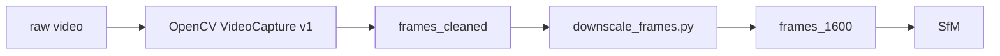
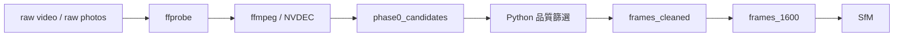
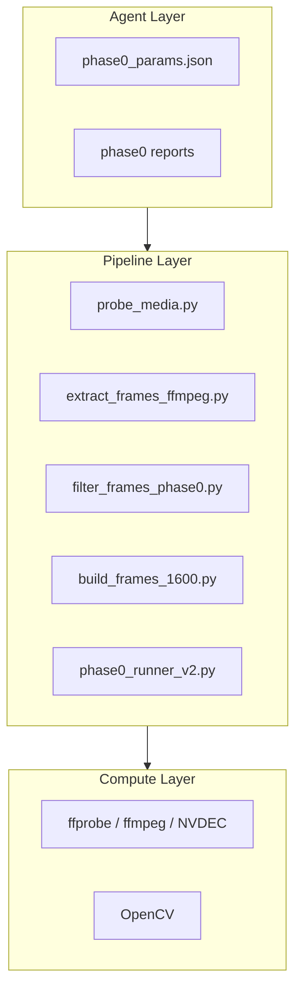
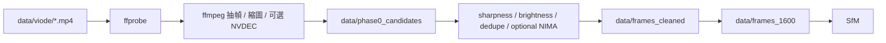
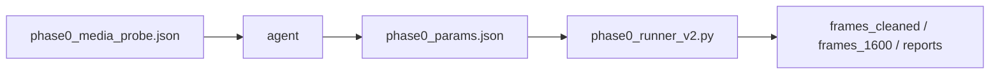
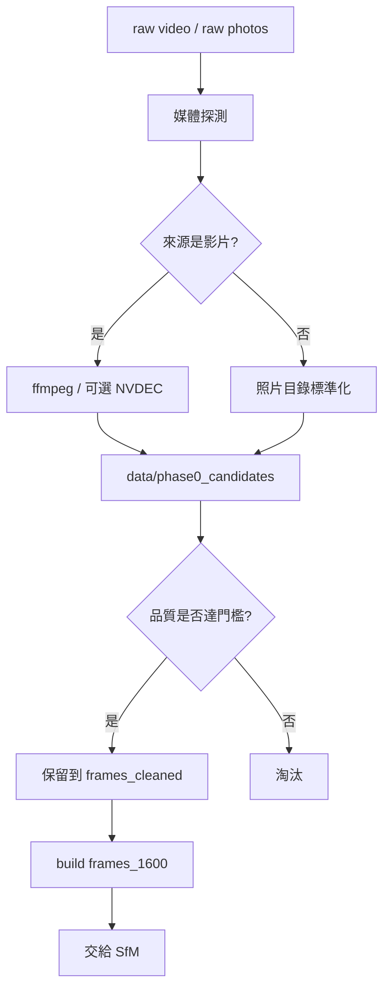
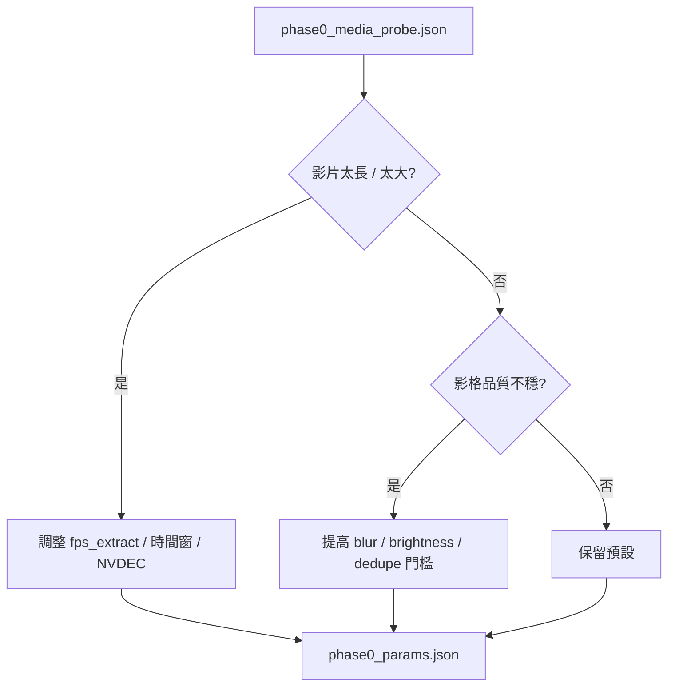

# Phase 0 v2：ffmpeg / NVDEC / Agent 介入設計草案

**狀態**: draft + first full-chain validated  
**日期**: 2026-04-11  
**定位**: 地圖優先主線的前處理升級方案  
**目標**: 讓 agent 從原始影片/原始照片層就能介入，而不是只從 `frames_1600` 開始介入

---

## 1. 背景

目前正式主線是：

`raw video -> OpenCV VideoCapture -> frames_cleaned -> downscale_frames.py -> frames_1600 -> SfM -> 3DGS`

這條線可以跑，也適合原型驗證，但和目前 GitHub 上較常見的主流作法相比，還有一個明顯差異：

- 主流：先用 `ffprobe / ffmpeg` 做影片層處理，再進 Python 質量篩選
- 現況：影片解碼、抽幀、品質過濾都混在 `preprocess_phase0.py`

因此 v2 的重點不是重寫整條管線，而是**把影片處理層正式抽出來**，並讓 agent 能在這一層就參與決策。

### 1.1 已完成的第一輪驗證

截至 `2026-04-11`，`Phase 0 v2` 已經不是純設計，已有一輪完整 full-chain 驗證：

- Run: [ffmpeg_fullchain_20260411_081715](/C:/3d-recon-pipeline/outputs/runs/ffmpeg_fullchain_20260411_081715)
- 路線：`hub.mp4 -> ffprobe / ffmpeg -> frames_1600 -> SfM -> 3DGS`

第一輪設定：

- `fps_extract = 12`
- `hwaccel = auto`
- `scale = 1600:-2:flags=lanczos`
- `blur_threshold = 40`

第一輪結果：

- `Phase 0`: 候選 `870` 張，保留 `467` 張
- `SfM`: `467 / 467` 全註冊，`87,395 points3D`
- `3DGS`: `PSNR 25.3309 / SSIM 0.8710 / LPIPS 0.2053 / num_GS 681,191`

目前判讀：

- `ffmpeg Phase 0 v2` 已證明流程可跑通
- 結果與 `U_phase0_sfm` 同級
- 但仍未超過目前最佳基準 `U_base`
- 因此 v2 的下一步不是證明「能不能跑」，而是研究 `ffmpeg` 參數策略如何優化





---

## 2. v2 的設計目標

Phase 0 v2 需要同時滿足 6 件事：

1. 能處理原始影片，也能處理原始照片資料夾
2. 優先用 `ffprobe / ffmpeg` 做影片解碼與抽幀
3. 可選擇使用 NVIDIA `NVDEC` 加速解碼
4. 保留目前 Python/OpenCV 的品質篩選能力
5. 讓 agent 可下發 Phase 0 參數，而不是只對 SfM / 3DGS 調參
6. 最終輸出仍維持目前主線依賴的 `frames_1600`

---

## 3. 正式定位

Phase 0 v2 應被視為：

**影片/影像供應層 + 品質篩選層 + agent 可控前處理層**

而不是：

- 3DGS 的一部分
- 只是一支抽幀腳本
- 純粹的 ffmpeg wrapper



---

## 4. v2 的主流程

### 4.1 影片輸入路徑

```text
data/viode/*.mp4
   ->
ffprobe 探測
   ->
ffmpeg 抽幀 / 選幀 / 縮圖（可選 NVDEC）
   ->
data/phase0_candidates/
   ->
Python 品質篩選（sharpness / brightness / dedupe / optional NIMA）
   ->
data/frames_cleaned/
   ->
生成 data/frames_1600/
   ->
SfM
```



### 4.2 照片輸入路徑

```text
data/raw_photos/
   ->
Python/ffmpeg 統一命名與尺寸檢查
   ->
data/phase0_candidates/
   ->
Python 品質篩選
   ->
data/frames_cleaned/
   ->
data/frames_1600/
   ->
SfM
```

---

## 5. 模組切分

建議 v2 拆成 5 個模組，而不是把所有邏輯放回單一腳本。

### 5.1 `probe_media.py`

用途：

- 用 `ffprobe` 讀取影片/影像資訊
- 產生標準化 metadata

輸出建議：

`outputs/reports/phase0_media_probe.json`

至少包含：

- `source_type`: `video` / `images`
- `duration_sec`
- `fps`
- `frame_count`
- `width`
- `height`
- `codec`
- `has_audio`
- `rotation`

### 5.2 `extract_frames_ffmpeg.py`

用途：

- 用 `ffmpeg` 抽出候選影格
- 必要時直接縮圖到長邊上限
- 必要時先做基本濾波

輸出：

- `data/phase0_candidates/`

### 5.3 `filter_frames_phase0.py`

用途：

- 讀候選影格
- 做品質篩選
- 產生 `frames_cleaned`

初版建議保留：

- `Laplacian variance`
- `mean brightness`
- `brightness range`
- `near-duplicate filtering`

可選二階段：

- `NIMA` 分數

### 5.4 `build_frames_1600.py`

用途：

- 統一生成正式工作影像集 `frames_1600`
- 讓後面 SfM / 3DGS 的輸入始終一致

### 5.5 `phase0_runner_v2.py`

用途：

- 作為 v2 的正式入口
- 接 `params-json`
- 協調 probe / ffmpeg extract / filter / export

---

## 6. ffmpeg 在 v2 的角色

### 6.1 `ffprobe`

用來先做媒體探測，不直接做重建決策，但會餵給 agent 當前置上下文。

### 6.2 `ffmpeg`

用來做：

- 抽幀
- 基本縮圖
- 裁切
- 去交錯
- 可選的代表幀抽樣

### 6.3 `NVDEC`

在 v2 裡的定位：

**解碼加速器**

適合：

- 高解析影片
- 長影片
- 需要快速反覆試不同抽幀率

不直接提升 SfM 幾何品質，但能讓前處理變快。

### 6.4 `NVENC`

在 v2 裡不是主角。

適合：

- 預覽影片輸出
- 調試時生成 preview clip

不應作為 SfM 前處理主鏈的核心。

---

## 7. 建議暴露的 ffmpeg / Phase 0 參數

### 7.1 影片抽幀層

- `fps_extract`
- `max_frames`
- `start_time`
- `end_time`
- `max_side`
- `crop`
- `deinterlace`
- `use_hwaccel`
- `hwaccel_backend`

### 7.2 品質篩選層

- `blur_threshold`
- `brightness_low`
- `brightness_high`
- `contrast_min`
- `dedupe_similarity_threshold`
- `keep_every_n`

### 7.3 可選品質模型層

- `use_nima`
- `nima_min_score`

---

## 8. Agent 介入點

v2 的重點是讓 agent 不再只在 `frames_1600` 後面介入，而是往前拉到原始媒體層。

### 8.1 Agent 在 Phase 0 的正式責任

- 根據媒體探測結果決定抽幀率
- 判斷是否啟用 `NVDEC`
- 決定是否要先裁切或限制片段
- 調整品質篩選門檻
- 選擇是否開啟 `NIMA`
- 輸出正式 `phase0_params.json`



### 8.3 Phase 0 的判斷邏輯



### 8.4 Agent 的 Phase 0 決策樹



---

## 9. 後續說明書插圖建議

等實驗矩陣與 Phase 0 v2 真正落地後，文件中的圖可再分成兩類：

1. Mermaid 結構圖
- 架構分層
- pipeline 流程
- agent 介入點

2. `matplotlib` 實驗圖
- Phase 0 篩選前後影格數量
- 各種抽幀率 / 篩選門檻比較
- 後續與 SfM / 3DGS 指標連動的對照圖

### 8.2 Agent 不應做的事

- 直接改 ffmpeg command 任意字符串
- 無限制改動幀率與濾波器
- 在沒有邊界的情況下做 aggressive 視覺增強

也就是說，agent 應該是：

**選參數**

不是：

**自由拼命令**

---

## 9. `phase0_params.json` 契約

建議格式：

```json
{
  "phase0_params": {
    "profile_name": "video_default_gpu_decode",
    "recommended_params": {
      "source_type": "video",
      "fps_extract": 6,
      "max_side": 1600,
      "use_hwaccel": true,
      "hwaccel_backend": "cuda",
      "blur_threshold": 40,
      "brightness_low": 30,
      "brightness_high": 220,
      "dedupe_similarity_threshold": 0.97,
      "use_nima": false,
      "crop": "",
      "start_time": "",
      "end_time": ""
    }
  }
}
```

---

## 10. v2 的安全預設

第一版不要一下子把所有優化都打開。

### 建議預設：

- `ffprobe`: 開
- `ffmpeg extract`: 開
- `NVDEC`: 可選，預設若可用則開
- `crop`: 關
- `deinterlace`: 關
- `NIMA`: 關
- `aggressive denoise`: 關
- `stabilization`: 關

### 原因：

因為對 SfM/3DGS 來說，最重要的是：

- 視角覆蓋
- 可匹配性
- 幀的一致性

不是把畫面修得「好看」。

---

## 11. `NIMA` 在 v2 的正確位置

`NIMA` 不是第一層主篩選器，而是：

**第二層可選品質評估器**

建議使用方式：

1. 先用幾何/工程向指標過第一關
   - sharpness
   - brightness
   - dedupe

2. 再用 `NIMA` 排掉感知品質特別差的影格

這樣比較符合 3D 重建需求。

---

## 12. 建議的輸出結構

```text
data/
  viode/
  raw_photos/
  phase0_candidates/
  frames_cleaned/
  frames_1600/

outputs/reports/
  phase0_media_probe.json
  phase0_extraction_report.json
  phase0_quality_report.json
  phase0_final_report.json
```

### 報告至少要有：

- 原始媒體資訊
- 抽幀策略
- 是否使用 NVDEC
- 候選幀數
- 被濾掉的原因統計
- 最終保留幀數
- 輸出目錄

---

## 13. 與現有主線的兼容方式

v2 不應破壞現有主線。

建議做法：

### 現有保留

- [preprocess_phase0.py](/C:/3d-recon-pipeline/src/preprocess_phase0.py)
- [downscale_frames.py](/C:/3d-recon-pipeline/src/downscale_frames.py)

### 新增

- `src/phase0_runner_v2.py`
- `src/probe_media.py`
- `src/extract_frames_ffmpeg.py`
- `src/filter_frames_phase0.py`

### 轉換策略

- v1 保持可跑
- v2 先並行存在
- 等 v2 穩定後，再決定是否取代 v1

---

## 13A. Mask Route A：NumPy + OpenCV 自適應遮罩 baseline

`ffmpeg full-chain` 已證明：

- Phase 0 v2 可以穩定跑通
- 但第一輪官方型抽幀/縮圖設定未超過 `U_base`

因此若後續要繼續在 Phase 0 層探索，下一個合理方向不是再重跑同一組 `ffmpeg`，而是驗證：

**「遮掉高光與明顯無關背景」是否能改善 SfM / 3DGS。**

這一條線先不引入重模型，先做一個 classical CV baseline：

- `OpenCV`：影像操作、形態學、連通區
- `NumPy`：percentile threshold、mask 組合、統計

### 13A.1 定位

Mask Route A 的目標不是直接成為正式主線，而是先回答：

**masking 這件事本身值不值得。**

如果 `NumPy + OpenCV` 的 baseline 都完全沒有幫助，之後再投入：

- `SAM 2`
- `Grounded-SAM-2`
- `YOLO11-seg`

的收益就會下降。

### 13A.2 原則

第一輪不做：

- 只保留機台輪廓的 hard crop
- 完全移除背景
- 直接改寫正式主線

第一輪只做：

- 保留原圖
- 額外產生 mask
- 先遮掉最可能違反多視角一致性的區域

也就是：

- 強光/爆光區
- 明顯無關背景
- 雜物或動態區域

### 13A.3 最小三步實驗

#### `A1_highlight_mask`

只做高光區自適應遮罩。

方法：

- HSV / LAB 亮度通道
- 亮度 percentile threshold
- morphology clean

目的：

- 驗證強光與爆光是否為主要干擾

#### `A2_machine_roi`

只做主體 ROI 保留。

方法：

- 顏色先驗
- 邊緣
- connected components
- 主體區域外擴 margin

目的：

- 驗證背景是否為主要噪聲來源

#### `A3_combined`

高光 mask + 主體 ROI 組合。

目的：

- 驗證兩者是否有交互效果

### 13A.4 評估方式

這條線仍使用：

- 同一套 SfM baseline
- 同一套 train baseline

比較項目：

- `registered_images_count`
- `points3d_count`
- `PSNR`
- `SSIM`
- `LPIPS`
- `num_GS`

### 13A.5 成功條件

- `LPIPS` 明顯低於 `U_base = 0.2049`
- 或 Unity 觀感改善，且 `PSNR/SSIM` 無明顯崩壞

### 13A.6 失敗條件

- 三組都仍收斂在 `0.205x`
- 或 `SfM` 註冊數 / 點雲品質明顯惡化

若失敗，則停止 classical mask 路線，不再往這條追加工程成本。

### 13A.7 建議輸出

```text
outputs/experiments/
  mask_route_a/
    A1_highlight_mask/
      masks/
      masked_frames/
      reports/
    A2_machine_roi/
      masks/
      masked_frames/
      reports/
    A3_combined/
      masks/
      masked_frames/
      reports/
```

### 13A.8 建議新增模組

- `src/run_mask_route_opencv.py`
- `src/build_masks_opencv.py`
- `src/apply_masks_phase0.py`

這三支在第一輪只作為實驗工具，不直接進正式主線。

### 13B. L0 Mask-Aware Selection Strategy

`Mask Route A` 若要從單純遮罩實驗，升級為真正的 `L0` 主線候選，還需要再補一層：

**mask-aware frame selection**

也就是：

`raw video -> ffmpeg candidates -> OpenCV/NumPy mask -> ROI-aware scoring -> windowed selection -> frames_1600`

這層的目的不是再增加一個新模型，而是讓：

- `ffmpeg` 負責穩定解碼、抽幀、縮圖
- `OpenCV + NumPy` 負責內容感知的遮罩與評分
- Python 只做 orchestration 與 summary

#### 13B.1 ffmpeg 階段的角色

`ffmpeg` 在這條路線中，仍只負責便宜、穩定、規則式處理：

- 固定抽幀（先保留較高密度候選）
- 固定縮圖到 `1600`
- 必要時做基本光度標準化
- 可選做粗去重與固定區域裁切

這一層不負責語義分割，也不負責判斷機台本體。

#### 13B.2 OpenCV + NumPy 階段的角色

這一層要補的不是更重的 segmentation 框架，而是：

**以 mask 為前提的 frame scoring**

建議第一輪至少加入 4 個分數：

1. `glare_ratio`
   - 高光遮罩區域占比
   - 用來判斷該幀是否被燈源 / 反光污染過重

2. `blur_score_in_roi`
   - 不再看整張圖，而是只看保留區域或機台 ROI 的清晰度
   - 可沿用 Laplacian variance

3. `feature_count_in_roi`
   - 在保留區域內評估可追蹤點數
   - 比單純亮度 / 模糊更接近 SfM 真正需要的訊號

4. `duplicate_score_in_roi`
   - 在 ROI 內比較相似度，而不是全圖去重
   - 避免固定背景讓 duplicate 判斷失真

#### 13B.3 建議補的第五個分數

若第一輪遮罩有訊號，再補：

5. `novelty_score`
   - 與上一張已接受影格比較
   - 目的不是找最清楚，而是找對幾何真正有新資訊的幀

#### 13B.4 選幀策略

這條線不建議只靠單一 threshold，而應改成：

**滑動窗口選優**

做法：

- 先剔除極差幀
- 再於每個窗口內保留 `score` 最好的 1~2 張

初版可先用簡單分數：

`score = feature_count_in_roi - glare_penalty - duplicate_penalty`

這比單純：

- `blur_threshold`
- `brightness_high`
- `dedupe`

更能反映對 SfM 有沒有幾何價值。

#### 13B.5 與 mask_path 的關係

目前 `A1` 第一輪是直接輸出 `masked_frames`，以黑色覆蓋高光區。

後續仍應補一輪：

- `masked_frames`
  vs
- `COLMAP mask_path`

因為：

- `masked_frames` 最容易快速驗證方向
- `mask_path` 更接近正式 SfM 忽略區域的正統做法

#### 13B.6 正式定位

這段若被證明有效，代表 `Mask Route A` 不再只是「多一層清洗照片」，而是：

**把 `L0` 正式從靜態抽幀，升級成 mask-aware selection layer**

也就是：

- 上游先把無效觀測降權
- 下游 `L1 ~ L3` 就不需要再承擔那麼多補償性複雜度

這也是目前 Phase 0 v2 最有可能讓整體主線收斂、而不是繼續膨脹的方向。

### 13C. L0 清洗策略的快速驗證 protocol

若後續重新開啟 `OpenCV + NumPy` 或更高階 `Grounded-SAM-2 / SAM2 / YOLO11-seg` 的 L0 清洗路線，
**不應直接跑完整 `SfM -> 3DGS 30000 iter`**。

正確流程應先做分層 gate，先驗證 `L0 -> L2` 是否有訊號，再決定是否值得進 `L3`。

#### 13C.1 Gate 0：清洗結果本身是否合理

目的：

- 先淘汰明顯錯誤的清洗策略
- 避免一開始就浪費 `SfM` 或 `3DGS` 時間

至少檢查：

1. `keep_ratio`
   - 保留區域占比不能過低
2. `glare_ratio`
   - 高光比例是否確實下降
3. `ROI feature count`
   - 清洗後機台主體區域可追蹤特徵是否增加
4. `duplicate score`
   - 清洗後相鄰幀是否仍高度重複
5. 人工抽查 `20` 張
   - 機台主體是否被誤砍
   - 背景雜物是否真的被壓低

若 Gate 0 就顯示主體被破壞、可用特徵明顯下降，則該策略直接停止。

#### 13C.2 Gate 1：只跑快速 SfM 子集

目的：

- 驗證清洗後的影像是否讓幾何更穩，而不是只讓畫面看起來更乾淨

做法：

- 固定一批小子集，例如 `120 ~ 180` 張
- 用**相同索引**比較：
  - `baseline subset`
  - `cleaned subset`

只看：

- `registered_images / total`
- `points3D`
- `matches`
- `inlier ratio`
- `track` 數與長度（若可取得）
- `BA warnings` / `Linear solver failure` 次數

若 Gate 1 沒有讓 SfM 更穩，則不進訓練。

#### 13C.3 Gate 2：只跑短訓練 smoke

目的：

- 驗證清洗後資料是否在早期就有明顯優勢

做法：

- 只跑 `3000 ~ 5000` iterations
- 固定同一組 sparse model 與 eval images

比較：

- `PSNR`
- `SSIM`
- `LPIPS`
- `num_GS`
- train curve 是否更穩
- 早期 render 是否更乾淨

若 `5000` step 都沒有優勢，通常不值得跑滿 `30000`。

#### 13C.4 Gate 3：只有通過前面才跑 full training

只有在以下條件同時成立時，才進完整 end-to-end：

- Gate 0：清洗結果合理
- Gate 1：SfM 幾何不差，最好更穩
- Gate 2：短訓練有早期優勢

否則該清洗策略直接停止，不再投入 full training。

#### 13C.5 正式結論

L0 清洗策略的快速驗證重點不是最終 full-train 分數，而是：

- 清洗後的 ROI 特徵是否更好
- SfM 幾何是否更穩
- 短訓練是否更早出現優勢

這條 protocol 的目的，是把 L0 驗證成本控制在最小範圍內，避免每一種清洗思路都直接消耗完整訓練成本。

### 13D. L0-S1: Windowed Frame Selection Baseline

在 `Mask Route A` 第一輪與 `A2` subset Gate 1 都沒有帶來幾何優勢後，`L0` 的下一步不再是遮罩，而是：

**直接用視窗式選幀取代「每張都保留」。**

第一版固定策略：

- `window_size = 6`
- `keep_top_k = 1`
- 目標是從 `853` 張中保留約 `143` 張
- 讓候選數量與既有 `every_6th_frame` baseline subset 可直接對照

第一版分數：

- `blur_score`
- `feature_count`
- `glare_ratio`
- `novelty_score`

第一版驗證方式：

- 只跑 Gate 1 `SfM`
- 若 Gate 1 有訊號，再跑 Gate 2 `5000 iter` 短訓練
- 與 `every_6th_frame` baseline subset 比：
  - `registered images`
  - `points3D`
  - `features / matches`
  - BA 穩定性

正式入口：

```powershell
python -m src.run_l0_windowed_selection ^
  --imgdir data/frames_1600 ^
  --window-size 6 ^
  --keep-top-k 1 ^
  --min-points3d 1
```

第一輪實測：

#### Gate 1（幾何）

- baseline subset
  - `143 / 143` 註冊
  - `25,925 points3D`
  - `280,777 matches`
  - `inlier = 0.868`
- `L0-S1`
  - `143 / 143` 註冊
  - `28,767 points3D`
  - `324,534 matches`
  - `inlier = 0.883`

結論：

- `L0-S1` 在 Gate 1 幾何上有正訊號

#### Gate 2（5000 iter 短訓練）

- baseline subset
  - `PSNR 22.9143`
  - `SSIM 0.8317`
  - `LPIPS 0.26589`
  - `num_GS 380,233`
- `L0-S1`
  - `PSNR 22.8425`
  - `SSIM 0.8308`
  - `LPIPS 0.26605`
  - `num_GS 380,998`

結論：

- Gate 1 的幾何改善沒有轉成早期畫質優勢
- 目前不支持直接進 full train
- 若要繼續，應以 Gate 1 sweep 為主，而不是擴成新的全量訓練主線

---

### 13E. L0-S2: Semantic ROI + Classical Scoring

`L0-S1` 的問題已經很清楚：

- 純 `OpenCV + NumPy` 可以做 `ROI-aware scoring`
- 但 `ROI` 本身仍然依賴顏色、邊緣、中央連通區等 heuristic
- 在工業機台、線材、工作台、工具盤、風扇同時入鏡時，這個 `ROI` 來源不一定夠穩

因此 `L0` 的下一級候選不是把整條選幀線推翻，而是：

**只替換 `ROI` 的取得方式，保留後面的 classical scoring。**

#### 13E.1 正式定位

`L0-S2` 定位為：

- `AI` 提供主體 `ROI`
- `OpenCV + NumPy` 繼續做便宜、可控的分數計算

也就是：

`Semantic ROI -> ROI-aware scoring -> windowed selection -> Gate 0 / 1 / 2`

這條線不是正式主線，而是：

- 高於 `L0-S1` 的成本
- 但低於直接整條改成大模型前處理

#### 13E.2 核心原則

第一輪 `L0-S2` 必須遵守：

1. `AI` 只負責 `ROI`
2. 不直接 hard crop 原圖
3. 不直接 black mask 原圖
4. `ROI` 只先作為 scoring 區域
5. 後段分數仍維持 classical 形式

原因：

- 先用 `ROI` 改善選幀
- 不要一開始就破壞原始像素與 SfM 幾何

#### 13E.3 第一輪最小實作

第一輪不追求複雜，只做：

- `get_roi_mask(frame)` 改由語義模型提供
- 後段沿用 `L0-S1` 的四個分數：
  - `ROI feature count`
  - `blur_score_in_roi`
  - `duplicate_penalty`
  - `glare_ratio`

分數仍在 window 內正規化後加權：

```text
score =
  + 0.35 * norm_feature_count
  + 0.30 * norm_blur_score
  - 0.25 * norm_duplicate_penalty
  - 0.10 * norm_glare_ratio
```

#### 13E.4 需要的保護機制

因為 `AI ROI` 不會完美，第一輪必須加：

- `dilation / margin`
  - 避免 `ROI` 貼邊切掉有用上下文
- `fallback ROI`
  - 若偵測失敗，退回中央 ROI 或 full-frame
- `ROI-only scoring`
  - 先只影響評分，不直接影響 SfM 輸入像素

#### 13E.5 驗證順序

`L0-S2` 不直接進 full train。

仍然遵守 `13C`：

1. Gate 0
   - 抽看 `ROI` 是否穩
   - `keep_ratio / glare_ratio / feature_count` 是否合理
2. Gate 1
   - 跑 subset `SfM`
   - 比 `registered images / points3D / matches / inlier ratio`
3. Gate 2
   - 只有 Gate 1 真的更穩，才跑 `3000 ~ 5000 iter`
4. Gate 3
   - 只有前面有訊號，才進 full train

#### 13E.6 與 L0-S1 的關係

`L0-S2` 不是 `L0-S1` 的替代，而是下一級候選：

- `L0-S1`
  - 純 `OpenCV + NumPy`
  - 成本最低
  - 優先驗證
- `L0-S2`
  - `AI ROI + OpenCV scoring`
  - 成本更高
  - 只有在 `L0-S1` 已證明 `L0` 值得繼續深挖時才啟用

目前正式判讀：

- `L0-S1` 已證明 `L0` 在幾何上可能有改善空間
- 但 `ROI` heuristic 仍可能是瓶頸
- 因此 `L0-S2` 是合理的下一級研究分支
- 但不是立即主線

---

## 14. 與地圖優先主線的關係

這份 v2 設計的目的不是立即擴張成完整數位孿生，而是：

**讓地圖建立的最前段資料品質與可控性提高**

也就是：

`raw video -> better frames -> better SfM -> better 3DGS -> better Unity map`

因此它仍然是「地圖優先」的一部分，不是額外岔出去的新系統。

---

## 15. 建議實作順序

### Phase 0 v2 - Step 1

先做：

- `ffprobe` 探測
- `ffmpeg` 抽幀
- 直接輸出 `phase0_candidates`

### Step 2

把現在的品質篩選邏輯抽成獨立模組：

- sharpness
- brightness
- dedupe

### Step 3

讓 agent 可輸出 `phase0_params.json`

### Step 4

再評估是否加入：

- `NIMA`
- 裁切策略
- 多 profile（品質優先 / 速度優先）

---

## 16. 最終結論

Phase 0 v2 的核心不是「換工具」，而是：

**把影片處理層正式工程化，並讓 agent 從原始資料層就能介入。**

一句話描述：

> `ffprobe/ffmpeg (+可選 NVDEC)` 負責把影片穩定地轉成候選影格  
> Python 負責品質篩選  
> agent 負責選擇 Phase 0 參數  
> 最終仍輸出 `frames_1600` 給 SfM / 3DGS 主線
