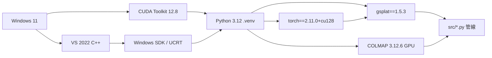

# 專案環境與安裝指南 (Setup)

> 狀態：Current  
> 用途：提供最乾淨、無腦的執行指令。當環境爛掉時，唯一解法就是把你原本的 `.venv` 砍掉，照著本篇一行一行重打。不要試圖修補舊環境。

> **共同治理**：請見 [_governance.md](_governance.md)（治理戒律 + 正式 9 份說明書清單 + 跨層接口）。

## 1. 系統與基礎依賴要求
- **OS**: Windows 11
- **Python**: 3.12 (嚴格要求，不可使用 3.10/3.11 否則可能會遇到 pre-built wheel 快取或相容性問題)
- **CUDA**: Toolkit 12.8 (需正確安裝於系統環境)
- **C++ 編譯鏈**: Visual Studio 2022 Community (必須包含「使用 C++ 的桌面開發」工作負載)
- **Ninja**: 必須透過 `winget install ninja` 安裝並確保已加入系統路徑 (PATH)

### 依賴關係鏈



> ⚠️ **RTX 5070Ti 用戶**：GSPLAT 安裝前必須先看 `故障排查與急診室.md` 打 4 個補丁，否則 GSPLAT 這個節點 JIT 時必崩。

## 2. 乾淨的安裝指令 (Clean Install SOP)

```powershell
# 1. 確保在專案根目錄，無情砍掉舊環境並重建
rm -r -force .venv
python -m venv .venv
.venv\Scripts\activate

# 2. 升級基礎工具
python -m pip install --upgrade pip setuptools wheel ninja

# 3. 安裝 PyTorch (嚴格綁定 cu128 版)
# ⚠️ 基準鎖死：torch==2.11.0+cu128, torchvision==0.26.0+cu128
python -m pip install torch torchvision --index-url https://download.pytorch.org/whl/cu128

# 4. 安裝專案核心與 gsplat
# ⚠️ 基準鎖死：gsplat==1.5.3
# ⚠️ 注意：若顯卡為 RTX 5070Ti (sm_120)，此步前必讀 故障排查與急診室.md 上補丁！
python -m pip install gsplat==1.5.3

# 5. 確保 imageio-ffmpeg 存在 (防止短跑驗證末期 traj_*.mp4 產生失敗)
python -m pip install imageio-ffmpeg
python -m pip install -r requirements.txt
```

## 3. 執行環境要求 (Visual Studio Developer Command Prompt)
為了避免遇到 `corecrt.h: No such file` 等 Windows SDK 連結檔遺失錯誤，**所有的管線訓練與 gsplat JIT 編譯** 都必須在具有完整 C++ 環境變數的終端模式下執行。
請在每次開啟新的 PowerShell 準備工作前，先執行以下批次指令以載入 VS 開發環境：

```powershell
$vcvarsall = "C:\Program Files\Microsoft Visual Studio\2022\Community\VC\Auxiliary\Build\vcvarsall.bat"
$envLines = cmd.exe /c "`"$vcvarsall`" x64 && set" 2>&1
foreach ($ln in $envLines) { if ($ln -match "^([^=]+)=(.*)$") { [System.Environment]::SetEnvironmentVariable($Matches[1], $Matches[2], "Process") } }
```

## 4. 目錄防呆與路徑約定
本專案的對照實驗與資料流高度依賴路徑乾淨度，請遵守唯一的合法正式輸出目錄規範：
- **正確路徑 (`outputs/`)**: SfM 與 3DGS 訓練的所有成果必須收入 `outputs/SfM_models/` 與 `outputs/3DGS_models/`。
- **非法路徑 (`exports/`)**: 絕不允許將檔案寫入任何包含 `exports/` 或 `exports/3dgs_auto/` 的舊版殘留路徑。

### 目錄結構（正式責任邊界）

```
c:\3d-recon-pipeline\
├── src/              ← ✅ 正式生產層入口（計 coverage）
├── tests/            ← ✅ 正式主線 smoke/unit 測試
├── scripts/          ← 🔧 本機工具腳本（不計 coverage）
├── data/             ← 📂 原始與工作影像集
├── outputs/          ← 📦 所有生成物、實驗結果、報告
├── docs/             ← 📚 8 份說明書 + figures/
├── gsplat_runner/    ← 📦 Bundled runner（不計 coverage）
└── unity_setup/      ← 🎮 Unity 匯入輔助
```

## 5. 安裝前置確認 Checklist

在開始安裝 Python 套件前，必須確認以下所有項目：

- [ ] 系統 CUDA 12.8 已存在，且不打算更動
- [ ] Visual Studio 2022 C++ 工具鏈可用（`where cl.exe` 有輸出）
- [ ] Windows SDK / UCRT 可用
- [ ] Ninja 可用（`ninja --version` 有輸出）
- [ ] COLMAP 可執行（`.\colmap\bin\colmap.exe --version`）
- [ ] 舊 `.venv` 已移除（若有的話）
- [ ] 新 `.venv` 已建立並啟動
- [ ] PyTorch 安裝後 `torch.cuda.is_available()` 為 `True`
- [ ] `python -c "import gsplat; print(gsplat.__version__)"` 輸出 `1.5.3`
- [ ] 主線輸出預期使用 `outputs/`（不是 `exports/`）

> ✅ 全部勾選後，才建議開始完整訓練。
