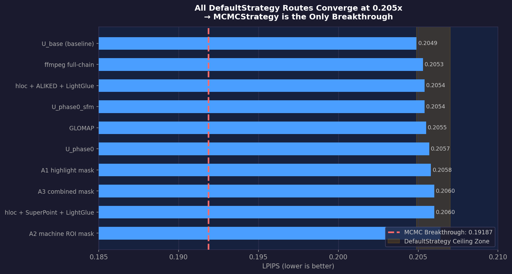
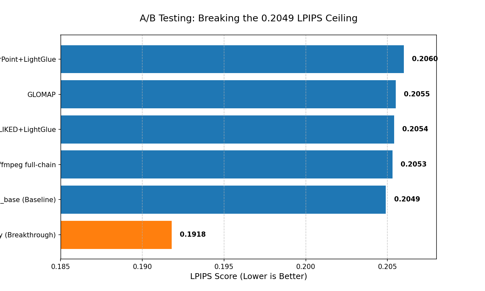

# 實驗決策日誌 (Architecture Decision & Experiment History)

> 狀態：Archived / Reference
> 用途：記錄過去嘗試過的方向與數據，作為未來 Agent 或開發者避免「重複踩坑」的歷史借鑑。

## 1. 為了突破天花板我們走過的彎路 (Training Strategy)
在針對 `U_base` (853 張機台影像) 的訓練優化中，我們曾長期卡在 `LPIPS ~0.2049` 的天花板。以下是曾經探索過但後來被標記為**弱訊號或負面方向**的實驗：

### ❌ 局部參數微調查探
- **實驗內容**：單獨啟動 `app_opt=True`、限制 `sh_degree=1`、開啟 `pose_opt=True`。
- **結論**：這些參數在 `5000 iter` 短跑時看似有正訊號（例如 `sh_degree=1` 短跑 LPIPS 曾落至 0.35）。但當火力全開跑到滿 `30000 iter` 時，最終結果全面輸給原版 H_D0。這確立了我們「短跑優勢不保證長跑勝利，不再沉迷零碎參數」的鐵律。

### ❌ 慘痛教訓：`colmap_scene` 目錄污染事件
- **事件還原**：早期 `train_3dgs.py` 曾強制重用全局的 `data/colmap_scene` 目錄，導致在進行 `H_D0` 143 張最佳子集的訓練時，引擎默默載入了 853 幀的全量資料，造成長達數週的對照組數據全數作廢。
- **防呆戒律**：從今以後，任何新的 `train_3dgs.py` 執行，都必須**在自己的輸出目錄下建立獨立的 `_colmap_scene`**！且每次實跑後，Agent 第一件事必須去檢查 `[Parser] N images` 中的 N 是否與該子集預期數量完全一致！

### ❌ 機台主體硬遮罩 (Machine-level hard mask)
- **實驗內容**：早期曾嘗試對 SfM 或 3DGS 進行暴力式的非主體黑底遮罩 (Black masking, 像是 Mask Route A)。
- **結論**：第一輪驗證即宣告失敗。硬幹遮罩會徹底毀滅依賴背景邊緣特徵的 COLMAP SfM 幾何推斷。

### 📉 特徵提取升級：ALIKED + LightGlue
- **實驗內容**：試圖取代 SIFT + Sequential matcher，在高光反光工業場景引入 ALIKED (特徵) + LightGlue (匹配)。
- **結論**：在 `inlier_ratio` 與 `registered_images` 確實有 `5%~15%` 提升。但其伴隨的是巨大的運算成本，且最終輸入 3DGS 所渲染出的 LPIPS **並無顯著超越現行 U_base**。這條路目前保留為實驗替代品，尚未被提拔為主線。

---

## 📊 兩堵天花板全景：DefaultStrategy 所有路線對照表

> 以下 10 條路線在 DefaultStrategy 下**全數收斂在 LPIPS `0.205x`**。這是 MCMC 才不可跳過的背景依據。

| 路線 | 影像數 | PSNR | SSIM | LPIPS | num_GS | 備註 |
|------|:------:|:----:|:----:|:-----:|:------:|------|
| `U_base`（基準組）| 853 | 25.3986 | 0.8718 | 0.2049 | 684,641 | ⭐ 最佳基準 |
| `ffmpeg full-chain` | 467 | 25.3309 | 0.8710 | 0.2053 | 681,191 | |
| `hloc + ALIKED + LightGlue` | 853 | 25.2939 | 0.8708 | 0.2054 | 674,545 | |
| `U_phase0_sfm` | 313 | 25.2976 | 0.8711 | 0.2054 | 677,233 | |
| `GLOMAP` | 853 | 25.3500 | 0.8706 | 0.2055 | 669,802 | |
| `U_phase0` | 313 | 25.2912 | 0.8705 | 0.2057 | 686,899 | |
| `A1 highlight mask` | 853 | 25.2752 | 0.8709 | 0.2058 | 677,421 | |
| `A3 combined mask` | 853 | 25.2788 | 0.8705 | 0.2060 | 673,093 | |
| `hloc + SuperPoint + LightGlue` | 853 | 25.2285 | 0.8704 | 0.2060 | 679,961 | |
| `A2 machine ROI mask` | 853 | 25.2680 | 0.8702 | 0.2064 | 670,214 | |
| **`U_base + MCMCStrategy`** | **853** | **26.1572** | **0.8826** | **0.19187** | **1,000,000** | 🏆 唯一突破 |

> 💡 執行 `python plot_all_routes.py` 可重新產生此圖表。

---

## 2. 迎來突破：MCMCStrategy 降臨
在嘗試無數微調後，最終幫助我們斬斷 `0.2049` 天花板的，是從架構底層切換策略：

- **採用決策**：放棄原本 default 繁雜的 densify 控制，全面改用官方的 **`MCMCStrategy`** (Preset: `init_opa=0.5`, `init_scale=0.1`, `opacity_reg=0.01`, `scale_reg=0.01`)。
- **最終戰鬥數據**：在全量公平對照下，LPIPS 從 `0.2049` 直接推進至 **`0.19187`**。

### ⚠️ MCMC 的代價與下一步
MCMC 的機制會毫無保留地將高斯數量 (num_GS) 推到系統設定的最高上限（目前為 **1,000,000 顆**）。相較於傳統練出來的 30 萬顆，這對最終 Unity 的 VRAM 與渲染壓力是一大挑戰。未來的優化重點將圍繞在「MCMC 壓縮 (`cap_max`)」與效能成本控制上。

### ✅ `MCMC + cap_max=750k` full train（成本折衷版）
- **實驗內容**：在正式主線 `U_base + MCMCStrategy` 基礎上，將 `cap_max` 從 `1,000,000` 下調至 `750,000`，以公平 `30000 iter` full train 對照畫質與成本。
- **結果數據**：
  - `1M MCMC`：`PSNR 26.1572 / SSIM 0.8826 / LPIPS 0.19187 / num_GS 1,000,000`
  - `750k MCMC`：`PSNR 26.0209 / SSIM 0.8803 / LPIPS 0.19602 / num_GS 750,000`
- **結論**：
  - `750k` 沒有打贏 `1M`，不是新的品質主線。
  - 但它以 `LPIPS +0.00415` 的代價，換取 `250,000` 顆高斯的成本下降，是目前可接受的成本折衷版。
  - 因此後續重點不是把 `750k` 升成正式最佳，而是用它去做 **Unity / export 成本驗證**，確認品質損失是否值得。

### ✅ `MCMC + cap_max=750k` Unity / export 驗證（部分成功，阻塞於 Unity runtime）
- **實驗內容**：針對 `u_base_mcmc_capmax_fulltrain_20260419_143927` 的 `750k` 成本折衷版，驗證 `PLY 匯出 → Unity batch import → Scene 綁定` 是否可走通。
- **匯出結果**：
  - `point_cloud_unity.ply` 成功產生
  - 檔案大小：`186,001,531 bytes`（約 `177.4 MB`）
- **Unity 匯入結果**：
  - `GaussianSplatBatchImport` 已成功產生：
    - `point_cloud_unity.asset`
    - `point_cloud_unity_chk.bytes`
    - `point_cloud_unity_col.bytes`
    - `point_cloud_unity_oth.bytes`
    - `point_cloud_unity_pos.bytes`
    - `point_cloud_unity_shs.bytes`
  - Unity log 明確記錄：`[GaussianSplatBatchImport] 匯入完成：Assets/GaussianAssets/point_cloud_unity.asset`
- **阻塞點**：
  - 在開啟 `FactoryGaussian.unity` 並啟用 `GaussianSplatRenderer` 時，Unity runtime 報錯：
    - `Kernel 'InitDeviceRadixSort' not found`
  - 報錯位置位於 `org.nesnausk.gaussian-splatting` package 的 `GpuSorting / GaussianSplatRenderer.OnEnable`
- **結論**：
  - **匯出成功**
  - **匯入成功**
  - **當前阻塞是 Unity / plugin runtime 相容性，不是 `.ply` 匯出失敗**
  - 這代表 `750k` 已證明可生成可匯入資產，但尚未完成「可渲染、可量測幀率」的 Unity 階段驗證。

### ✅ `InitDeviceRadixSort` root cause 驗證完成（非 package 缺檔，而是 Unity 啟動參數）
- **實驗內容**：針對同一個 `750k` PLY，額外驗證 Unity 的 `Kernel 'InitDeviceRadixSort' not found` 是否由 package 缺檔、graphics API，或 batch 啟動參數造成。
- **檢查結果**：
  - `org.nesnausk.gaussian-splatting` package 內的 `Shaders/SplatUtilities.compute` 實際包含：
    - `#pragma kernel InitDeviceRadixSort`
    - `#pragma kernel Upsweep`
    - `#pragma kernel Scan`
    - `#pragma kernel Downsweep`
  - 因此不是 package 缺 kernel。
- **A/B 驗證**：
  - `-batchmode -nographics -force-d3d12`：仍報 `InitDeviceRadixSort not found`
  - `-batchmode -force-d3d12`（不加 `-nographics`）：scene 可正常開啟，log 不再出現該錯誤
- **正式結論**：
  - root cause 是 **`-nographics` 讓 Gaussian Splatting runtime 無法建立所需 compute shader kernel**
  - Unity Gaussian batch import / batch scene bind 的正式做法應改為：
    - `-batchmode -force-d3d12`
    - **不要使用 `-nographics`**
  - 這條線現在已從「runtime 阻塞」前進到「可正式量測 750k / 1M 的 Unity 成本」階段

### ✅ `750k vs 1M` Unity 視覺對照（人工觀察）
- **實驗內容**：在同一個 Unity 專案 `BendViewer` 內，依序匯入：
  - `750k MCMC`：`point_cloud_unity.asset` 顯示 `Splats = 750,000`
  - `1M MCMC`：重新匯入同名 `point_cloud_unity.asset` 後，Inspector 顯示 `Splats = 1,000,000`
- **觀察結果**：
  - `750k`：雖仍有高光區泛白與拖影，但整體主體可辨識度較佳
  - `1M`：雖然離線指標最佳（`LPIPS 0.19187`），但在 Unity 端高光糊化、白霧、透明排序感與拖影更嚴重，肉眼觀感反而比 `750k` 更差
- **正式結論**：
  - `1M MCMC` 是 **離線品質 benchmark**
  - `750k MCMC` 是 **目前 Unity 候選部署版**
  - 後續若要改善 Unity 端視覺，不應先往 `1M` 繼續堆量，而應在 `750k` 上優先測 `MCMC + antialiased`

### ✅ `MCMC + cap_max=750k + antialiased` full train（新的 Unity 候選版）
- **實驗內容**：在 `750k MCMC` 的正式 full train 基礎上，額外開啟 `antialiased`，以公平 `30000 iter` 驗證是否能在不增加 `num_GS` 的前提下改善離線指標與 Unity 候選品質。
- **結果數據**：
  - `750k MCMC`：`PSNR 26.0209 / SSIM 0.8803 / LPIPS 0.19602 / num_GS 750,000`
  - `750k MCMC + antialiased`：`PSNR 26.1582 / SSIM 0.8810 / LPIPS 0.19529 / num_GS 750,000`
  - `1M MCMC`：`PSNR 26.1572 / SSIM 0.8826 / LPIPS 0.19187 / num_GS 1,000,000`
- **結論**：
  - `750k + antialiased` 明確優於 `750k plain`
  - 它仍然沒有打贏 `1M` 的離線 LPIPS，因此不改寫離線 benchmark
  - 目前最佳定位是：**`1M` 保留為離線品質 benchmark；`750k + antialiased` 升格為最新 Unity 候選部署版**

### ✅ `750k + antialiased` Unity 匯入驗證（成功）
- **匯出結果**：
  - `point_cloud_unity.ply` 已成功匯出
  - 路徑：`outputs/experiments/train_probes/u_base_mcmc_capmax_aa_fulltrain_20260420_032355/mcmc_capmax_750k_aa/ply/point_cloud_unity.ply`
- **Unity 匯入結果**：
  - `BendViewer` 中的 `Assets/GaussianAssets/point_cloud_unity.asset` 已重建成功
  - Unity log 明確出現：`[GaussianSplatBatchImport] 匯入完成：Assets/GaussianAssets/point_cloud_unity.asset`
  - 對應 `.bytes` 檔案時間戳已更新為同一次匯入
- **正式結論**：
  - `750k + antialiased` 已成功從訓練走到 `.ply` 與 Unity 資產匯入
  - 後續 Unity 比較應以這版作為主候選，而不是回到 `750k plain`

### ⚠️ `750k + antialiased` Unity 單視角人工觀察（仍未通過部署品質門檻）
- **測試方式**：
  - 在 `BendViewer / FactoryGaussian` scene 中，套用版本化資產 `1_point_cloud_unity.asset`
  - 關閉 `Directional Light`
  - 使用 `FactoryScene/2. 套用所選 Gaussian Asset 並重設視角` 固定相機位置後觀察
- **觀察結果**：
  - 相比 `1M`，主體機台可辨識度明顯提升
  - 單一視角下已經能看清主要折床機輪廓與前景桌面
  - 但畫面仍存在明顯：
    - 白霧感 / 霧化
    - 高光 halo
    - 邊緣拖影與背景抹化
- **正式結論**：
  - `750k + antialiased` 是目前 **最佳 Unity 候選版**
  - 但它仍然**沒有通過 Unity 部署品質門檻**
  - 因此目前正式定位應維持：
    - `1M`：離線品質 benchmark
    - `750k + antialiased`：Unity 候選，但仍在驗證中，尚未升格為可交付版本

### ❌ `GLOMAP + MCMC @ 7000` mid probe（未打贏 `U_base + MCMC`，不升 full train）
- **實驗內容**：沿用既有 `GLOMAP` 稀疏模型（`853` 張全量資料，`registered_images_count = 853`），直接切換訓練策略為 `MCMC`，跑公平 `7000 iter` 中期 probe。
- **結果數據**：
  - `U_base + MCMC @ 7000`：`PSNR 24.107 / SSIM 0.8569 / LPIPS 0.224 / num_GS 1,000,000`
  - `GLOMAP + MCMC @ 7000`：`PSNR 24.100 / SSIM 0.8554 / LPIPS 0.228 / num_GS 1,000,000`
- **結論**：
  - `GLOMAP + MCMC` 在中期 probe **沒有打贏** `U_base + MCMC`
  - 差距雖小，但方向為負，不符合「只讓有明確優勢的組合升到 `30000 iter`」的規則
  - 因此這條線**到此為止，不升 full train**
  - 下一個更合理的上游交叉驗證是：**`ALIKED + LightGlue + MCMC`**

### ❌ `ALIKED + LightGlue + MCMC @ 7000` mid probe（顯著差於 `U_base + MCMC`，不升 full train）
- **實驗內容**：沿用既有 `ALIKED + LightGlue` 的 `853` 張全量 SfM 稀疏模型（`registered_images_count = 853`），在完全相同資料量下直接切換訓練策略為 `MCMC`，跑公平 `7000 iter` 中期 probe。
- **結果數據**：
  - `U_base + MCMC @ 7000`：`PSNR 24.107 / SSIM 0.8569 / LPIPS 0.224 / num_GS 1,000,000`
  - `ALIKED + LightGlue + MCMC @ 7000`：`PSNR 22.689 / SSIM 0.8183 / LPIPS 0.274 / num_GS 1,000,000`
- **結論**：
  - 這條線不只沒有打贏 `U_base + MCMC`，而且差距明顯，不屬於可接受的雜訊級差異。
  - 因此 `ALIKED + LightGlue` 在切到 `MCMC` 後，仍然沒有形成更好的正式主線。
  - 這條線**到此為止，不升 full train**。
  - 到目前為止，`GLOMAP + MCMC` 與 `ALIKED + LightGlue + MCMC` 這兩條上游交叉組合都未能優於 `U_base + MCMC`。
  - 依照目前證據，後續不再優先擴張新的上游交叉組合，主線重心回到 Unity 候選版的視覺 / 部署驗證。

### ❌ `750k + antialiased + mcmc_min_opacity=0.01 @ 7000` mid probe（無明顯改善，不升 full train）
- **實驗內容**：在目前 Unity 候選底座 `U_base + MCMC + cap_max=750k + antialiased` 上，正式暴露並測試 `MCMCStrategy` 的 `min_opacity`，將其從官方預設 `0.005` 提高到 `0.01`，觀察是否能減少 floater / 霧化傾向。
- **有效配置**：
  - `cap_max = 750,000`
  - `antialiased = ON`
  - `mcmc_min_opacity = 0.01`
  - `mcmc_noise_lr = 500000`（維持預設）
  - `opacity_reg = 0.01`（`mcmc` preset 既有設定）
- **結果數據**：
  - `U_base + MCMC @ 7000`：`PSNR 24.107 / SSIM 0.8569 / LPIPS 0.224 / num_GS 1,000,000`
  - `750k plain @ 7000`：`PSNR 24.020 / SSIM 0.8545 / LPIPS 0.229 / num_GS 750,000`
  - `750k + antialiased + min_opacity=0.01 @ 7000`：`PSNR 24.134 / SSIM 0.8558 / LPIPS 0.2278 / num_GS 750,000`
- **結論**：
  - 與 `750k plain` 相比，這條線有小幅改善，但幅度有限。
  - 與 `1M MCMC @ 7000` 相比，仍明顯落後，沒有形成新的離線主線。
  - 這輪沒有證據顯示把 `min_opacity` 提到 `0.01` 能成為解決 Unity 霧化的關鍵突破。
  - 因此此參數**不升 full train**，目前主線定位不變：
    - `1M`：離線品質 benchmark
    - `750k + antialiased`：最新 Unity 候選部署版

### ❌ `750k + antialiased + mcmc_noise_lr=100000 @ 7000` mid probe（無改善，不升 full train）
- **實驗內容**：在相同 Unity 候選底座 `U_base + MCMC + cap_max=750k + antialiased` 上，正式暴露並測試 `MCMCStrategy` 的 `noise_lr`，將其從官方預設 `500000` 下調到 `100000`，觀察是否能降低 relocation 強度並減少霧化 / 拖影傾向。
- **有效配置**：
  - `cap_max = 750,000`
  - `antialiased = ON`
  - `mcmc_min_opacity = 0.005`（維持預設）
  - `mcmc_noise_lr = 100000`
  - `opacity_reg = 0.01`（`mcmc` preset 既有設定）
- **結果數據**：
  - `750k plain @ 7000`：`PSNR 24.020 / SSIM 0.8545 / LPIPS 0.229 / num_GS 750,000`
  - `750k + antialiased + min_opacity=0.01 @ 7000`：`PSNR 24.134 / SSIM 0.8558 / LPIPS 0.2278 / num_GS 750,000`
  - `750k + antialiased + noise_lr=100000 @ 7000`：`PSNR 24.032 / SSIM 0.8541 / LPIPS 0.2300 / num_GS 750,000`
- **結論**：
  - 與 `750k plain` 相比，這條線沒有形成穩定改善，`LPIPS` 反而略差。
  - 與前一輪 `min_opacity=0.01` 相比，`noise_lr=100000` 的結果更弱，沒有顯示出正向訊號。
  - 因此此參數**不升 full train**，也沒有理由改寫目前主線定位：
    - `1M`：離線品質 benchmark
    - `750k + antialiased`：最新 Unity 候選部署版

### ⚠️ `750k + antialiased + random_bkgd=True @ 7000` mid probe（有輕微信號，但不足以升 full train）
- **實驗內容**：在同一個 Unity 候選底座 `U_base + MCMC + cap_max=750k + antialiased` 上，單獨開啟 `random_bkgd=True`，觀察背景隨機化是否能降低半透明 Gaussian 與高光汙染在 Unity 端的風險。
- **有效配置**：
  - `cap_max = 750,000`
  - `antialiased = ON`
  - `random_bkgd = ON`
  - `mcmc_min_opacity = 0.005`（維持預設）
  - `mcmc_noise_lr = 500000`（維持預設）
  - `opacity_reg = 0.01`（`mcmc` preset 既有設定）
- **結果數據**：
  - `750k plain @ 7000`：`PSNR 24.020 / SSIM 0.8545 / LPIPS 0.2290 / num_GS 750,000`
  - `750k + antialiased + min_opacity=0.01 @ 7000`：`PSNR 24.134 / SSIM 0.8558 / LPIPS 0.2278 / num_GS 750,000`
  - `750k + antialiased + random_bkgd=True @ 7000`：`PSNR 24.205 / SSIM 0.8557 / LPIPS 0.2282 / num_GS 750,000`
- **結論**：
  - 與 `750k plain` 相比，`random_bkgd=True` 有輕微正向訊號。
  - 但與前一輪 `min_opacity=0.01` 相比，它沒有形成更清楚的優勢，`LPIPS` 仍然略差。
  - 這代表 `random_bkgd` 可能值得記錄為次要可疑因子，但目前證據仍不足以升 `30000 iter`。
  - 因此此參數**不升 full train**，目前正式主線定位仍不變：
    - `1M`：離線品質 benchmark
    - `750k + antialiased`：最新 Unity 候選部署版
