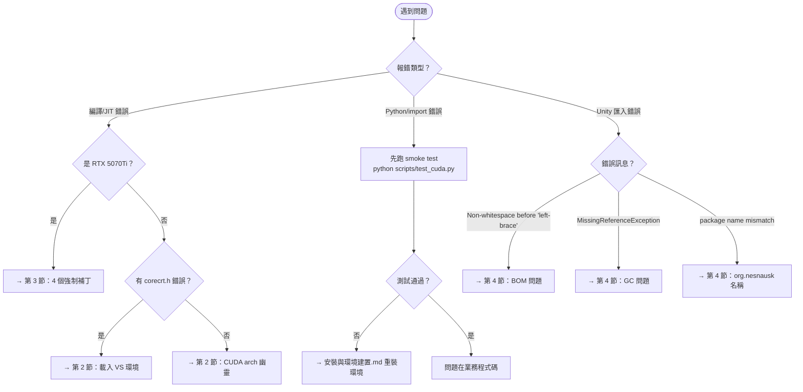
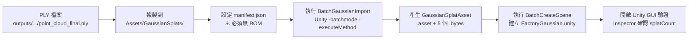

# 故障排查與急診室 (Troubleshooting)

> 狀態：Current  
> 用途：記錄常見的環境崩潰、編譯錯誤，以及為特規硬體（如 RTX 5070Ti Blackwell 架構）所特製的強制補丁。當開發出問題時先來這裡找藥。

## 1. 單一驗證防線 (Smoke Test)
當你懷疑環境爛掉時，不需要去檢查哪包套件的版本，只需執行這支煙霧測試腳本：
```powershell
# 如果這支報錯，不管缺什麼，一律捨棄修補，砍掉 .venv 照著 安裝與環境建置.md 重裝
python scripts/test_cuda.py
```

## 2. 症狀快速診斷樹

> 遇到問題時，先沿著下方決策樹走一遍，找到對應章節再深入處理。



## 3. 一般常見錯誤與解法

### 🩹 編譯丟失：`corecrt.h: No such file or directory` 或 `ninja: build stopped`
- **原因**：你的 Terminal 沒有載入 Windows SDK 以及 MSVC 的工具鏈路徑。單跑 `vcvars64.bat` 有時不會完美帶入所有 UCRT 路徑。
- **解法**：這是因為你用了普通的 PowerShell。請回頭參考 `安裝與環境建置.md`，在每一次啟動終端時，都用標準的迴圈加載腳本載入全套環境。

### 🩹 環境幽靈：`Unknown CUDA arch (120)` 
- **原因**：舊腳本或環境變數裡殘留了 `TORCH_CUDA_ARCH_LIST=12.0` 的設定，這並非合法值。
- **解法**：在 PowerShell 執行 `Remove-Item Env:TORCH_CUDA_ARCH_LIST -ErrorAction SilentlyContinue` 清掉全域變數後重試。

### 🩹 Unity 匯入地雷：`MissingReferenceException` / `manifest.json "Non-whitespace before {"`
- **原因**：BatchScript 在 CLI 模式會觸發底層 GC 清除物件；另外如果在 PowerShell 寫出帶有 BOM 的 UTF-8 檔案，會讓 Unity 解析直接罷工。
- **解法**：
  - Unity 報錯：清空 Unity 的 Library 暫存快取重新編譯腳本。
  - JSON 報錯：建立 `manifest.json` 時，必須在 PowerShell 腳本寫明白我們不要 BOM：`(New-Object System.Text.UTF8Encoding $false)`。

---

## 3. 🚨 RTX 5070 Ti (sm_120) 強制破解安裝紀錄
**背景**：RTX 5070 Ti 屬於 Blackwell 架構。當前的 `gsplat==1.5.3` 版本的 `setup.py` 並沒有原生支援此架構。
為了解決無法訓練的死局，專案採納了由社群與原作者實踐的 **「路線 A (PTX 降階編譯：`TORCH_CUDA_ARCH_LIST="9.0+PTX"`)」** 。

這絕對不是常規安裝。如果要在 sm_120 的機器上裝 gsplat，在執行完 `pip install gsplat==1.5.3` 但 **尚未呼叫任何訓練指令前**，必須先潛入 `.venv\Lib\site-packages\` 手動為底層打上以下 4 個救命補丁，否則 JIT 時必崩潰：

### 補丁 1：解除 CUDA 版本號硬性比對阻擋
- **目標檔案**：`.venv\Lib\site-packages\torch\utils\cpp_extension.py`（約 567 行）
- **症狀**：`RuntimeError: CUDA versions mismatch`

```python
# 找到這一行：
raise RuntimeError(CUDA_MISMATCH_MESSAGE.format(d, torch_version, cuda_str))

# 改成：
warnings.warn(f"CUDA version mismatch (d={d} torch={torch_version} toolkit={cuda_str}), ignored")
```

### 補丁 2：修補 VS Code ConPTY 的 stdin 句柄錯誤
- **目標檔案**：`.venv\Lib\site-packages\torch\utils\cpp_extension.py`（`_run_ninja_build` 函數，約 2807 行）
- **症狀**：`ninja: fatal: ReadFile: The handle is invalid`

```python
# 找到 subprocess.run() 的呼叫，加入 stdin=subprocess.DEVNULL：
subprocess.run(
    command,
    shell=IS_WINDOWS and IS_HIP_EXTENSION,
    stdout=stdout_fileno if verbose else subprocess.PIPE,
    stderr=subprocess.STDOUT,
    stdin=subprocess.DEVNULL,   # ← 新增這行
    cwd=build_directory,
    check=True,
    env=env)
```

### 補丁 3：修補 nvcc 指令在 Windows 的路徑跳脫
- **目標檔案**：`.venv\Lib\site-packages\torch\utils\cpp_extension.py`（約 3069 行）
- **症狀**：`CreateProcess failed: The system cannot find the file specified`

```python
# 原始（所有平台都用 POSIX 單引號）：
nvcc = shlex.join(_wrap_compiler(nvcc))

# 改成（Windows 用雙引號）：
nvcc_parts = _wrap_compiler(nvcc)
if IS_WINDOWS:
    nvcc = subprocess.list2cmdline(
        nvcc_parts if isinstance(nvcc_parts, list) else [nvcc_parts])
else:
    nvcc = shlex.join(nvcc_parts)
```

### 補丁 4：MSVC Compiler Flag 衝突強制拔除
- **目標檔案**：`.venv\Lib\site-packages\gsplat\cuda\_backend.py`
- **症狀**：`cl: D8021 '/Wno-attributes'` 或 `invalid combination of type specifiers: bool char`

```python
# 原始：
extra_cflags = [opt_level, "-Wno-attributes"]
extra_cuda_cflags = [opt_level]
if not NO_FAST_MATH:
    extra_cuda_cflags += ["-use_fast_math"]

# 改成：
import sys as _sys
extra_cflags = [opt_level]
if not _sys.platform == "win32":
    extra_cflags.append("-Wno-attributes")   # GCC/Clang only
extra_cuda_cflags = [opt_level]
if not NO_FAST_MATH:
    extra_cuda_cflags += ["-use_fast_math"]
if _sys.platform == "win32":
    extra_cuda_cflags += ["-DWIN32_LEAN_AND_MEAN", "-allow-unsupported-compiler"]
    extra_cflags     += ["/DWIN32_LEAN_AND_MEAN"]
```

---

## 4. 🎮 Unity 高斯點雲匯入 SOP

### 環境資訊
| 項目 | 版本 |
|------|------|
| Unity Editor | 6000.3.9f1 |
| 高斯套件 | `org.nesnausk.gaussian-splatting` |
| 輸入 PLY | `outputs/3DGS_models/ply/point_cloud_final.ply` |



### Step 1：設定 manifest.json（⚠️ 必須無 BOM）

```powershell
$PROJ = "C:\Users\User\Downloads\phase0\Unity\BendViewer"
$manifest = @'
{
  "dependencies": {
    "org.nesnausk.gaussian-splatting": "https://github.com/aras-p/UnityGaussianSplatting.git?path=package",
    "com.unity.render-pipelines.universal": "17.3.0"
  }
}
'@
# ⚠️ 必須用 UTF8Encoding($false)，Out-File 會加 BOM 造成 Unity 拒絕解析
[System.IO.File]::WriteAllText(
    "$PROJ\Packages\manifest.json",
    $manifest,
    (New-Object System.Text.UTF8Encoding $false)
)
```

### Step 2：Batch 匯入 PLY → GaussianSplatAsset

```powershell
$UNITY = "C:\Program Files\Unity\Hub\Editor\6000.3.9f1\Editor\Unity.exe"
$PROJ  = "C:\Users\User\Downloads\phase0\Unity\BendViewer"
Copy-Item "C:\3d-recon-pipeline\outputs\3DGS_models\ply\point_cloud_final.ply" `
          "$PROJ\Assets\GaussianSplats\" -Force
$proc = Start-Process $UNITY -ArgumentList `
    "-batchmode","-force-d3d12",`
    "-projectPath",$PROJ,`
    "-executeMethod","BatchGaussianImport.Run",`
    "-quit","-logFile","unity_setup\import_log.txt" -PassThru
$proc.WaitForExit(600000)
```

### 版本化匯入命名（避免覆蓋主線資產）

若要並存多個 Unity 高斯版本，不要再反覆覆蓋同名 `point_cloud_unity.asset`。正式做法是：

- 匯入來源：`Assets/GaussianSplats/<version>_point_cloud_unity.ply`
- 匯入結果：`Assets/GaussianAssets/<version>_point_cloud_unity.asset`
- 對應 bytes：`<version>_point_cloud_unity_*.bytes`

範例：

```powershell
pwsh -File scripts/run_unity_batch_import.ps1 `
  -SourcePly outputs\experiments\...\1_point_cloud_unity.ply `
  -UnityProject C:\Users\User\Downloads\phase0\Unity\BendViewer `
  -LogPath outputs\experiments\...\unity_import_1_point_cloud_unity.log `
  -AssetBaseName 1_point_cloud_unity
```

這會產生：
- `Assets/GaussianSplats/1_point_cloud_unity.ply`
- `Assets/GaussianAssets/1_point_cloud_unity.asset`
- `Assets/GaussianAssets/1_point_cloud_unity_*.bytes`

### Step 3：Batch 建立場景

```powershell
$proc = Start-Process $UNITY -ArgumentList `
    "-batchmode","-force-d3d12",`
    "-projectPath",$PROJ,`
    "-executeMethod","BatchCreateScene.Run",`
    "-quit","-logFile","unity_setup\create_scene_log.txt" -PassThru
$proc.WaitForExit(300000)
```

### ⚠️ 已知地雷一覽表

| 症狀 | 根本原因 | 解法 |
|------|---------|------|
| `Non-whitespace before {` | manifest.json 有 BOM | 改用 `UTF8Encoding($false)` |
| `MissingReferenceException: GaussianSplatAsset` | batch 模式 `NewScene()` 觸發 GC | `NewScene()` 後立即重新 `AssetDatabase.LoadAssetAtPath<>()` |
| `error CS1061: 'SplatCount' not found` | 屬性大小寫錯誤 | 改用 `splatCount`（小寫 s）|
| package 找不到 | manifest 用了 `com.aras-p`（README 有誤）| 必須用 `org.nesnausk.gaussian-splatting` |
| `UniversalAdditionalCameraData` 找不到 | batch 模式下 URP namespace 衝突 | 移除 `using UnityEngine.Rendering.Universal` |
| `Kernel 'InitDeviceRadixSort' not found` | 用 `-nographics` 啟動 Unity batch mode，導致 GaussianSplatting 的 compute shader / wave-ops kernel 無法正確建立 | **不要用 `-nographics`**；改用 `-batchmode -force-d3d12`，保留 graphics context |
| `C:\Program` not recognized / PowerShell 把路徑拆壞 | 用未加引號的完整路徑直接拼命令字串，空格把 `C:\Program Files\...` 拆成兩段 | 呼叫 PowerShell/Unity 時一律用 `Start-Process -FilePath ... -ArgumentList ...`，或 `& '完整路徑\pwsh.exe' -File '腳本.ps1'` |
| `InvalidOperationException: You are trying to read Input using the UnityEngine.Input class` | Unity 專案切到 Input System package，但 `OrbitCamera.cs` 仍使用舊 `Input.GetAxis / GetMouseButton` | 將 `OrbitCamera.cs` 改為同時支援 `UnityEngine.InputSystem` 與舊 Input；若臨時驗證，也可把 Player Settings 的 Active Input Handling 改成 `Both` |
| 在 Project 視窗點了新資產，但 Game 視窗沒切換 / 只看到天空 | 選中資產不等於把資產綁到 `FactorySplat`；此外舊視角可能已飄走 | 在 Unity 上方選單使用 `FactoryScene/2. 套用所選 Gaussian Asset 並重設視角`；它會把選中的 Gaussian asset 綁到 `FactorySplat`、關掉 `Directional Light`，再呼叫 `ReframeCamera` |

### 2026-04-19 補充：`MCMC 750k` 的 Unity runtime 阻塞已定位

- 已確認 `point_cloud_unity.ply` 匯出成功
- 已確認 `GaussianSplatBatchImport` 成功產生 `point_cloud_unity.asset` 與 5 個 `.bytes`
- `InitDeviceRadixSort` 不是 package 缺檔；`SplatUtilities.compute` 內實際存在該 kernel
- 真正問題是：**以 `-nographics` 啟動 Unity batch import 時，Gaussian Splatting runtime 找不到 compute kernel**
- 實測改成：
  - `-batchmode -force-d3d12`
  - **不加 `-nographics`**
  後，`FactoryGaussian.unity` 可成功開啟且不再報 `InitDeviceRadixSort`
- 因此當你看到這個錯誤時，優先檢查 Unity 啟動參數，而不是先懷疑 `.ply` 或 package 檔案本身

### 2026-04-20 補充：PowerShell 路徑含空格的正式啟動規則

- 根因：
  - 直接把 `C:\Program Files\PowerShell\7\pwsh.exe ...` 當成未加引號的單行字串時，PowerShell 會把 `C:\Program` 當成指令，導致命令在最外層就被拆壞
- 正式規則：
  - **腳本內部**：外部程式一律用 `Start-Process -FilePath ... -ArgumentList ...`
  - **臨時單行命令**：一律用 `& 'C:\Program Files\PowerShell\7\pwsh.exe' -File '...ps1'`
- 專案已修正：
  - [scripts/run_unity_batch_import.ps1](/C:/3d-recon-pipeline/scripts/run_unity_batch_import.ps1) 現在使用 `Start-Process -FilePath` 啟動 Unity，並用明確的 success marker 判斷匯入是否成功，不再依賴容易失真的 `$LASTEXITCODE`

## 5. 📏 絕對尺度校正（Scale Calibration）

COLMAP 預設只提供**相對尺度**。如果 Unity 場景要和真實折床機 1:1 對齊，必須在匯入前先算出 `1 COLMAP unit = X mm`。

### 正式工具

- [src/scale_calibrate.py](/C:/3d-recon-pipeline/src/scale_calibrate.py)

### 三種模式

1. `list`
- 列出低重投影誤差點，先挑可作為基準的 point3D IDs

```powershell
python -m src.scale_calibrate --mode list --max-err 1.0
```

2. `a4`
- 掃描時放一張 A4 紙，訓練後指定 2 或 4 個角點 ID 計算比例

```powershell
python -m src.scale_calibrate --mode a4 --ids 10 20 30 40
```

3. `ruler`
- 已知兩個點的真實距離（mm），直接算比例

```powershell
python -m src.scale_calibrate --mode ruler --ids 10 20 --real-mm 297
```

### 正式輸出

- `outputs/reports/scale_calibration.json`

內容包含：
- `scale_mm_per_unit`
- `scale_m_per_unit`
- `mode`
- `reference_ids`

### 套用方式

腳本會直接提示：

- `train_3dgs.py` 可用的 `--scene-scale`

也就是把 `scale_m_per_unit` 當成場景縮放係數，讓後續 PLY / Unity 匯入使用公尺尺度。

### 什麼時候一定要做

- 要把 PLY 放進 Unity 當正式場景
- 要做真實尺寸比對
- 要把 3DGS、碰撞體、DXF 或後續人機模擬放在同一個公尺座標系
