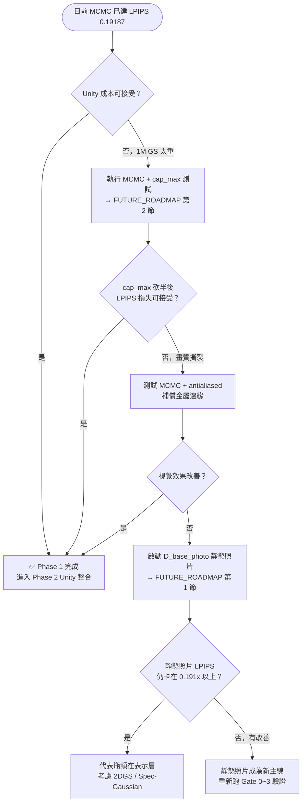

# 實驗未來藍圖與備用方案 (Future Roadmap)

> 狀態：Planned
> 用途：封存尚未啟動，但如果現有主線路線遇上死胡同時，可以立即調用的備份戰略計畫。

> **共同治理摘要**
> - 以目前專案結構與正式主線為準，不依單張圖片、單次對話、舊封存文件或舊路徑推斷架構。
> - 任務開始前先依 [文件導航.md](/C:/3d-recon-pipeline/文件導航.md) 路由，再讀 [專案願景與當前狀態.md](/C:/3d-recon-pipeline/專案願景與當前狀態.md) 的「當前狀態」與任務對應正式文件；需要主線總覽時再讀 [README.md](/C:/3d-recon-pipeline/README.md)。
> - 正式來源只有 9 份文件（8+1）；舊中文文件與 `docs/experiments/` 不再作為正式決策依據。
> - 生產層：`C:\3d-recon-pipeline`；決策層：`D:\agent_test`；正式接口只看 `outputs/agent_events/latest_*_complete.json` 與 `outputs/agent_decisions/latest_*_decision.json`。
> - 長任務必須開可見終端；PowerShell 空格路徑只用 `Start-Process -FilePath` 或 `& '完整路徑'`；coverage 只看正式主線六模組；修改前先列保留 / 刪除 / 歸檔建議。

## Agent V1 演進路線

> 這一節處理的不是生產層功能擴張，而是「決策層如何在不反客為主的前提下，逐步升級成可持續優化的輔助系統」。

### 正式目標

- agent 仍是**輔助生產層**，不是專案主體。
- 核心只管理：`state / event / candidate / decision / feedback / audit`。
- 地圖建立、人行為、機器狀態、DXF 等 domain 細節後續都應以 strategy packs 擴充。

### V1 必做順序

1. 定義 5 個核心 schema：
   - `current_state`
   - `event`
   - `candidate`
   - `arbiter_decision`
   - `outcome_feedback`
2. 把目前地圖建立規則收斂成第一個 `map_building` strategy pack。
3. 建立單一 arbiter，限制正式 outbox 只能有一個裁決來源。
4. 建立 feedback 回圈，讓每輪實驗能回饋到下一輪候選排序。
5. 由外部對話框 AI 作為 `meta evaluator`，檢查是否真的更收斂。

### PyTorch 學習器（已啟動但未升格）

- 決策層已新增 `D:\agent_test\adapters\pytorch_decision_model.py`。
- 它的定位不是正式 `arbiter`，而是**離線學習器**：
  - 輸入：`outcome_feedback.json`
  - 特徵：`psnr / ssim / lpips / num_gs / decision / source_module / problem_layer / can_proceed` 等結構化欄位
  - 目標：預測 `decision_useful`
- 2026-05-05 現況：
  - audit root 共 `9` 筆 feedback
  - 可訓練標籤 `8` 筆
  - 離線訓練 accuracy 可達 `1.0`
- 這代表目前資料量太小，屬於**明顯過擬合風險**，所以：
  - 可用於驗證 feature 設計與資料管線
  - 不可直接接手正式 `arbiter`
  - 後續至少要先累積更多人工標籤與多輪 outcome，才討論是否變成 advisory score

### Coverage 輔助層

- 在決策層新增 `CoverageStrategy`，但它只做 coverage finding / candidate 生成，不直接改主線。
- coverage 正式口徑仍只看六個主線模組；任何把 `outputs`、`scripts`、`gsplat_runner`、`unity_setup` 混入的做法都視為偏離主線。
- 正式主線保護應由 CI hard gate 承擔，例如 branch coverage、diff coverage、required status checks。
- 外部對話框 AI 則審查：coverage 機制是否真的讓正式主線更穩，而不是只追數字。

### 五個核心 Schema 草案

- `current_state`
  - 決策層的唯一正式狀態摘要；至少包含 `phase / active_pack / current_best / next_focus / allowed_actions / blocked_actions / blacklist / source_docs / updated_at`。
- `event`
  - 生產層剛完成的事實；至少包含 `event_id / run_id / stage / pack / status / run_root / artifacts / metrics / evidence / timestamp / source_contract`。
- `candidate`
  - strategy module 提出的單一候選；至少包含 `candidate_id / source_module / scope / proposal_type / title / rationale / params / expected_gain / expected_risk / estimated_cost / blocked_by / evidence / confidence`。
- `arbiter_decision`
  - arbiter 的唯一正式輸出；至少包含 `decision_id / state_ref / event_ref / selected_candidate_id / rejected_candidate_ids / decision / reason / next_action / can_proceed / requires_human_review / written_at`。
- `outcome_feedback`
  - 已執行決策的回饋；至少包含 `feedback_id / decision_ref / run_id / outcome_status / observed_metrics / observed_artifacts / drift_vs_expectation / lessons / update_targets / recorded_at`。

### Schema 使用原則

- 核心 schema 只定義抽象決策流程，不攜帶 map-building 專用 heuristics。
- phase-specific 細節只能出現在 pack 自己的 `metrics / evidence / params` 內。
- `latest_*_decision.json` 只能代表 `arbiter_decision`，不可混入候選池。
- `outcome_feedback` 只能回饋，不可直接改寫正式 `current_state`。

### 現有 `agent_test` 對照切分

- **核心候選**
  - `run_phase0.py`
  - `src/phase0_runner.py`
  - `src/coordinator.py` 中的 contract intake / decision outbox / audit 路徑管理
  - `src/candidate_pool.py`
  - `src/arbiter.py`
  - `src/current_state.py`
  - `src/shared_decision_mapper.py`
  - `src/outcome_feedback.py`
- **`map_building` pack 候選**
  - `agents/phase0/pointcloud_validator.py`
  - `agents/phase0/map_validator.py`
  - `agents/phase0/production_param_gate.py`
  - `agents/phase0/unity_param_gate.py`
  - `agents/phase0/unity_importer.py`
  - `agents/phase0/recovery_advisor.py`
  - `agents/phase0/phase_reporter.py`
- **目前缺口**
  - `current_state` 已初步一級化為 `current_state.json`，但仍是 phase0 / map-building 專用摘要
  - `candidate` 已初步形成 `candidate_pool.json`，但 pack-specific `params / evidence / cost` 仍未深化
  - `arbiter_decision` 已初步獨立為 `arbiter_decision.json`，但 arbiter 仍是 phase0 專用
  - `outcome_feedback` 已初步形成 `outcome_feedback.json`，但尚未回饋到下一輪 candidate ranking
- **正式下一步**
  - 已完成 `coordinator.py` / `map_building_pack.py` 切分，並抽出 `candidate_pool.py` / `arbiter.py` / `current_state.py` / `shared_decision_mapper.py` / `outcome_feedback.py`；下一步是讓 feedback 影響 candidate ranking，並逐步把 arbiter 拉向 pack-agnostic，仍不先動 map-building heuristics 細調。

### 明確禁止

- 不直接把 `LPIPS`、`cap_max`、Unity 霧化等 map-building heuristics 寫死進 agent 核心。
- 不讓多個 strategy module 直接改主線或覆寫 `latest_*_decision.json`。
- 不讓決策層 hook / validator 反向阻塞生產層主流程。

### 工程債治理候選（未啟動）

> 下列項目只作為重構候選，不代表已決定改寫。任何項目要升格，必須先提出受影響檔案、fixture、coverage 目標與回退方式。

1. **影像處理共用化**
   - 候選範圍：`src/preprocess_phase0.py` 內 CLAHE、gamma correction、高光抑制等影像處理函式。
   - 判斷原則：可以先抽成小型 helper 並補測試；不應為了形式統一而引入大型新依賴。
   - 風險：若改動影像像素處理，必須重跑 Gate 0 / Gate 1，不得只看單元測試。
2. **品質度量 API 收斂**
   - 候選範圍：`preprocess_phase0.py` 的 Laplacian 指標、3DGS eval metrics、`D:\agent_test\adapters\adaptive_threshold.py` 的歷史指標。
   - 判斷原則：可規劃 `MetricsEngine`，但 CPU/GPU 混用需以實測決定；不得預設 GPU 一定更快。
   - 風險：不同階段的 metric 語義不同，不能只因名稱相似就合併。
3. **JSON / contract schema 收斂**
   - 候選範圍：`src/utils/agent_contracts.py`、`D:\agent_test\src\coordinator.py`、`D:\agent_test\adapters\adaptive_threshold.py`。
   - 判斷原則：優先抽出共用 loader 與 schema validation；可考慮 Pydantic，但要先確認依賴、啟動時間與現有 contract 相容。
   - 風險：schema 一旦嚴格化，舊 event / decision 可能讀不進來，必須保留遷移策略。
4. **COLMAP 呼叫方式收斂**
   - 候選範圍：`src/sfm_colmap.py` 的 feature / matching / mapper subprocess 流程。
   - 判斷原則：先評估 `colmap automatic_reconstructor` 是否能保留目前所有參數與報告；`pycolmap` 只能作為候選，不得直接替換主線。
   - 風險：目前分段 subprocess 雖然冗長，但可分段診斷；合併成單命令可能降低故障定位能力。
5. **生產層 / 決策層 contract 明確化**
   - 候選範圍：`latest_*_complete.json`、`latest_*_decision.json` 與 `D:\agent_test` 五個核心 schema。
   - 判斷原則：這是最值得優先推進的重構候選；先從 fixture 與 schema test 開始，再逐步導入 runtime validation。
   - 風險：不得讓決策層 schema 反向阻塞生產層，生產層 hook 失敗仍只能降級警告。

## 備用計畫啟動決策樹

> 下方決策樹明確定義「什麼條件下才啟動備用計畫」，避免過早放棄主線。

---

## 1. 備用資料層計畫：靜態照片極限測試 (`D_base_photo`)

### 動機 (Motivation)
目前所有的 L0 努力都建立在「影片抽幀 (Video -> Frames)」的基礎上。我們懷疑現有 `U_base` 逼近 `LPIPS 0.191` 後，剩下的誤差可能是由於「動態影片連拍」本質上存在著無可避免的快門微模糊與壓縮假影。

### 實驗設計 (The Plan)
如果我們連下一階的 `L0-S2` (Semantic ROI 選幀) 都無法進一步壓低 LPIPS，我們將暫停對影片抽幀演算法的死嗑，轉向建構一組純靜態照片。
- **資料來源**：`120 ~ 220` 張針對折床機的「固定相機、靜態補光、禁止自動變焦」的高畫素精緻照片。
- **對照目標**：跑完全相同流程的 `SfM -> 3DGS (MCMC)`，純粹看看在「完全沒有擷取模糊」的最理想資料流下，這套 3DGS 引擎的天花板到底在哪裡？
- **判斷基準**：若這組完美的 `D_base_photo` 依舊卡在 `0.191` 甚至 `0.205x`，那就證實了**問題的本質出在模型表示層 (Representation) 而不是輸入的資料層**。這將成為重大轉折，代表我們後續就該考慮徹底放棄標準 3DGS，轉投 2DGS 或 Spec-Gaussian 等其他架構。

## 2. Unity 效能與視覺平衡測試 (Phase 2)
隨著 MCMC 的發威將點雲推放至全域邊界的 1,000,000 顆，我們在將產生的 `.ply` 依賴 Batch Scripts 轉進 Unity 時，將開展以下 A/B 效能平衡測試：
1. **Cap_max 成本折衷測試**：目前已知 `750k` 是可接受折衷版，`500k` 太激進；後續 Unity 驗證應以 `750k` 為主，而非再往更低 cap 盲目壓縮。
2. **Antialiased 補償測試**：`MCMC + antialiased (750k)` 已完成 full train，結果為：
   - `PSNR 26.1582 / SSIM 0.8810 / LPIPS 0.19529 / num_GS 750,000`
   - 明確優於 `750k plain`，但仍未打贏 `1M`
   - 最新 Unity 單視角人工觀察顯示：主體已更可辨識，但仍有霧化、高光 halo 與拖影，因此尚未正式通過部署品質門檻
   - 因此它已升格為目前**最新 Unity 候選部署版**，但仍在驗證中
3. **Export-side probe 結論（2026-05-06 已完成）**：
   - `max-scale-percentile=99.5`：幾乎無效，未能明顯改善白霧 / halo / 拖影
   - `min_opacity=0.01`：明顯降低 splat 數與成本，但畫質仍未通過，且畫面更破碎
   - 因此目前可正式判定：`750k + antialiased` 的 Unity 視覺問題，**不是 export-side 小過濾就能補救**
4. **當前下一步**：不再回頭重跑已否決的 `GLOMAP + MCMC` / `ALIKED + LightGlue + MCMC`，也不再延伸 `min_opacity / percentile` 小矩陣；正式轉入 **reflection-aware / specular-aware 3DGS framework evaluation**

> 正式 runner 已支援以 `python -m src.train_3dgs --train-mode mcmc --cap-max N` 控制 MCMC 的高斯上限，供 Gate 2 / Gate 3 成本測試使用。
> 目前也已支援：
> - `--mcmc-min-opacity`
> - `--mcmc-noise-lr`
> 供後續針對 floater / 霧化 / relocation 強度做正式 probe。
> 若要直接跑可見終端的 full train，可用 `scripts/run_u_base_mcmc_capmax_fulltrain.ps1 -CapMax N`。
> 目前策略已收斂成：`1M` 保留作離線品質 benchmark；`750k + antialiased` 作最新 Unity 候選部署版。

## 3. Unity 絕對物理尺度校正 (Absolute Scale Calibration)
COLMAP 預設輸出的是「相對尺度」。為了讓數位孿生與現實機台 1:1 吻合，必須實施尺度校正：
- **標準作法 (A4 校正法)**：於相機掃描前，在機台前方放置一張標準 A4 紙 (210×297mm) 或精準尺寸的棋盤格。
- **轉換**：訓練完成後，測量 A4 紙在 COLMAP 點雲中的像素/單位距離，算出絕對 `Scale Factor` (1 COLMAP Unit = X mm)，並直接在 Unity 中匯入時縮放比例，藉此消弭 T12 的 Sim-to-Real Gap。

> 實際操作與 JSON 輸出格式見 [docs/故障排查與急診室.md](/C:/3d-recon-pipeline/docs/故障排查與急診室.md) 的尺度校正章節。

## 4. 2DGS / Spec-Gaussian 的定位

這兩條不是當前主線，而是**表示層升級**候選，只有在 `MCMC + cap_max / antialiased` 與資料源升級都無法滿足需求時才啟動。

### 2DGS 的正式定位

- 主要用途不是取代目前的 Unity 高斯底圖流程
- 它更適合：
  - 需要更穩幾何邊界時的工件重建
  - 需要 mesh / surface 輸出時的幾何驗證
  - 當作尺寸量測、scale 校正、碰撞體生成的候選工具

也就是：

- `gsplat + MCMC`
  - 目前仍是靜態場景底圖主線
- `2DGS`
  - 比較像幾何層工具或替代表示層，不直接預設升格為主線

### Spec-Gaussian 的正式定位

- 針對金屬高光、鏡面反射、各向異性外觀的表示層升級
- 問題對題，但工程整合成本高於目前官方 `gsplat mcmc preset`
- 因此它屬於：
  - `MCMC` 與資料層升級都不足時才啟動的高成本候選

### 啟動條件

只有當下列條件同時成立，才應該把 2DGS / Spec-Gaussian 升成真正實驗：

- `MCMC` 主線已無法再平衡畫質與成本
- 靜態照片 `D_base_photo` 仍無法突破當前上限
- 問題被判定為表示層，而不是資料層或管線層

## 5. Reflection-aware / Specular-aware 3DGS framework evaluation

這一節只在現有主線已完成下列事實後啟動：

- `1M MCMC` 已作為離線品質 benchmark 保留
- `750k + antialiased` 已作為最佳 Unity 候選版驗證
- export-side probe（`max-scale-percentile`、`min_opacity`）已驗證完畢，無法把畫質提升到可交付門檻

### 啟動理由

目前證據已經指向：

- 問題主因不像單一 `MCMC` 小參數
- 也不像 Unity / export 端能用簡單後處理救回
- 更像是現有 `gsplat + Unity GaussianSplatting` 對金屬高反光、強 view-dependent 外觀的表示上限

### 正式評估目標

下一條框架候選必須直接回答這個問題：

- 是否能把金屬反光從「白霧 / halo / 拖影」轉成更穩定的 view-dependent 表達
- 是否能在 Unity 端保持比現有候選更自然的金屬外觀
- 是否仍保留可接受的訓練成本、匯出成本與 Unity 接入成本

### 優先級

1. **Specular-aware / reflection-aware Gaussian**
   - 直接對準金屬高反光與 view-dependent 外觀問題
2. **Material-aware / PBR-aware Gaussian**
   - 若第一類沒有可用實作，再評估材質 / 反射屬性更完整的表示層
3. **新的 SfM / MVS 前端**
   - 只有在重新檢查後確認幾何前端本身不穩時才啟動

### 明確禁止

- 不得把這一節當成「立刻切主線」
- 不得在沒有小規模可重現 probe 前，直接重寫正式 `train_3dgs.py`
- 不得因網路上的 `YOLO / inverse rendering / SuperSplat` 類方向詞，就跳過本專案既有正式證據

### 正式第一步

新框架評估啟動時，第一輪只做：

- 候選 repo / framework 篩選
- 輸入輸出格式與 Unity 接入成本盤點
- 最小可跑 probe 設計

不直接進入 full migration。

### 第 1 輪候選盤點（2026-05-06）

> 這一輪只盤點「有 repo / 有 paper / 有最小 probe 可能性」的候選，不把方向詞直接寫成正式方案。

| 候選 | 類型 | 為何值得看 | 對目前問題的對準度 | Unity / 工程接入成本 | 第 1 輪判定 |
|------|------|------------|--------------------|----------------------|-------------|
| [`gapszju/3DGS-DR`](https://github.com/gapszju/3DGS-DR) | reflection-aware Gaussian | 直接把 deferred reflection 納入 Gaussian 表達，明確對準 specular 問題 | 高 | 高 | **第 1 優先 probe 候選** |
| [`city-super/Scaffold-GS`](https://github.com/city-super/Scaffold-GS) | 幾何/結構強化的 3DGS 變體 | repo 成熟、仍沿用 `images + sparse/0` 自訂資料結構，整合風險低於重寫 specular renderer | 中等：可改善 challenging views，但不保證直接解金屬反光 | 中 | **第 2 優先 probe 候選** |
| [`hbb1/2d-gaussian-splatting`](https://github.com/hbb1/2d-gaussian-splatting) | 幾何邊界更穩的表示層 | 對工件邊界、幾何穩定與 surface 感較友善 | 中等偏低：比較像幾何 fallback，不是直接解 view-dependent 反光 | 中到高 | **保留為第二梯隊** |
| [`Asparagus15/GaussianShader`](https://github.com/Asparagus15/GaussianShader) | material / shading-aware Gaussian | 將著色函式顯式化，理論上更接近金屬/PBR 外觀 | 高 | 很高 | **保留為高成本候選** |
| [`ingra14m/Specular-Gaussians`](https://github.com/ingra14m/Specular-Gaussians) | specular / anisotropic Gaussian | 直接針對鏡面與各向異性外觀 | 高 | 很高 | **保留為高成本候選** |
| [`ndming/GS-2M`](https://github.com/ndming/GS-2M) | material-aware Gaussian + mesh | 對材質分解與高保真 mesh 有吸引力，但離現有 Unity 直接接入更遠 | 中到高 | 很高 | **保留為後續高成本候選** |

### 本輪排除與降級

- `GART`
  - 更偏 articulated / dynamic 場景與分解，不是目前靜態折床地圖主線的第一優先。
- `GS-MVS / Dust3R / MAV3D` 類
  - 只有在重新確認 `SfM` 前端幾何本身不穩時才啟動；目前主問題不是 `COLMAP` 掛掉，而是 `3DGS + Unity` 視覺失敗。
- `YOLO / inverse rendering / Diff-YOLO`
  - 屬於未來 Phase 2 感知層，不屬於當前 Phase 1 地圖建立主線。

### 第 1 輪最小 probe 順序

1. **先查 `3DGS-DR / reflection-aware Gaussian` 類**
   - 先以 `gapszju/3DGS-DR` 為唯一入口
   - 看輸入是否仍能沿用目前 `COLMAP / camera pose / image folder`
   - 看輸出是否仍可轉成 Unity 可接受資產
2. **再查 `Scaffold-GS`**
   - 先以 `city-super/Scaffold-GS` 為唯一入口
   - 作為較低整合風險的對照候選
   - 若 reflection-aware 類完全不可落地，Scaffold-GS 是第一個可實跑 fallback
3. **最後才查 `2DGS / GaussianShader / Specular-Gaussians / GS-2M`**
   - 這些不是不值得，而是整合成本更高，不適合作為第 1 支真正下場的 probe

### `3DGS-DR` 最小 probe 設計（第 1 優先）

#### 為什麼先選它

- 它直接對準目前最痛的問題：
  - 金屬高反光
  - view-dependent 外觀
  - Unity 端白霧 / halo / 拖影
- 相較於完全改成 mesh / PBR / inverse rendering，它更接近目前 Gaussian 表示層語境。

#### 本地相容性初查

- 目前正式主線訓練輸入會為每個 run 建立：
  - `_colmap_scene/images`
  - `_colmap_scene/sparse/0`
- `train_3dgs.py` 目前的 `_ensure_scene_dir()` 已明確保證這個結構。
- 因此任何仍接受 **COLMAP scene format** 的候選，都有機會直接沿用現在的資料準備流程，不必先重寫 `sfm_colmap.py`。

#### 第 1 輪 probe 目標

只回答三個問題：

1. 是否能直接吃目前 `_colmap_scene/images + sparse/0`
2. 是否能在不改正式 `src/train_3dgs.py` 的情況下獨立訓練
3. 輸出是否至少能轉回 `.ply` 或等價可比格式，供 Unity 端做第一輪肉眼驗證

#### 第 1 輪 probe 的工程邊界

- **不改**正式 `src/train_3dgs.py`
- **不改**正式 `src/export_ply.py`
- **不改**正式 `src/export_ply_unity.py`
- 若要下場，只能：
  - 新增獨立 launcher / script
  - 新增獨立 outputs root
  - 新增獨立實驗記錄

#### 第 1 輪成功條件

- 能在本機建立最小可跑環境
- 能讀入目前主線 `_colmap_scene`
- 能完成至少一輪短 probe（不要求 full train）
- 能產生可比較輸出（影像 / 指標 / 點雲或等價資產）

#### 第 1 輪失敗條件

只要出現下列任一，即暫停 `3DGS-DR`，轉進 `Scaffold-GS`：

- 資料格式不相容，需要重寫 `SfM` 或資料轉換主線
- 輸出格式完全無法回到現有 Unity 比較鏈
- 安裝依賴與本機 CUDA / Windows 環境明顯衝突
- 需要大改 renderer 或 package，超出「最小 probe」範圍

#### `3DGS-DR` 可落地性審計結果（2026-05-06）

- **資料入口**
  - 目前 repo README 明確說明它建立在 vanilla 3DGS tutorial 之上，並要求先能跑 vanilla 3DGS。
  - 我方目前正式主線每個 run 都會建立：
    - `_colmap_scene/images`
    - `_colmap_scene/sparse/0`
  - 因此在**資料結構層**，`3DGS-DR` 有機會直接沿用現有 `COLMAP` 場景，不需要先重寫 `sfm_colmap.py`。
- **依賴層**
  - `3DGS-DR` 依賴的是 vanilla 3DGS 生態：
    - `cubemapencoder`
    - `diff-gaussian-rasterization_c3`
    - `diff-gaussian-rasterization_c7`
    - `simple-knn`
  - 這與目前本專案使用的 Berkeley `gsplat` 主線不同，不是同一套 rasterizer / trainer。
  - 因此它**不能直接併入**現有 `train_3dgs.py`；若要驗證，必須走獨立環境與獨立 launcher。
- **輸出層**
  - README 明確提供的是：
    - `eval.py --model_path ...`
    - `net_viewer.py --model_path ...`
  - 目前沒有正式文件證據顯示它可直接輸出我方現行 Unity 匯入鏈所需的 `.ply + bytes` 資產格式。
  - 因此若要下場，必須預設：
    - 第 1 輪先驗證訓練與 eval
    - Unity 對接屬於第 2 輪額外工作，不假設天然相容
- **自訂 real scene 前提**
  - README 明寫 real scene 為了讓 environment lighting 生效，可能需要額外提供反光主體的球域（`env_scope_center` / `env_scope_radius`）。
  - 這表示它不是「餵進資料就跑」；對真實金屬場景還需要額外場景先驗。

#### 正式判定

- `3DGS-DR` 目前**值得保留為第 1 優先研究候選**，因為它在問題定義上最對題。
- 但它**不適合直接進入本專案正式主線 probe**，原因是：
  - 依賴棧與目前 `gsplat` 主線不同
  - Unity 匯出鏈沒有現成相容證據
  - real scene 額外需要 environment scope 先驗
- 因此它的正式定位是：
  - **可研究，但先不安裝、不切主線**
  - 若之後真的啟動，應先做獨立 sandbox / fork 級別的小型驗證
- 在此之前，較低整合風險的第一個可實跑 fallback 仍是 `Scaffold-GS`

### `Scaffold-GS` 最小 probe 設計（第 1 個可實跑 fallback）

#### 為什麼接在 `3DGS-DR` 後面

- 它不一定像 `3DGS-DR` 那樣直接對準 specular / reflection 問題。
- 但它在工程上更接近「可以真的下場驗證」：
  - custom data 入口清楚
  - 與 `images + sparse/0` 佈局相容
  - 至少保留 `point_cloud.ply` 類輸出入口

#### `Scaffold-GS` 可落地性審計結果（2026-05-06）

- **資料入口**
  - 官方 custom data 範例要求：
    - `images/`
    - `sparse/0/`
  - 這與我方目前 run 內 `_colmap_scene` 直接對齊。
  - 因此它在**資料格式層**比 `3DGS-DR` 更容易直接拿現成 run 來做最小 probe。
- **依賴層**
  - 官方基線偏向 Linux / conda / CUDA 11.6。
  - 這與我方 `Windows + venv + CUDA 12.8` 主線不一致。
  - 但相較於 `3DGS-DR` 額外牽涉 reflection-specific rasterizer 與 environment lighting 先驗，`Scaffold-GS` 的整合風險較低。
- **輸出層**
  - 官方 viewer checkpoint 結構包含：
    - `point_cloud/point_cloud.ply`
    - 多個 `*_mlp.pt`
    - `cfg_args`
    - `cameras.json`
  - 這代表它不是完全黑箱格式；至少存在可見的點雲入口，利於後續研究是否能回接 Unity 比較鏈。
- **問題對準度**
  - 官方描述對 challenging views、specularity、reflection、texture-less regions、fine-scale details 有改善。
  - 雖然不像 `3DGS-DR` 那樣直接以 reflection-aware 為主軸，但仍比 vanilla 3DGS 更對準我方場景。

#### 正式判定

- `Scaffold-GS` 是目前**第一個值得真正下場做最小 probe 的 fallback**。
- 它的優勢不是理論最強，而是：
  - 資料格式對齊現有 `_colmap_scene`
  - custom data 流程清楚
  - 至少保留 `point_cloud.ply` 輸出入口
  - 不需要像 `3DGS-DR` 那樣先引入 environment scope 額外先驗
- 它的限制也必須寫清楚：
  - 官方驗證平台仍偏 Linux / conda，不是我方現在的正式 Windows 主線
  - 不能預設與現有 Unity 匯入鏈天然相容
  - 若要啟動，仍應先在獨立 sandbox / fork 中驗證，不得直接污染正式 `gsplat` 主線

#### 真正要啟動時的第 1 輪範圍

只做四件事：

1. 建獨立 sandbox
2. 直接複製現有 `_colmap_scene` 作為 custom data
3. 跑單場景最小 probe
4. 驗證：
   - 能否成功 train
   - 能否成功 render / metrics
   - `point_cloud.ply` 是否可導回現有 Unity 比較鏈
