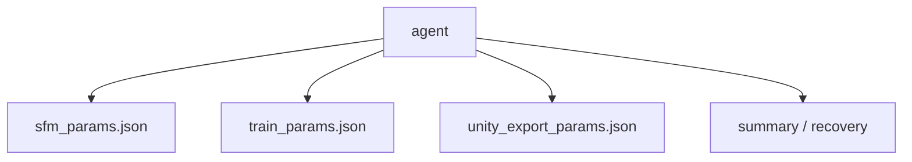
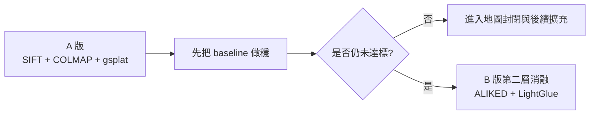
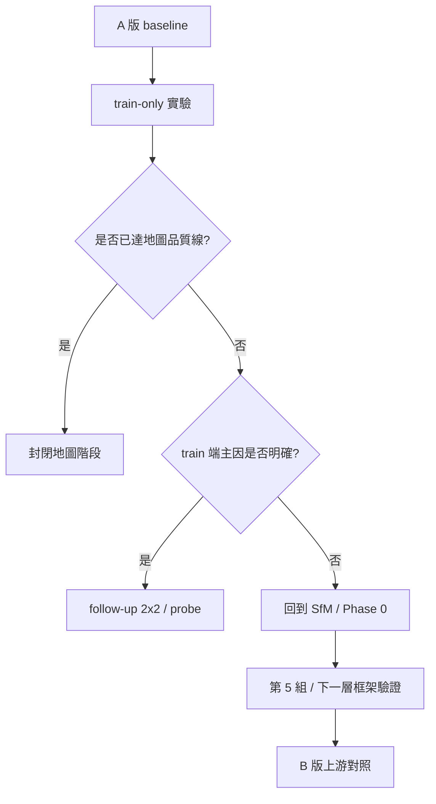
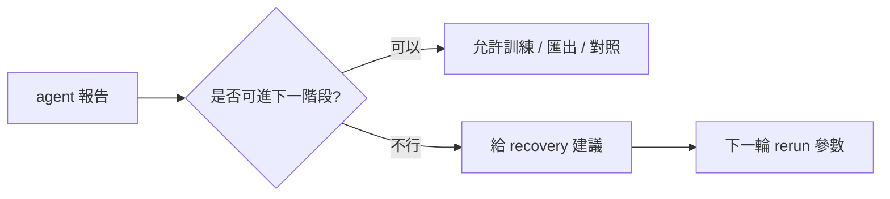
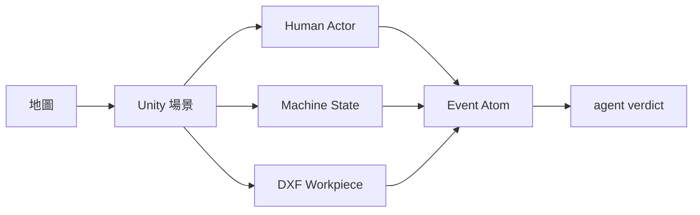

# 地圖優先開發說明書

> ⚠️ **封存文件（Archived）**
>
> 本文件已不再是正式來源。正式來源請改讀新 9 份文件（8+1）：
> - 導航：`文件導航.md`
> - 主說明：`README.md`
> - 狀態唯一來源：`專案願景與當前狀態.md`
> - 其餘正式參考：`AI代理作業守則.md` 與 `docs/` 下 5 份文件
>
> 本文件目前只保留作為歷史決策與遷移來源，不應再用來覆蓋新文件內容。

## 1. 文件定位

本文件用來定義本專案現階段的主軸：

**先把地圖建立、驗證、對照做完整，再談人類模擬、機器狀態模擬、DXF 工件與事件化擴充。**

這份文件是目前階段的執行基準，不是最終總體藍圖。  
後續 Unity 人類、機台狀態、DXF、事件化證據鏈，屬於第二階段擴充。

---

## 2. 當前核心目標

目前第一優先工作不是硬體整合，也不是即時事件判斷，而是：

1. 建立可用的工站地圖
2. 驗證地圖品質
3. 建立可重跑的 A/B 對照流程
4. 讓 agent 系統介入地圖建立與訓練決策

換句話說，現階段的主線是：

`video -> 抽幀 -> L0 照片清洗/選幀 -> SfM -> 3DGS -> 匯出/檢視 -> A/B 對照 -> agent 報告`

---

## 3. 當前輸入與正式工作資料

目前正式工作影像集為：

- `data/frames_1600`

說明：

- 這批影像是目前地圖建立的正式輸入
- 單張影像約為 `1600 x 900`
- 現階段地圖重建、A/B 對照、agent rerun 都以這批影像為主
- 但正式主線已不再把它視為「抽幀後直接可用」，而是視為 `L0` 清洗/選幀的工作集

現階段不以下列資料當主線：

- `data/frames_cleaned`
  - 作為保留資料，可回退使用
- `data/viode`
  - 作為影片來源保留，但不是目前主線直接輸入

---

## 4. 當前正式主線

### 4.1 生產層主線

目前正式主線腳本：

- `src/preprocess_phase0.py`
- `src/sfm_colmap.py`
- `src/train_3dgs.py`
- `src/export_ply.py`
- `src/export_ply_unity.py`

用途：

- `preprocess_phase0.py`：影片抽幀與候選影像集生成
- `sfm_colmap.py`：特徵提取、matching、mapper、SfM 驗證
- `train_3dgs.py`：以 SfM 結果做 3DGS 訓練
- `export_ply.py`：輸出最終 PLY
- `export_ply_unity.py`：輸出 Unity 用 PLY / preview 版本

### 4.1A `L0` 正式定位

`L0` 指的是：

- 影片抽幀後的照片清洗
- ROI-aware 選幀
- 在不改動後段主線的前提下，提高輸入有效性

目前 `L0` 不再視為附加實驗，而是影片主線中的正式分層。  
正式設計與快速驗證 protocol 見：

- [Phase0_v2_ffmpeg_agent_設計草案.md](/C:/3d-recon-pipeline/docs/experiments/Phase0_v2_ffmpeg_agent_設計草案.md)

### 4.2 agent 主線

目前 agent 的定位是：

**介入地圖建立與訓練決策，而不是只做事後報告。**

當前 agent 介入重點：

- 在 rerun 前產生 `sfm_params.json`
- 在 SfM 完成後產生 `train_params.json`
- 在 Unity 匯出前產生 `unity_export_params.json`
- 對每次 run 產生 summary 與 recovery 建議

目前 agent 相關主入口：

- `D:\\agent_test\\run_phase0.py`
- `D:\\agent_test\\run_agent_rerun_cycle.py`

---

## 5. 當前專案狀態

### 5.1 已完成

- Windows 環境已可成功進行 `gsplat` 訓練
- train-only 第一輪矩陣已完成
- 上游 `2x2`（`Phase 0 x SfM`）已完成
- `ffmpeg full-chain` 第一輪已完成
- `GLOMAP` 第一輪 end-to-end 驗證已完成
- route 3 baseline `hloc + SuperPoint + LightGlue` 第一輪 end-to-end 驗證已完成
- route 3 第二層消融 `hloc + ALIKED + LightGlue` 第一輪 end-to-end 驗證已完成
- `Mask Route A` 第一輪三個變體 `A1 / A2 / A3` 已完成
- agent 已可介入地圖建立與訓練參數決策
- A 路線目前已找出較穩的 frozen train baseline

### 5.2 最新結果

目前四組上游結果如下：

| 組別 | 影像數 | SfM | 3DGS |
|------|------:|-----|------|
| `U_base` | `853` | `154,502 points3D` | `PSNR 25.3986 / SSIM 0.8718 / LPIPS 0.2049 / num_GS 684,641` |
| `U_phase0` | `313` | `71,790 points3D` | `PSNR 25.2912 / SSIM 0.8705 / LPIPS 0.2057 / num_GS 686,899` |
| `U_sfm` | `853` | 失敗 | 未進 train |
| `U_phase0_sfm` | `313` | `83,999 points3D` | `PSNR 25.2976 / SSIM 0.8711 / LPIPS 0.2054 / num_GS 677,233` |

Mask Route A 第一輪結果如下：

| 組別 | SfM | 3DGS |
|------|-----|------|
| `A1_highlight_mask` | `853 / 853` 註冊，`153,798 points3D` | `PSNR 25.2752 / SSIM 0.8709 / LPIPS 0.2058 / num_GS 677,421` |
| `A2_machine_roi` | `847 / 853` 註冊，`151,250 points3D` | `PSNR 25.2680 / SSIM 0.8702 / LPIPS 0.2064 / num_GS 670,214` |
| `A3_combined` | `853 / 853` 註冊，`153,401 points3D` | `PSNR 25.2788 / SSIM 0.8705 / LPIPS 0.2060 / num_GS 673,093` |

### 5.3 目前判讀

目前最穩的結論是：

- `U_base` 仍是目前 `DefaultStrategy` 主線基準
- 現有 `data/frames_1600` 仍比這版 `curated phase0` 更穩
- `U_sfm` 證明激進 SIFT / matching 參數在 `853` 張全量上會破壞 mapper 穩定性
- `U_phase0_sfm` 只帶來增量改善，仍未超越 `U_base`

也就是說：

**目前沒有單點翻盤，只有多個因子各自帶來小幅影響。**

補充判讀：

- 已完成的 end-to-end 路線，`LPIPS` 幾乎都收斂在 `0.205x`
- 目前看不到只靠同族 `Phase 0 / SfM / train` 微調就能明顯跌破這個區間的證據
- route 3 兩層消融都已完成，且整體仍未超過 `U_base`
- `ALIKED + LightGlue` 明顯優於 `SuperPoint + LightGlue`
- 但目前仍看不到只靠 B 路線第一輪前端替換就能明顯跌破 `0.205x` 的證據
- `Mask Route A` 第一輪三個變體也都未超過 `U_base`
- 因此目前沒有證據支持：只靠第一輪 masking 就能打破 `LPIPS 0.205x`

### 5.4 GLOMAP 最新狀態

目前已完成第一輪 `GLOMAP` 單點驗證：

- 輸入：`data/frames_1600`
- 前端：COLMAP `feature_extractor + sequential_matcher`
- mapper：官方 `glomap.exe`

第一輪 `SfM` 結果：

- `853` 註冊影像
- `166,736 points3D`
- `5,396,750` 匹配
- `內點率 0.941`

第一輪 `3DGS` 結果：

- `PSNR 25.3500`
- `SSIM 0.8706`
- `LPIPS 0.2055`
- `num_GS 669,802`

因此目前可以下的結論是：

- `GLOMAP SfM` 可跑
- `GLOMAP -> 3DGS` 已跑通
- 但第一輪 end-to-end 結果仍未超過 `U_base`

### 5.5 尚未完成

目前還沒完成的重點：

- 第 5 組 best-combo 尚未執行
- `Phase 0 v2 (ffmpeg)` 已可跑通，但 `L0` 選幀策略尚未收斂
- `13B / 13C` 的 `mask-aware selection / fast validation` 尚未完整跑完
- Unity 端的人類、機台狀態、DXF 工件仍未納入正式主線

目前下一步已收斂成：

- 先停止同族 `L1 ~ L3` 內部細磨
- 正式主線先回到影片資料，完成：
  - 抽幀
  - `L0` 照片清洗 / ROI-aware 選幀
  - Gate 0 ~ Gate 3 快速驗證
- `D_base_photo` 靜態照片方案降為備用資料層方案

正式設計見：

- [Phase0_v2_ffmpeg_agent_設計草案.md](/C:/3d-recon-pipeline/docs/experiments/Phase0_v2_ffmpeg_agent_設計草案.md)
- [資料層實驗計畫.md](/C:/3d-recon-pipeline/docs/experiments/資料層實驗計畫.md)

其中：

- 前者是目前正式主線上的 `L0` 收斂設計
- 後者是備用資料層方案，不是當前主線

---

## 6. 地圖 A/B 對照定義

現階段一定要建立的不是單一地圖，而是**可對照的地圖流程**。

### 6.1 A 版定義

A 版是目前正式 baseline：

- 輸入：`data/frames_1600`
- 特徵：SIFT
- matching：COLMAP 既有主線
- mapper：COLMAP 既有主線
- 3DGS：現行 `gsplat_runner/simple_trainer.py`
- agent：介入參數建議與報告

### 6.2 B 版定義

B 版是未來對照版，已完成兩層第一輪驗證：

- 輸入：`data/frames_1600`
- 框架：`hloc`
- baseline 特徵：SuperPoint
- matching：LightGlue
- mapper：與 A 版可比較的重建流程
- 3DGS：與 A 版相同訓練配置原則
- agent：同樣介入決策與報告

第二層消融：

- `ALIKED + LightGlue`

### 6.3 現況說明

目前：

- A 版 baseline 與上游 `2x2` 已完成
- B 版第一輪 baseline `hloc + SuperPoint + LightGlue` 已完成
- B 版第二層消融 `ALIKED + LightGlue` 已完成

因此目前專案不能宣稱：

- 已完成 A/B 地圖對照
- 已證明 ALIKED + LightGlue 比 SIFT 更好

目前更準確的說法是：

- B 版的正式 baseline 已完成 `hloc + SuperPoint + LightGlue`
- B 版第二層消融 `ALIKED + LightGlue` 也已完成
- `ALIKED` 比 `SuperPoint` 更適合這批資料
- 但 B 路線第一輪整體仍未超過 `U_base`

### 6.4 當前優化決策邏輯

### 6.5 L0 ~ L4 分層與尚缺實驗

目前說明書中的優化問題，實際上可拆成 5 層：

| 層級 | 定義 | 目前已做 | 目前仍缺 |
|------|------|----------|----------|
| `L0` | 輸入有效性：原始影像是否乾淨、是否有高光/背景干擾 | `Phase 0 current/curated`、`ffmpeg full-chain`、`Mask Route A (A1/A2/A3)` | `13B / 13C` 的 `mask-aware selection / fast validation`，必要時才啟用資料層備用方案 |
| `L1` | 前端視覺對應：feature / matcher / pair policy | `SIFT`、`SuperPoint + LightGlue`、`ALIKED + LightGlue` | 若影片主線上的 `L0` 有新訊號，再做代表性重跑 |
| `L2` | 幾何求解：mapper / BA / sparse model | `COLMAP incremental`、`GLOMAP` | 若影片主線上的 `L0` 有新訊號，再做代表性重跑 |
| `L3` | 表示與訓練：3DGS densification / rasterization / loss | `grow_grad2d`、`random_bkgd`、`antialiased`、`absgrad` 系列 | `scales_lr`、`strategy.refine_every`、`strategy.reset_every`、`ssim_lambda` 仍未正式暴露 |
| `L4` | 輸出與評估：Unity / 最終觀感 / 指標解讀 | `PSNR / SSIM / LPIPS / num_GS`、Unity 匯出 | `machine-ROI LPIPS`、masked regime 的固定視角對照 |

目前最重要的判讀是：

- 先前大多數實驗都集中在 `L1 ~ L3`
- `L0` 直到現在才被正式升格為主變因
- 因此目前新增的 `Mask Route A` 與 `13B / 13C` 不是額外支線，而是影片主線上的正式 `L0` 收斂方向

目前 `Mask Route A` 第一輪已跑完，因此這段的結論已更新為：

- masking 第一輪沒有打敗 `U_base`
- `L0` 仍然重要，但第一輪 classical masking 不是突破點
- 更合理的下一步是影片主線上的 `L0` 清洗/選幀收斂，而不是更多同族 `L1 ~ L3` 微調

#### 當前優先順序

1. 封存 `Mask Route A` 第一輪結果
2. 把下一步改為影片主線上的 `L0` 收斂：
   - `L0-S1: Windowed Frame Selection Baseline`
   - `ROI-aware scoring`
   - subset `SfM`
   - 短訓練 gate
3. 不直接全量跑到底
4. 只有當影片主線上的 `L0` 仍無法突破時，才啟用資料層備用方案

#### 尚缺但暫不優先的實驗

以下實驗仍有技術價值，但在影片主線上的 `L0` 新證據出來前，不列為第一優先：

- `L1`：保守版 `SIFT` 掃描（`sift_peak_threshold / max_features / seq_overlap`）
- `L0`：`13B` 的 `ROI-aware scoring / windowed selection / novelty_score`
- `L2`：`mask_path` 版本與直接黑遮罩版本對照
- `L3`：`scales_lr`、`strategy.refine_every`、`strategy.reset_every`
- `L3`：`ssim_lambda` 小範圍 probe
- `L4`：`machine-ROI LPIPS` 與 Unity 固定視角對照

這段的正式結論是：

**目前真正還缺的，不是更多同族 `L1 ~ L3` 微調，而是先把影片主線上的 `L0` 清洗/選幀補完整，再決定是否啟用資料層備用方案。**

目前 `L0` 的直接下一步已定為：

- `L0-S1: Windowed Frame Selection Baseline`
  - 固定 `window_size = 6`
  - 每窗保留 `1` 張
  - 先跑 Gate 1 `SfM`
  - 若 Gate 1 有訊號，再跑 Gate 2 `5000 iter` 短訓練

目前 `L0-S1` 的實測結果如下：

#### L0-S1 Gate 1：SfM 幾何對照

與 `every_6th_frame` baseline subset 對照：

- baseline subset
  - `143 / 143` 註冊
  - `25,925 points3D`
  - `280,777 matches`
  - `inlier = 0.868`
- `L0-S1`
  - `143 / 143` 註冊
  - `28,767 points3D`
  - `324,534 matches`
  - `inlier = 0.883`

Gate 1 判讀：

- `L0-S1` 在幾何上有正訊號
- 選幀後的幾何條件優於簡單等距抽樣 baseline

#### L0-S1 Gate 2：5000 iter 短訓練

- baseline subset
  - `PSNR 22.9143`
  - `SSIM 0.8317`
  - `LPIPS 0.26589`
  - `num_GS 380,233`
- `L0-S1`
  - `PSNR 22.8425`
  - `SSIM 0.8308`
  - `LPIPS 0.26605`
  - `num_GS 380,998`

Gate 2 判讀：

- Gate 1 的幾何優勢沒有轉成更好的早期畫質
- 目前不支持直接進 `30000` iter full train

因此 `L0-S1` 的正式定位更新為：

- 在 `L0` 幾何層面有潛力
- 但尚未證明能帶來畫質收益
- 若繼續，只應做低成本 Gate 1 sweep，不應直接擴成 full training 分支

目前若要開下一個 `L0` 候選，不應直接再細磨 `L0-S1` 公式，而應改成：

- `L0-S2: Semantic ROI + Classical Scoring`
  - `AI` 只負責提供主體 `ROI`
  - `OpenCV + NumPy` 仍負責：
    - `ROI feature count`
    - `blur_score_in_roi`
    - `duplicate_penalty`
    - `glare_ratio`
  - 不直接 hard crop，不直接 black mask 原圖
  - 第一輪只把 `AI ROI` 當 scoring ROI
  - 先跑 Gate 0 / Gate 1，只有幾何真的更穩才進 Gate 2

`L0-S2` 的定位不是正式主線，而是 `L0-S1` 之後成本更高的一級候選：

- `L0-S1`：純 `OpenCV + NumPy`
- `L0-S2`：`AI ROI + OpenCV scoring`

也就是說，若未來要繼續探索 `L0`，下一個合理方向不是更多遮罩，而是更穩定地取得主體 `ROI`。

若 `L0-S2` 要走到 `YOLO11-seg` 微調，正式策略不應直接從 `853` 張全量開始，而應先做 **bootstrap 標註**：

- 只標 `1` 類：`punch_holders`
- 第一輪只取 `20 ~ 30` 張代表圖，不超過 `50` 張
- 混合三種畫面：
  - 上模夾具清楚、正面視角
  - 側面 / 遠視角
  - 背景雜、反光重、較難的畫面
- 第一輪允許**粗 segmentation / 粗 polygon**，不追求 pixel-perfect 邊界
- 標註原則：
  - 只標可見的 `punch_holders`
  - 明顯背景不要包進來太多
  - 未出現 `punch_holders` 的影格保留為空標註負樣本
- 若 zero-shot ROI（例如 `Grounded-SAM-2`）可用，應優先拿來做 pseudo-label 起點，再人工快速修正

目前 `L0-S2` 已完成三輪 bootstrap 與兩個 gate：

#### L0-S2 bootstrap 與 inference 摘要

- `bootstrap_12_split`
  - split 驗證：`Box mAP50 = 0.665`、`Mask mAP50 = 0.665`
  - 全量 inference：僅 `59 / 853` 張有偵測
- `bootstrap_24_split`
  - split 驗證：`Box mAP50 = 0.83`、`Mask mAP50 = 0.83`
  - 全量 inference 在 `conf=0.25` 下為 `0 / 853`
  - 顯示 tiny-val 過度樂觀，泛化失敗
- `bootstrap_36_split`
  - split 驗證：`Box mAP50 = 0.746`、`Mask mAP50 = 0.746`
  - `Precision = 0.935`、`Recall = 0.750`
  - 全量 inference confidence sweep：
    - `conf=0.25`：`724 / 853`
    - `conf=0.15`：`765 / 853`
    - `conf=0.10`：`781 / 853`
    - `conf=0.05`：`806 / 853`

#### L0-S2 Gate 1 / Gate 2 對照

- Gate 1 `SfM` 幾何
  - `heuristic`：`143 / 143` 註冊，`27,724 points3D`
  - `semantic`：`143 / 143` 註冊，`28,001 points3D`
  - 判讀：`semantic ROI` 在幾何上小幅優於 `heuristic`

- Gate 2 `5000 iter` 短訓練
  - `heuristic`：`PSNR 22.9460 / SSIM 0.8320 / LPIPS 0.26494`
  - `semantic`：`PSNR 22.9112 / SSIM 0.8310 / LPIPS 0.26547`
  - 判讀：幾何優勢沒有轉成早期畫質優勢，`heuristic` 仍略好

目前這段的正式判讀更新為：

- 直接微調 `YOLO11-seg` 需要標註
- 但目前影片抽幀畫面雜亂，不適合直接做大規模精標
- 若要走 `YOLO11-seg`，應先做**少量、一致、粗標**的 bootstrap set
- `punch_holders` 這條 semantic ROI 路線現在已證明「可用且有正訊號」
- 但 `L0-S2` 仍**未證明比 heuristic 更值得進正式主線**
- 因此目前不建議直接進 `30000 iter` full train，也不建議直接主線化 `semantic ROI`

若要繼續驗證 `L0-S2`，下一步應改成低成本正式 `2x2`：

- 因子 A：`ROI source`
  - `A0 = heuristic`
  - `A1 = semantic`
- 因子 B：`duplicate penalty`
  - `B0 = off`
  - `B1 = on`

四組 cell：

- `H_D0`
- `H_D1`
- `S_D0`
- `S_D1`

目前這個 `2x2` 只跑 Gate 1 `SfM`，不直接進 full train。

#### L0 2x2 Gate 1 結果

- `H_D0 = heuristic ROI + duplicate penalty off`
  - `143 / 143` 註冊
  - `29,386 points3D`
- `H_D1 = heuristic ROI + duplicate penalty on`
  - `143 / 143` 註冊
  - `27,778 points3D`
- `S_D0 = semantic ROI + duplicate penalty off`
  - `143 / 143` 註冊
  - `28,258 points3D`
- `S_D1 = semantic ROI + duplicate penalty on`
  - `143 / 143` 註冊
  - `28,033 points3D`

#### L0 2x2 判讀

- 這輪最佳 cell 是 `H_D0`
- 在目前 `frames_1600` 與 Gate 1 幾何下：
  - `heuristic ROI` 平均略優於 `semantic ROI`
  - `duplicate penalty off` 明顯優於 `duplicate penalty on`
- `duplicate penalty` 對 `heuristic ROI` 傷害較大
- `semantic ROI` 已證明可用，但在這個 `2x2` 下仍未超過 `H_D0`

因此目前 `L0` 的正式最佳候選更新為：

- `heuristic ROI`
- `duplicate penalty off`

#### 重要更正：`train_3dgs.py` 的 scene dir 污染 bug

2026-04-18 後續追查發現，先前部分 `Phase 1B / 3DGS` 對照並非真正使用當輪指定的 `143` 張子集。

錯誤原因：

- 舊版 `train_3dgs.py` 會重用全域的 [data/colmap_scene](C:/3d-recon-pipeline/data/colmap_scene)
- 若該 junction 已存在，就不會為當輪 `imgdir / colmap` 重新建立 scene dir
- 結果造成部分本應是 `H_D0 (143 張)` 的訓練，實際 trainer log 顯示：
  - `[Parser] 853 images`

受影響的舊結論：

- 舊版 `H_D0 full train`
- 舊版 `H_D0 shorttrain / masked shorttrain`
- 舊版 `masked H_D0 full train` 早期判讀

因此，上述舊數字一律視為：

- **已污染**
- **不可作為 143 張 regime 的正式證據**

修正方式：

- `train_3dgs.py` 已改為每輪在輸出目錄下建立獨立的 `_colmap_scene`
- 不再重用全域 [data/colmap_scene](C:/3d-recon-pipeline/data/colmap_scene)
- 每次正式訓練都必須檢查：
  - trainer log 的 `[Parser] N images`
  - 其中 `N` 必須等於本輪預期影格數

新的正式規則：

1. `Phase 1B` 任何新結果，只有在 `[Parser]` 幀數正確時才算有效
2. 舊版受污染 run 只保留作為失敗樣本，不再參與主結論比較
3. `H_D0` / `masked H_D0` 的正式對照，必須以修正後的 rerun 為準

#### H_D0 公平 full train 對照

以下是**舊版紀錄**；由於後續確認有 `colmap_scene` 污染，這批數字目前僅保留為歷史紀錄，不作正式結論依據。

在 `L0 2x2` 收斂後，舊版曾補做：

- `H_D0`
  - `143` 張最佳子集
  - `30000 iter`
  - 與 `U_base` 正式比較

最終結果：

- `H_D0`
  - `PSNR 25.3347`
  - `SSIM 0.8710`
  - `LPIPS 0.20556`
  - `num_GS 682,669`
- `U_base`
  - `PSNR 25.3986`
  - `SSIM 0.8718`
  - `LPIPS 0.2049`
  - `num_GS 684,641`

舊版判讀（目前失效）：

- `H_D0` 沒有超過 `U_base`
- 但已非常接近 `U_base`
- 這證明 `143` 張最佳子集不是死路
- 也證明先前 `5000 iter` 的 `0.265x` 不能直接拿來判定 `143` 張 regime 無效

修正後正式結果：

- `plain H_D0 full train (fixed)`
  - `Run: H_D0_fulltrain_FIXED_20260418_114253`
  - `[Parser] 143 images`
  - `PSNR 22.2590`
  - `SSIM 0.8125`
  - `LPIPS 0.24772`
  - `num_GS 504,973`

判讀：

- 在真正乾淨的 `143 張 regime` 下，`plain H_D0` 與舊版污染數字差距極大
- 因此舊版 `H_D0 full train ≈ U_base` 的結論正式撤回
- 目前可確認：
  - `143 張 H_D0` 在公平 full train 下，明顯劣於 `U_base`

#### machine-level foreground loss mask smoke

以下 smoke 對照同樣屬於**舊版紀錄**；由於使用了受污染的 scene dir，暫不作正式證據。

在舊版 `H_D0 full train` 後，曾用 heuristic 機台 ROI 生成 `machine-level` 背景遮罩，並接到：

- `train_3dgs.py --loss-mask-dir`
- 規則：`PNG 非零像素 = 排除區域（背景）`

`H_D0` 的 `5000 iter` smoke 對照如下：

- plain
  - `PSNR 22.9412`
  - `SSIM 0.83117`
  - `LPIPS 0.26545`
  - `num_GS 379,699`
- masked
  - `PSNR 22.9644`
  - `SSIM 0.83186`
  - `LPIPS 0.26538`
  - `num_GS 376,537`

舊版判讀（目前失效）：

- `machine-level loss mask` 方向正確，且至少沒有拉差
- 但目前收益很小，只能算弱正訊號
- 尚不足以證明它能打破 `U_base 0.2049`

修正後正式結果：

- `plain H_D0 full train (fixed)`
  - `PSNR 22.2590`
  - `SSIM 0.8125`
  - `LPIPS 0.24772`
  - `num_GS 504,973`
- `masked H_D0 full train (fixed)`
  - `Run: H_D0_masked_fulltrain_FIXED_20260418_111512`
  - `[Parser] 143 images`
  - `PSNR 22.0658`
  - `SSIM 0.8067`
  - `LPIPS 0.25456`
  - `num_GS 470,565`

正式判讀：

- 在**公平的 143 張 fixed 對照**下，`masked` 明顯差於 `plain`
- 目前這版 `machine-level loss mask` 是負面因素，不是弱正訊號
- 差距：
  - `PSNR -0.1932`
  - `SSIM -0.00575`
  - `LPIPS +0.00684`
  - `num_GS -34,408`

因此目前正式收斂為：

- `H_D0 = heuristic ROI + duplicate penalty off` 仍是 `L0` 最佳配置
- `L0 2x2` 的 Gate 1 結論仍有效
- 舊版 `H_D0 / masked H_D0` 訓練結論已被 fixed rerun 覆寫
- 目前這版 `machine-level loss mask` 應暫停，不再當主方向

#### `app_opt` 與 `sh_degree=1` probe（fixed 143 張 regime）

為了避免再次被 polluted run 污染，以下 probe 全部都基於：

- `H_D0 selected_frames = 143 張`
- 獨立 `_colmap_scene`
- `[Parser] 143 images`

先做 `5000 iter` smoke，再決定是否進 full train。

公平基準：

- `plain H_D0 @ val_step4999`
  - `PSNR 19.6872`
  - `SSIM 0.7328`
  - `LPIPS 0.39939`
  - `num_GS 183,290`

`app_opt=True` smoke：

- `Run: app_opt_h_d0_smoke_20260418_124511`
- `PSNR 19.4702`
- `SSIM 0.7460`
- `LPIPS 0.35854`
- `num_GS 145,820`

`sh_degree=1` smoke：

- `Run: sh1_h_d0_smoke_20260418_132355`
- `PSNR 20.1197`
- `SSIM 0.7553`
- `LPIPS 0.35909`
- `num_GS 143,862`

`sh_degree=1 + app_opt=True` smoke：

- `Run: sh1_appopt_h_d0_smoke_20260418_134418`
- `PSNR 19.4501`
- `SSIM 0.7458`
- `LPIPS 0.35668`
- `num_GS 143,934`

smoke 判讀：

- 三個 probe 都明顯優於 `plain H_D0 @ step4999` 的 `LPIPS 0.39939`
- 其中 `LPIPS` 最低的是 `sh_degree=1 + app_opt=True`
- 但 `sh_degree=1` 在 `PSNR / SSIM` 上較穩，所以先被推進到 full train

`app_opt=True` full train：

- `Run: app_opt_h_d0_fulltrain_20260418_124945`
- `PSNR 20.0509`
- `SSIM 0.7669`
- `LPIPS 0.27352`
- `num_GS 497,527`

`sh_degree=1` full train：

- `Run: sh1_h_d0_fulltrain_20260418_135309`
- `PSNR 21.8149`
- `SSIM 0.8017`
- `LPIPS 0.25826`
- `num_GS 495,251`

和 `plain H_D0 full train (fixed)` 對照：

- `plain H_D0 full train (fixed)`
  - `PSNR 22.2590`
  - `SSIM 0.8125`
  - `LPIPS 0.24772`
  - `num_GS 504,973`
- `app_opt=True`
  - `LPIPS +0.02580`
- `sh_degree=1`
  - `LPIPS +0.01054`

正式判讀：

- `5000 iter` 的正訊號沒有延續到 `30000 iter`
- `app_opt` 在 full train 下明顯劣於 `plain H_D0 (fixed)`
- `sh_degree=1` 在 full train 下雖優於 `app_opt`，但仍明顯劣於 `plain H_D0 (fixed)`
- 因此目前這批 train 端 probe：
  - `machine-level loss mask`
  - `app_opt`
  - `sh_degree=1`
  都不應繼續加碼

目前 train 端正式收斂為：

- `plain H_D0 full train (fixed)` 仍是 `143 張 regime` 最佳結果
- train 端 probe 暫停
- 後續若要再啟動 train 端實驗，前提應先補：
  1. 固定公平 eval / validation protocol
  2. 明確定義與 `U_base` 可比較的 validation view
  3. 再考慮 `pose_opt=True`

#### `U_base`（853 張）7000-step 中期 probe

為了避免再拿 `143 張 H_D0` 的 smoke 結果外推正式主線，補做了 `853 張 U_base regime` 的中期 probe：

- `853 張`
- 獨立 `_colmap_scene`
- `7000 iter`
- 先比較 `plain / app_opt / sh_degree=1`
- 後續再補 `opacity_reg=0.01 / pose_opt=True`

`plain`：

- `Run: u_base_mid_probes_20260418_142136/plain`
- `PSNR 23.445`
- `SSIM 0.8420`
- `LPIPS 0.250`
- `num_GS 429,942`

`app_opt=True`：

- `Run: u_base_mid_probes_20260418_142136/app_opt`
- `PSNR 22.651`
- `SSIM 0.8299`
- `LPIPS 0.259`
- `num_GS 417,085`

`sh_degree=1`：

- `Run: u_base_mid_probes_20260418_142136/sh1`
- `PSNR 23.209`
- `SSIM 0.8370`
- `LPIPS 0.256`
- `num_GS 423,690`

`opacity_reg=0.01`：

- `Run: u_base_opacity_pose_mid_probes_20260418_145232/opacity_reg_001`
- `PSNR 23.055`
- `SSIM 0.8336`
- `LPIPS 0.267`
- `num_GS 316,312`

`pose_opt=True`：

- `Run: u_base_opacity_pose_mid_probes_20260418_145232/pose_opt`
- `PSNR 23.297`
- `SSIM 0.8391`
- `LPIPS 0.251`
- `num_GS 427,813`

正式判讀：

- 在更正確的 `853 張 U_base` 中期對照裡，最佳仍是 `plain`
- `app_opt` 明顯劣於 `plain`
- `sh_degree=1` 也劣於 `plain`，只是優於 `app_opt`
- `opacity_reg=0.01` 明顯劣於 `plain`
- `pose_opt=True` 非常接近 `plain`，但仍略差，沒有正訊號
- 因此：
  - `app_opt`
  - `sh_degree=1`
  - `opacity_reg`
  - `pose_opt`
  都已在 `853 張 U_base` 中期 probe 下顯示不優於 `plain`

因此目前 train 端 probe 正式收斂為：

- `app_opt`
- `sh_degree=1`
- `opacity_reg=0.01`
- `pose_opt=True`

以上四個方向，在目前有效的主線 probe 中都沒有打贏 `plain U_base`。

#### `MCMCStrategy`（853 張主線）

補做 `MCMCStrategy` 後，結果明顯改變：

`7000 iter` 中期 probe：

- `Run: u_base_mcmc_mid_probe_20260418_151718/mcmc`
- `PSNR 24.107`
- `SSIM 0.8569`
- `LPIPS 0.224`
- `num_GS 1,000,000`

和 `plain U_base @ 7000 iter` 對照：

- `plain`
  - `PSNR 23.445`
  - `SSIM 0.8420`
  - `LPIPS 0.250`
  - `num_GS 429,942`
- `mcmc`
  - `PSNR +0.662`
  - `SSIM +0.0149`
  - `LPIPS -0.026`
  - `num_GS` 直接打到 `1,000,000`

因此 `MCMCStrategy` 是目前第一個在 `853 張 U_base` 主線 probe 上，明顯優於 `plain` 的方向。

`30000 iter` full train：

- `Run: u_base_mcmc_fulltrain_20260418_155339/mcmc`
- `PSNR 26.1572`
- `SSIM 0.8826`
- `LPIPS 0.19187`
- `num_GS 1,000,000`

和正式 baseline `U_base` 對照：

- `U_base`
  - `PSNR 25.3986`
  - `SSIM 0.8718`
  - `LPIPS 0.20493`
  - `num_GS 684,641`
- `mcmc`
  - `PSNR +0.7586`
  - `SSIM +0.0108`
  - `LPIPS -0.01306`

正式判讀：

- `MCMCStrategy` 已正式打贏 `U_base`
- 這是目前專案第一個明確超越 `LPIPS 0.2049` 的方向
- 但代價也很清楚：
  - 高斯數量直接撞到 `1,000,000` 上限
  - 記憶體 / export / Unity 成本都會上升

補充說明：

- 這次贏的不是「只把 `strategy` 從 `DefaultStrategy` 換成 `MCMCStrategy`」。
- 目前本地 [gsplat_runner/simple_trainer.py](C:/3d-recon-pipeline/gsplat_runner/simple_trainer.py) 的 `mcmc` preset，實際上是官方 bundle：
  - `strategy = MCMCStrategy`
  - `init_opa = 0.5`
  - `init_scale = 0.1`
  - `opacity_reg = 0.01`
  - `scale_reg = 0.01`
- 因此目前正式結論應理解為：
  - **官方 `mcmc preset` 已正式打贏 `default preset`**
  - 而不是單獨證明某一個小旋鈕（例如 `opacity_reg`）本身就能翻盤

這也代表：

- 過去在 `DefaultStrategy` 主線下失敗的：
  - `app_opt`
  - `sh_degree=1`
  - `opacity_reg=0.01`
  - `pose_opt=True`
  - `machine-level loss mask`
  - `143 張 H_D0 regime`
- 不應直接再和 `MCMC` 任意組合重跑
- 目前更合理的後續，是把 `MCMC` 當成新的正式中心，再做少數有明確理由的 follow-up

因此目前正式主線優先順序更新為：

1. `MCMCStrategy`
2. 檢查 `1,000,000 GS` 的 export / Unity 代價
3. 若要收斂成本，再做 `MCMC + cap_max / 成本控制` follow-up

#### `MCMC` 後續值得做的組合

以目前有效結果來看，`MCMC` full train：

- 是**目前最佳已知結果**
- 但還不是「已證明全域最佳」

後續若要繼續推進，優先順序應該是：

1. `MCMC + cap_max / 成本控制`
   - 目的：先回答 `1,000,000 GS` 對 export / Unity 的實際成本是否可接受
   - 若成本太高，這是第一個應收斂的方向
   - 若成本可接受，則可維持 `1,000,000` 作為品質版主線

2. `MCMC + antialiased`
   - 這是官方 `gsplat` eval 已經有做過的組合
   - 屬於真正有依據的下一個策略層 follow-up
   - 但優先序仍低於 `cap_max`，因為目前主風險不是畫面不夠好，而是成本過高

3. `MCMC + 更高 cap_max`
   - 若目標是單純追更低 `LPIPS`，理論上官方 ablation 顯示更高上限仍可能再改善
   - 但這條風險最高：
     - OOM
     - 記憶體膨脹
     - Unity 成本惡化
   - 因此不列為目前第一優先

目前**不建議**優先做的 `MCMC` 組合：

- `MCMC + app_opt`
- `MCMC + sh_degree=1`
- `MCMC + pose_opt`
- `MCMC + machine-level loss mask`
- `MCMC + 143 張 H_D0`

原因：

- 這些方向在較弱或較錯誤的 regime 下已經沒有正訊號
- 目前沒有足夠證據支持它們會在 `MCMC` 下突然翻正
- 若現在直接全展開，只會再次把實驗空間炸開

補充規則：

- 若未來重新啟動 `OpenCV + NumPy` 或更高階 segmentation 的 `L0` 清洗路線，
- 不應直接跑完整 `SfM -> 3DGS 30000 iter`
- 應先遵守快速驗證 protocol：
  1. Gate 0：先檢查 `keep_ratio / glare_ratio / ROI feature count`
  2. Gate 1：只跑小子集 `SfM`
  3. Gate 2：只跑 `3000 ~ 5000 iter` 短訓練
  4. Gate 3：只有前面有訊號才進 full training

完整定義見：

- [Phase0_v2_ffmpeg_agent_設計草案.md](/C:/3d-recon-pipeline/docs/experiments/Phase0_v2_ffmpeg_agent_設計草案.md)

---

## 7. A/B 對照必比項目

未來 A/B 對照至少必須比較以下項目：

### 7.1 SfM 層

- 註冊影像數
- `points3D` 數量
- 相機/影像覆蓋率
- 幾何穩定度
- 特徵與 matching 耗時

### 7.2 3DGS 層

- `PSNR`
- `SSIM`
- `LPIPS`
- gaussians 數量
- 訓練時間
- Unity 可視品質

### 7.3 Unity / 實際使用層

- 主體完整度
- 浮點 / 白點 / 雜點量
- 表面連續度
- 可作為後續人機模擬底圖的可用性

---

## 8. 地圖階段的完成標準

地圖階段完成，不代表整個專案完成。  
本階段完成標準是：

1. A 版 baseline 可從 `frames_1600` 全鏈重跑
2. agent 可介入 rerun 並輸出完整報告
3. A 版地圖與 3DGS 可匯出到 Unity
4. B 版對照流程可啟動
5. A/B 有明確可比指標與輸出目錄

如果以上未完成，則代表地圖階段仍未封閉。

---

## 9. agent 在地圖階段的正式角色

現階段 agent 的責任不是「接管整個工廠」，而是：

1. 檢查 SfM 是否可進入 3DGS
2. 建議 SfM / 3DGS 參數
3. 對每輪 run 產生 summary
4. 幫助建立可重跑的 A/B 對照流程

現階段 agent 不應過度擴張到：

- 直接替代 Unity 人類模擬
- 直接替代機台事件系統
- 直接替代 DXF 製程規劃器

這些屬於第二階段。

---

## 10. 第二階段擴充方向

在地圖階段做穩之前，以下內容先定義為下一階段擴充：

1. Unity 生成人類模型
2. 人類動作狀態機
3. 虛擬機器狀態 / 虛擬 PLC 事件
4. DXF 工件解析與折彎步序
5. 人 / 機 / 工件三線合流的事件化證據鏈

第二階段的核心主線會是：

`地圖 -> Unity 場景 -> Human Actor -> Machine State -> DXF Workpiece -> Event Atom -> agent verdict`

但前提是第一階段地圖已完成。

---

## 11. 當前開發原則

現階段開發時，所有新增程式與文件都應遵守：

1. 先服務地圖建立，不先擴充過多模擬功能
2. 每個新流程都要能 A/B 對照
3. agent 介入必須可追蹤、可回放、可關閉
4. 不把未完成的 B 版寫成已完成能力
5. Unity 擴充要等地圖品質先穩定

---

## 12. 目錄結構與 Coverage 邊界

目前專案先把根目錄切成三層責任：

- `src/`
  - 正式生產層與正式 CLI
- `tests/`
  - 正式主線 smoke / unit tests
- `scripts/`
  - 本機 watcher / 圖表腳本
- `outputs/`
  - 所有生成物、run、實驗與報告

其餘目錄定位：

- `experimental/`
  - 研究支線，不視為正式產品主線
- `gsplat_runner/`
  - bundled runner，與 `src/` 分開看待
- `unity_setup/`
  - Unity 匯入與場景輔助

從現在開始，產品 coverage 只統計：

- `src/preprocess_phase0.py`
- `src/downscale_frames.py`
- `src/sfm_colmap.py`
- `src/train_3dgs.py`
- `src/export_ply.py`
- `src/export_ply_unity.py`

不再把以下內容混算：

- `outputs/**`
- `scripts/**`
- `experimental/**`
- `gsplat_runner/**`
- `src/run_*.py`
- `unity_setup/**`
- `scripts/test_cuda.py`

正式 coverage 邊界由 `.coveragerc` 控制。

目前產品 coverage 已提升到：

- `41%`

而且這次不是只靠排除目錄，而是新增了正式 `tests/`：

- `tests/test_train_3dgs_helpers.py`
- `tests/test_sfm_colmap_helpers.py`
- `tests/test_export_helpers.py`
- `tests/test_preprocess_and_downscale.py`

另外本機 watcher 也已收斂成單一入口：

- `scripts/watch_live.py`

先前多支 PowerShell watcher 已清除，避免工具層繼續膨脹目錄結構。

---

## 13. 一句話總結

**本專案現階段不是先做完整數位孿生，而是先把「地圖建立 + agent 介入 + A/B 對照」這條主線做完整。**
