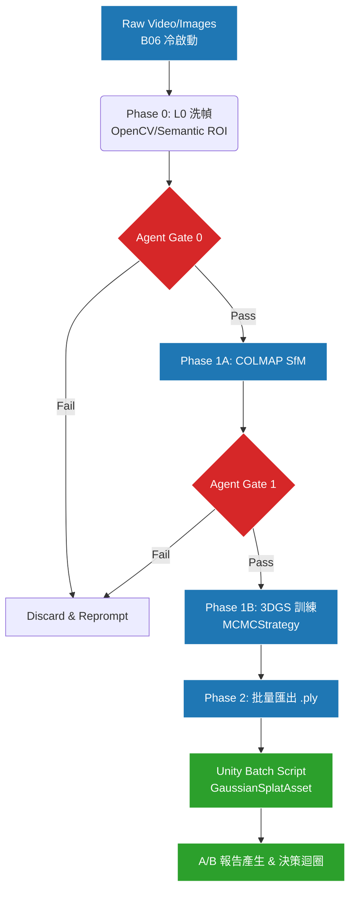
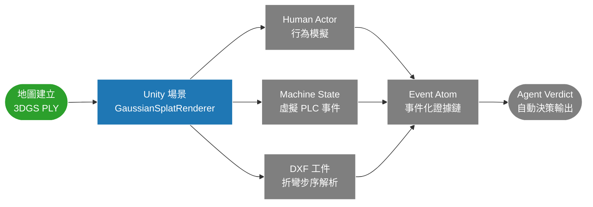
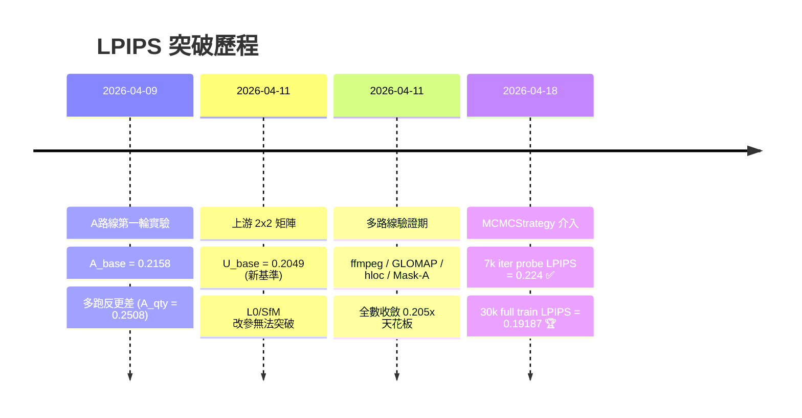

# 專案研發靈魂與長遠計畫 (Project Vision)

> 狀態：Current  
> 用途：提煉專案的核心「Why (動機)」與「What (長遠目標)」，讓 Agent 徹底明白自己的存在意義。

---

## 🔒 當前狀態（AI 每次任務前讀這裡）

> 此區塊是全域狀態唯一來源。每次實驗後由 AI 強制更新。

| 項目 | 狀態 |
|------|------|
| **當前階段** | Phase 1 — 地圖建立（進行中）|
| **目前最佳** | `U_base + MCMCStrategy` → LPIPS **0.19187** |
| **下一步** | 持續驗證 `750k + antialiased` 的 Unity 視覺 / FPS / VRAM；`1M` 保留離線品質基準；若霧化仍不可接受，再考慮 `GLOMAP/ALIKED + MCMC` |
| **最後更新** | 2026-04-20 |

### ✅ 本階段允許
- 3DGS / MCMC 訓練優化（`cap_max`、`antialiased`）
- Unity PLY 匯出與匯入驗證
- L0 洗幀實驗（Gate 0~3 協定）
- 環境維護與補丁

### ❌ 本階段禁止
- Phase 2 功能（Human Actor / Machine State / DXF / Event Atom）
- 未通過 Gate 3 的參數寫入主線預設值
- 重新啟動已失敗的方向（見 `實驗歷史與決策日誌.md`）

### 🚦 進入下一階段的條件
- [ ] `750k + antialiased` PLY 在 Unity 渲染幀率可接受（> 30fps）
- [ ] `outputs/3DGS_models/` 有可交付的正式 PLY
- [ ] LPIPS ≤ 0.192 且無明顯霧化 / halo / 視覺破損

---

## 1. 核心動機：為什麼要先拼死將「地圖」推向極致？
本專案為「中小企業板金製造現場智慧化系統」的一環。
最終目標是基於真實機台實現 DXF 數位孿生與人機行為追蹤。但在達成此目標前，最大痛點在於 **B06（冷啟動零標注資料）** 導致的 `sim-to-real gap`：傳統 Unity 手工拉出的合成場景與真實廠房差異過大，尺寸失真。
為此，我們確立了非常收斂且克制的戰略方針：
**「在現階段，第一且唯一的優先事項是保證能生出一張近乎完美、供 Unity 讀取的地圖。在達成此目標前，絕不提早碰觸任何人類模擬、物理事件等第二階段工作。」**

## 2. 專案靈魂：基於 Gate 機制的 A/B 對照煉丹爐
這不是一個一次性跑完就結束的建圖腳本。這是一個讓 AI Agent 能自行判讀指標並阻斷錯誤實驗的「自動化驗證大腦」。
- **Agent 的決策職責**：Agent 需要讀取不同階段的指標（SfM 註冊率、5000 iter 早期指標等），在每次 Rerun 前決定/產生 `sfm_params.json` 或 `train_params.json`。
- **正式接線方式**：生產層會在 stage 完成後寫出 `outputs/agent_events/latest_*.json` contract；決策層只讀這些 contract，不再依賴舊式固定路徑掃描。決策層完成後，會再把共享判斷寫回 `outputs/agent_decisions/latest_*_decision.json` 供生產層讀取。
- **審計與共享分離**：`latest_*` 只承擔共享當前狀態；完整歷史由 `run_root/reports/agent_<stage>.json` 與 `D:\agent_test\outputs\phase0\...` 承擔，不把共享 inbox/outbox 當長期檔案倉庫。
- **快速止損思維 (Gate 0~3)**：為了不浪費算力，專案明確了 Gate 0 (影像理智檢查) -> Gate 1 (SfM 驗證) -> Gate 2 (5000 step 早優) -> Gate 3 (滿練) 的嚴格驗證。Agent 必須死守這些閥門，沒過關就撤退，絕不硬跑完整流程。
**正式工作管線：**

## 2B. 第二階段全系統藍圖（Phase 2 Vision）

> ⚠️ 以下是**地圖完成後**的下一階段。在 Phase 1 完成前，這些功能嚴禁提前開發。

> 🟢 已完成 `地圖建立` ｜ 🔵 進行中 `Unity 場景` ｜ ⚫ 未啟動 `Phase 2+`

## 3. Data Layer (L0) 的戰略演進：從 OpenCV 走向 Semantic ROI
我們認知到：與其盲目調下游的 3DGS 小參數，不如從一開始就餵給 SfM 最乾淨的幾何資訊。但我們堅持「不破壞原圖特徵像素」的原則。
- **現行探索 (L0-S1)**：使用 Windowed Selection 搭配傳統 OpenCV heuristic 分數。這證實了 L0 洗幀對幾何穩定有幫助，但仍受限於計算邏輯盲點。
- **未來解方 (L0-S2)**：計畫引入強大的 Semantic ROI (如 Grounded-SAM-2)，但**不是**用來做對像素的強制 black hard mask，而是利用 AI 去框出主體(如 `punch_holders`)，將該遮罩作為特徵判斷的「評分加權區」，讓 L0 計分晉升為具備大腦語義認知的預處理。

## 4. 走向 MCMCStrategy 的歷史教訓

> 在 DefaultStrategy 下，**10 條不同路線全數收斂在 LPIPS `0.205x`**，MCMCStrategy 才是唯一突破。

- 我們花費了大量時間測試諸如 `app_opt`, `sh_degree=1` 等看似有效的微調，結果卻在足足 30000 iter 的完整對照中發現指標反向退化。這確立了專案**「不再回頭靠舊弱勢小參數盲測」**的紀律。
- 我們將主線切換為官方大招 **`MCMCStrategy`**，成功擊破了卡關已久的 LPIPS `0.2049` 天花板，一口氣推進至驚人的 `0.19187`。
- **接下來的戰役**：由於 MCMC 發威，導致高斯點雲會飆升至 1,000,000 顆（或撞到上限設定）。目前已確認 `1M` 在離線指標最佳，但 Unity 視覺上反而比 `750k` 更容易出現高光糊化、拖影與泛白；在 `750k` 上加入 `antialiased` 後，離線指標可小幅改善，且不增加高斯數量。不過最新 Unity 單視角人工觀察顯示，`750k + antialiased` 雖已優於 `1M`，仍殘留明顯霧化與高光 halo，尚未完全通過部署門檻。因此後續主線將拆成兩條：
  - `1M MCMC`：保留為離線品質 benchmark
  - `750k + antialiased`：作為目前最新 Unity 候選部署版（驗證中，尚未正式交付）
