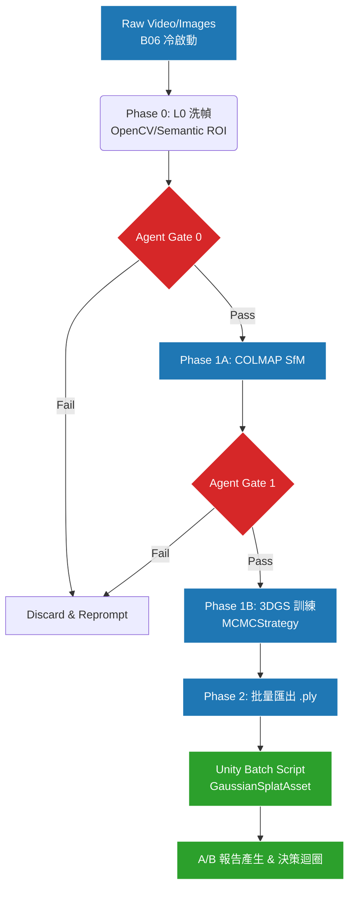
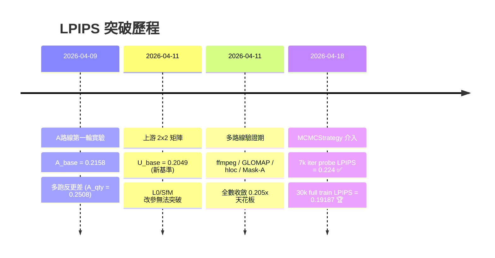

# 專案研發靈魂與長遠計畫 (Project Vision)

> 狀態：Current  
> 用途：提煉專案的核心「Why (動機)」與「What (長遠目標)」，讓 Agent 徹底明白自己的存在意義。

> **共同治理**：請見 [docs/_governance.md](docs/_governance.md)（治理戒律 + 正式 9 份說明書清單 + 跨層接口）。

---

## 🔒 當前狀態（AI 每次任務前讀這裡）

> 此區塊是全域狀態唯一來源。每次實驗後由 AI 強制更新。

| 項目 | 狀態 |
|------|------|
| **當前階段** | Phase 1 — 地圖建立（進行中）|
| **目前最佳** | `1M + antialiased + MCMCStrategy @ 30000` → LPIPS **0.189117** |
| **下一步** | Scaffold-GS 30k（LPIPS 0.035）+ MLP→SH export（E6/E7）已完成；**Bridge Gate 1 阻塞原因已根本診斷**：非訓練參數問題，是**輸入資料品質問題**（見下方 2026-05-16 診斷）。下一個最高優先動作：從原始 4K 影片重新抽幀（PNG，全解析度），以提升黑色機台暗部細節與訓練信噪比 |
| **最後更新** | 2026-05-16 |

---

## 🔍 根本問題診斷（2026-05-16）

> 本節記錄今日深度分析所發現的瓶頸，為後續方向的依據。

### 問題一：訓練資料角度覆蓋不足

- **現象**：Scaffold-GS 30k LPIPS=0.035（論文級），但 Unity 側面/背面視角完全崩潰（星爆碎片）
- **根因**：853 張訓練照片全部是正面環繞拍攝，側面和背面幾乎無相機覆蓋
- **表現**：Scaffold-GS 的 MLP 只學到正面視角的顏色；從未訓練的角度展開 → 顏色完全錯誤
- **對照**：MCMC + SH 在側面反而更好，因為 SH 自然插值，不像 MLP 硬崩
- **解法**：
  - 短期：補拍側面/背面照片（根治）
  - 中期：Zero123++ 生成側面合成視角後加入訓練集
  - 長期：多角度相機陣列採集

### 問題二：黑色機台表面無法被學習

- **現象**：機台主體（黑色鈑金機身、內部壓料區）在所有 3DGS 版本中均模糊或消失
- **根因**：黑色表面吸光率 ~95%，相機收到的光子訊號極低；COLMAP 無法在黑色表面建立特徵點；3DGS 沒有幾何基礎 → 黑色區域沒有 Gaussian
- **開源 knob 能否解決**：有限度幫助（`random_bkgd=True`、`absgrad=True`），但無法從「不存在的訊號」學習顏色
- **解法**：補光重拍（工業 LED 照亮暗部）；或 HDR 多曝光拍攝

### 問題三：4K 原始影片未充分利用（最重要發現）

- **原始影片**：`data/viode/hub.mp4`
  - 解析度：**3840 × 2160（4K UHD）**
  - 位元率：**62.8 Mbps**（極高，暗部細節豐富）
  - 時長：72.5 秒，**2175 幀**（30fps）
  - 裝置：Android 13
- **目前訓練用的資料**：853 張 JPG（推測為 FHD 解析度，只用了 39% 的幀）
- **問題**：
  - 4K → FHD 降解析度：損失 4× 像素資訊
  - JPG 壓縮：暗部 block artifact 進一步污染訓練數據
  - 只用 853/2175 幀：大量潛在視角和細節未被使用
  - `data_factor=8` 訓練：若基底是 FHD(1920px)，訓練時只有 240px 寬度
- **解法（不需補拍，立刻可做）**：
  ```
  ffmpeg -i data/viode/hub.mp4 -vf "fps=12" -compression_level 3 data/frames_4k_png/frame_%06d.png
  ```
  重新以 4K PNG 抽幀 → 重跑 COLMAP → Scaffold-GS 用 `data_factor=2`（訓練寬度 1920px，比現在大 8 倍）

### 問題優先順序

| 問題 | 可否不補拍解決 | 優先順序 | 預期效果 |
|------|--------------|---------|--------|
| 4K 影片未充分利用 | ✅ 是（重新抽幀）| **P0** | 黑色細節大幅改善，整體 LPIPS 可能再降 |
| 側面/背面無相機覆蓋 | ⚠️ 部分（Zero123++）| P1 | 側面不崩潰 |
| 黑色表面物理限制 | ❌ 需補光 | P2 | 需現場條件配合 |

### ✅ 本階段允許
- 3DGS / MCMC 訓練優化（`cap_max`、`antialiased`）
- Unity PLY 匯出與匯入驗證
- L0 洗幀實驗（Gate 0~3 協定）
- 環境維護與補丁

### ❌ 本階段禁止
- Phase 2 功能（Human Actor / Machine State / DXF / Event Atom）
- 未通過 Gate 3 的參數寫入主線預設值
- 重新啟動已失敗的方向（見 `實驗歷史與決策日誌.md`）

### 🚦 進入下一階段的條件
- [x] `750k + antialiased` PLY 在 Unity 渲染幀率可接受（> 30fps）
- [ ] `outputs/3DGS_models/` 有可交付的正式 PLY
- [ ] LPIPS ≤ 0.192 且無明顯霧化 / halo / 視覺破損

---

## 0B. 本輪 8 項任務執行順序（2026-05）

> 這一段不是實驗紀錄，而是目前這輪工作的正式執行順序。

1. 先做最小可觀測性
    - `decision_latency`
    - `candidate_recall`
    - `arbiter_correctness`
    - `problem_layer_accuracy`
    - `ai_exit_readiness_trend`
    - `EventBus` 只負責趨勢與警報，不只是記錄
2. 補 `outcome_feedback` 人工標籤
    - 先補最近 5 到 10 份決策標記
    - 補 `decision_useful`、`human_override`、`wasted_run`、`repeated_problem` 等欄位
3. 讓 `learning_curve` 真正開始學習
    - 檢查 `candidate_pool` ranking 是否因歷史回饋改變
    - 若完全沒變，先調整 feedback 權重，不急著加新機制
4. 做剩下 5 個 stage 的第二輪 ablation
    - 一次停用一個 stage
    - 只要正式輸出不變，就判定可刪
5. 審計生產層過時邏輯
    - 先看 `sfm_colmap.py`
    - 再看 `train_3dgs.py`
    - 分清正式主線、歷史殘技、可刪片段
6. 再談 `arbiter`
    - 包括之前提過的 `framework switch`
    - 先有回饋支撐的候選判斷，再研究 `research_frameworks`
7. 設定對話框 AI 的退出門檻
    - `success_rate`
    - `human_override_rate`
    - `repeat_error_rate`
    - `critical_bad_release`
    - 只在條件足夠時才從 meta evaluator 降為 observer-only
8. 暫時不要做的新架構
    - 不先跳新框架切換
    - 不先做 RL / DQN
    - 不先做大型決策平台
    - 先把量測、回饋、ablation 三件事做扎實

## 0C. 本輪生產層初查（2026-05-04）

> 這段只記第一輪審計結論，不改動正式程式碼。

- `sfm_colmap.py`
    - 保留：已有獨立 `_colmap_scene`，避免跨 run 污染。
    - 保留：目前沒有看到黑名單參數或舊全局路徑殘留。
    - 暫不刪除：未發現可直接移除且不影響正式 decision 的片段。
- `train_3dgs.py`
    - 保留：`random_bkgd`、`antialiased`、`MCMC` 相關 knobs，作為已驗證的 probe 級正式介面。
    - 待定：`pose_opt`、`app_opt` 目前只在單檔內部傳遞，尚未看到測試或正式文件依賴，但因 `params_json` 相容性仍在，先記為 probe-only 待再審。
    - 下一步：若後續確認沒有外部依賴，再考慮從正式 CLI 與訓練摘要中移除。

## 0D. 本輪 arbiter 初查（2026-05-04）

> 這段只記第一輪裁決器審計結論，不改動正式程式碼。

- `src/arbiter.py`
    - 保留：`switch_strategy` / `framework` 路徑仍是 export 失敗時的正式 fallback，且測試明確預期它存在。
    - 保留：`decision_context` 已把 `history_signal` 帶入裁決，與目前的回饋循環一致。
    - 暫不刪除：`_hold_action_type` 的 framework 分支；它目前不是孤立殘技，而是顯式的正式後備路徑。
    - 下一步：先把 candidate / feedback 的歷史壓力做穩，再決定是否收斂 framework-switch 相關文案或候選來源。

## 0E. 本輪 AI 退出門檻現況（2026-05-04）

> 這段記錄正式的 observer-only 門檻與目前 on-disk 驗證結果。

- 現有門檻
    - `min_recent_decisions >= 20`
    - `recommendation_success_rate >= 0.70`
    - `human_override_rate < 0.20`
    - `repeat_error_rate < 0.10`
    - `critical_bad_release_count == 0`
- 目前驗證結果
    - `D:\agent_test\outputs\phase0` 下可找到 8 份 `outcome_feedback.json`
    - 最新 learning curve 仍是 `total_decisions = 8`
    - `recommendation_success_rate = 0.875`
    - `repeat_error_rate = 0.875`
    - `ready_for_ai_observer_mode = false`
    - `mode_recommendation = keep_meta_evaluator`
- 已執行
    - `candidate_pool` 排序已加入 `repeat_error_rate` 懲罰，避免高重複問題來源長期維持過高排序
    - 三筆舊的 `train_complete` feedback 已回填 `selected_candidate_id` / `selected_source_module` / `problem_layer`
    - 三筆剩餘的舊 feedback 已回填 `problem_layer` / `dominant_problem_layer`
    - 回填後重新計算，`MapValidator` 仍為 `6` 筆，`ProductionParamGate` 為 `2` 筆，`RecoveryAdvisor` 為 `1` 筆；`parameter` 為 `7` 筆、`framework` 為 `1` 筆、`unknown` 為 `0`
- 下一步
    - 先繼續補足決策標籤與降低重複問題率，再談是否調整門檻

## 1. 核心動機：為什麼要先拼死將「地圖」推向極致？
本專案為「中小企業板金製造現場智慧化系統」的一環。
最終目標是基於真實機台實現 DXF 數位孿生與人機行為追蹤。但在達成此目標前，最大痛點在於 **B06（冷啟動零標注資料）** 導致的 `sim-to-real gap`：傳統 Unity 手工拉出的合成場景與真實廠房差異過大，尺寸失真。
為此，我們確立了非常收斂且克制的戰略方針：
**「在現階段，第一且唯一的優先事項是保證能生出一張近乎完美、供 Unity 讀取的地圖。在達成此目標前，絕不提早碰觸任何人類模擬、物理事件等第二階段工作。」**

## 2. 專案靈魂：基於 Gate 機制的 A/B 對照煉丹爐
這不是一個一次性跑完就結束的建圖腳本。這是一個讓 AI Agent 能自行判讀指標並阻斷錯誤實驗的「自動化驗證大腦」。
- **Agent 的決策職責**：Agent 需要讀取不同階段的指標（SfM 註冊率、5000 iter 早期指標等），在每次 Rerun 前決定/產生 `sfm_params.json` 或 `train_params.json`。
- **正式接線方式**：生產層會在 stage 完成後寫出 `outputs/agent_events/latest_*.json` contract；決策層只讀這些 contract，不再依賴舊式固定路徑掃描。`train_complete` / `export_complete` 現在會在寫出 contract 後立即同步呼叫 `D:\agent_test\run_phase0.py --contract ...`，並嘗試刷新 `outputs/agent_decisions/latest_*_decision.json`。若 decision hook 失敗，生產層會保留 event 與本地 contract，改以警告呈現，不讓決策層異常反向炸掉主流程。
- **審計與共享分離**：`latest_*` 只承擔共享當前狀態；完整歷史由 `run_root/reports/agent_<stage>.json` 與 `D:\agent_test\outputs\phase0\...` 承擔，不把共享 inbox/outbox 當長期檔案倉庫。
- **快速止損思維 (Gate 0~3)**：為了不浪費算力，專案明確了 Gate 0 (影像理智檢查) -> Gate 1 (SfM 驗證) -> Gate 2 (5000 step 早優) -> Gate 3 (滿練) 的嚴格驗證。Agent 必須死守這些閥門，沒過關就撤退，絕不硬跑完整流程。
**正式工作管線：**



## 2B. 第二階段全系統藍圖（Phase 2 Vision）

> ⚠️ 以下是**地圖完成後**的下一階段。在 Phase 1 完成前，這些功能嚴禁提前開發。


> 🟢 已完成 `地圖建立` ｜ 🔵 進行中 `Unity 場景` ｜ ⚫ 未啟動 `Phase 2+`

## 3. Data Layer (L0) 的戰略演進：從 OpenCV 走向 Semantic ROI
我們認知到：與其盲目調下游的 3DGS 小參數，不如從一開始就餵給 SfM 最乾淨的幾何資訊。但我們堅持「不破壞原圖特徵像素」的原則。
- **現行探索 (L0-S1)**：使用 Windowed Selection 搭配傳統 OpenCV heuristic 分數。這證實了 L0 洗幀對幾何穩定有幫助，但仍受限於計算邏輯盲點。
- **未來解方 (L0-S2)**：計畫引入強大的 Semantic ROI (如 Grounded-SAM-2)，但**不是**用來做對像素的強制 black hard mask，而是利用 AI 去框出主體(如 `punch_holders`)，將該遮罩作為特徵判斷的「評分加權區」，讓 L0 計分晉升為具備大腦語義認知的預處理。

## 4. 走向 MCMCStrategy 的歷史教訓

> 在 DefaultStrategy 下，**10 條不同路線全數收斂在 LPIPS `0.205x`**，MCMCStrategy 才是唯一突破。



- 我們花費了大量時間測試諸如 `app_opt`, `sh_degree=1` 等看似有效的微調，結果卻在足足 30000 iter 的完整對照中發現指標反向退化。這確立了專案**「不再回頭靠舊弱勢小參數盲測」**的紀律。
- 我們將主線切換為官方大招 **`MCMCStrategy`**，成功擊破了卡關已久的 LPIPS `0.2049` 天花板，一口氣推進至驚人的 `0.19187`。
- **接下來的戰役**：由於 MCMC 發威，導致高斯點雲會飆升至 1,000,000 顆（或撞到上限設定）。目前已確認 `1M` 在離線指標最佳，但 Unity 視覺上反而比 `750k` 更容易出現高光糊化、拖影與泛白；在 `750k` 上加入 `antialiased` 後，離線指標可小幅改善，且不增加高斯數量。不過最新 Unity 單視角人工觀察顯示，`750k + antialiased` 雖已優於 `1M`，仍殘留明顯霧化與高光 halo，尚未完全通過部署門檻。因此後續主線將拆成兩條：
  - `1M MCMC`：保留為離線品質 benchmark
  - `750k + antialiased`：作為目前最新 Unity 候選部署版（驗證中，尚未正式交付）
