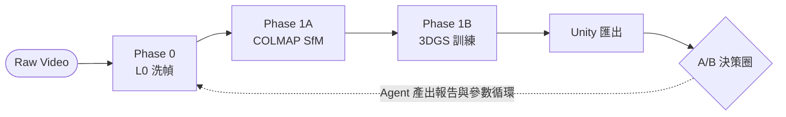
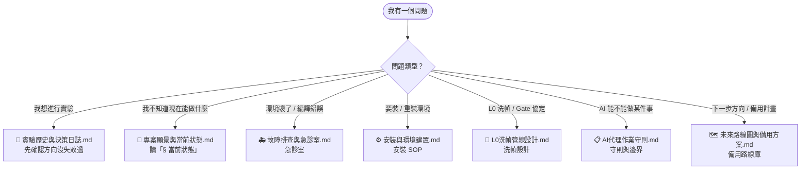
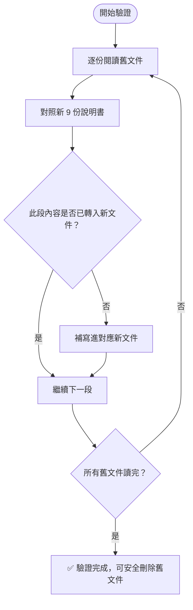

# 3D Recon Pipeline — 導航入口

> **路由規則：本文件只做導航，不放狀態，也不承擔主說明。主說明請看 `README.md`；當前狀態只看 `專案願景與當前狀態.md §當前狀態`。**
>
> **正式來源規則：目前只有新 9 份文件（8+1）是正式來源。舊中文文件與 `docs/experiments/` 內容僅作封存與遷移來源，不再作為正式決策依據。**

---

## 🗺️ 系統管線總覽

---

## 📚 這個問題去哪裡找答案？

---

## 📦 文件索引（Diátaxis 分層，9 份 = 8+1）

| 類型 | 文件 | 用途 |
|------|------|------|
| **Navigation** | `文件導航.md`（本文件）| 純路由，永遠不放狀態 |
| **Guide (+1)** | `README.md` | 人類閱讀用主說明：總覽、主線、目錄責任、目前採用路徑 |
| **Explanation** | `專案願景與當前狀態.md` | 全域狀態 + 系統全貌 + 設計動機 |
| **Explanation** | `AI代理作業守則.md` | Agent 行為守則與紅線 |
| **Reference** | `docs/實驗歷史與決策日誌.md` | 所有實驗結果封存（只增不改）|
| **Reference** | `docs/L0洗幀管線設計.md` | L0 洗幀架構與 Gate 協定 |
| **How-to** | `docs/安裝與環境建置.md` | 環境安裝 SOP |
| **How-to** | `docs/故障排查與急診室.md` | 排障與補丁急診室 |
| **Explanation** | `docs/未來路線圖與備用方案.md` | 備用計畫庫（尚未啟動）|

---

> ⚠️ 本文件不記錄實驗結果、不記錄當前最佳數值、不記錄階段狀態。
> `文件導航.md` 只負責導航；`README.md` 負責主說明；狀態唯一來源是 `專案願景與當前狀態.md §當前狀態`。

---

## 🔍 文件遷移驗證協定（Migration Verification）

> 若有任何疑問「舊文件的某段內容是否已寫入新說明書」，執行以下協定。

### 舊文件清單（11 份，待封存來源）

> 這 11 份是**遷移來源**，不是要求逐字保留的正式文件。  
> 遷移原則是：**保留仍有主線價值的規則、契約、結果與 SOP；過時流程、舊路徑、一次性實錄留在封存區，不再硬搬進新 9 份文件（8+1）。**

| # | 舊文件路徑 | 主要內容 |
|---|-----------|---------|
| 1 | `安裝指南.md` | 環境安裝步驟 |
| 2 | `環境設置.md` | 版本矩陣與衝突 |
| 3 | `故障排查.md` | 排障決策樹 |
| 4 | `文件重整藍圖.md` | 文件重整規劃（已完成使命）|
| 5 | `地圖優先開發說明書.md` | 核心實驗歷史與決策 |
| 6 | `README.md`（舊版）| 舊版主入口 |
| 7 | `docs/experiments/A路線_上游2x2_設計.md` | 上游矩陣設計 |
| 8 | `docs/experiments/A路線_第一輪實驗紀錄.md` | 第一輪 Train 端實驗 |
| 9 | `docs/experiments/Phase0_v2_ffmpeg_agent_設計草案.md` | Phase 0 v2 架構 |
| 10 | `docs/experiments/Phase0_掃描說明書.md` | RTX 補丁 + Unity SOP |
| 11 | `docs/experiments/資料層實驗計畫.md` | 靜態照片方案 |

### 驗證步驟

### 對應關係（舊 → 新）

| 舊文件內容 | 應在哪份新文件 |
|-----------|-------------|
| 安裝步驟、版本矩陣 | `docs/安裝與環境建置.md` |
| RTX 5070Ti 補丁、排障 | `docs/故障排查與急診室.md` |
| Unity 匯入 SOP | `docs/故障排查與急診室.md §4` |
| 所有實驗數據（LPIPS 表） | `docs/實驗歷史與決策日誌.md` |
| Gate 0~3 協定、L0 設計 | `docs/L0洗幀管線設計.md` |
| A/B 對照最小欄位、比較戒律 | `AI代理作業守則.md` |
| Phase 0 v2 模組契約、`ffprobe/ffmpeg/NVDEC/NIMA` 角色、`phase0_params.json` | `docs/L0洗幀管線設計.md` |
| Phase 2 全系統藍圖 | `專案願景與當前狀態.md §2B` |
| README 主入口與主線總覽 | `README.md` |
| 靜態照片 / 2DGS 備用方案 | `docs/未來路線圖與備用方案.md` |
| A4 / 尺規尺度校正、Unity 匯入時套用 scale | `docs/故障排查與急診室.md` |
| AI 行為守則 | `AI代理作業守則.md` |
